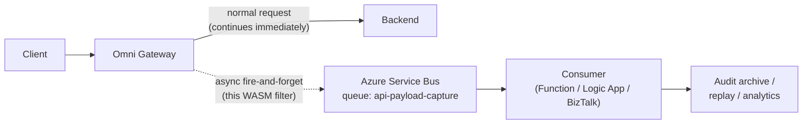

# payload-capture-wasm

Custom Anypoint Omni Gateway (formerly Flex Gateway) policy that captures every API call's request payload + headers and publishes them to an **Azure Service Bus queue** asynchronously. Implemented as an Envoy WASM filter in Rust.

> **Why custom, not built-in?** No built-in Anypoint policy targets a Service Bus queue directly. The Message Logging policy logs to log infrastructure (Splunk / Datadog), and the Mule runtime Service Bus connector doesn't exist in Omni Gateway. WASM is the path for queue publishing from the gateway tier. See [`docs/11-azure-service-bus-integration.md §1`](../../../docs/11-azure-service-bus-integration.md#1-scope--honest-framing--what-the-gateway-can-and-cant-do) for the framing.

## Architecture in one diagram



The capture path is **fire-and-forget** — Service Bus errors never propagate back to the original request. Gateway latency impact is single-digit milliseconds even at 100% sample rate.

## What's in this folder

| File | Purpose |
|---|---|
| [`src/lib.rs`](src/lib.rs) | The WASM filter (Rust, proxy-wasm SDK) |
| [`Cargo.toml`](Cargo.toml) | Rust project + WASM build config |
| [`policy-manifest.yaml`](policy-manifest.yaml) | MuleSoft custom policy manifest declaring config parameters surfaced in API Manager UI |
| [`deploy-policy.ps1`](deploy-policy.ps1) | Build + package + publish-to-Anypoint-Exchange script |
| [`tests/integration-test-plan.md`](tests/integration-test-plan.md) | End-to-end test approach (local Docker + DEV + QA load test + Prod canary) |
| `.gitignore` | Standard Rust artifacts |

## Capabilities

| Capability | How it's controlled |
|---|---|
| **Per-API attachment** | Attached via API Manager just like any policy; configure per-API in the API Manager UI |
| **Configurable sampling** | `sample_rate_percent` (0–100); critical for cost/perf at high TPS |
| **PII redaction** | `redact_body_fields` accepts JSON pointer paths (e.g. `/ssn`); non-JSON bodies are passed through as-is |
| **Header allowlist** | `capture_header_allowlist` — defaults to the safe set (excludes `Authorization`, `Cookie`, etc.) |
| **Payload size cap** | `max_payload_bytes` (default 64 KB; truncated with `request_truncated: true` marker) |
| **Optional response capture** | `capture_response` (default false; doubles capture cost) |
| **Async / non-blocking** | Uses `dispatch_http_call` (Envoy async); never blocks the original request |
| **Failure-tolerant** | SB outage produces WARN logs but no impact on gateway response |
| **Correlation ID propagation** | `X-Correlation-ID` / `X-Request-ID` becomes the Service Bus `MessageId` for dedup |

## CloudEvents envelope shape (what lands on the queue)

```json
{
  "specversion": "1.0",
  "type": "com.yourco.gateway.api-call-captured",
  "source": "/omni-gateway/payload-capture",
  "id": "<correlation-id>",
  "time": 1718812800123,
  "datacontenttype": "application/json",
  "data": {
    "method": "POST",
    "path": "/orders",
    "request_headers": [["content-type", "application/json"], ...],
    "request_body_b64": "<base64-encoded body>",
    "request_truncated": false,
    "response_status": 201,
    "response_headers": [...],
    "response_body_b64": "...",
    "response_truncated": false
  }
}
```

The body is base64'd so binary content (gRPC, file uploads) works without escaping problems. Consumers decode as needed.

## Build

Prerequisites:

```powershell
# Rust toolchain
rustup target add wasm32-wasi

# Anypoint CLI (for publishing to Exchange)
npm install -g anypoint-cli-v4
anypoint-cli-v4 conf authentication.type client_credentials
anypoint-cli-v4 conf client_id <YOUR_ANYPOINT_CONNECTED_APP_CLIENT_ID>
anypoint-cli-v4 conf client_secret <SECRET>
```

Build the WASM binary:

```powershell
cargo build --release --target wasm32-wasi
# Output: target/wasm32-wasi/release/payload_capture_wasm.wasm
```

Run unit tests:

```powershell
cargo test
```

## Deploy

```powershell
# One command does: build + package + upload to Anypoint Exchange
.\deploy-policy.ps1 -BusinessGroupId <YOUR_GROUP_ID>
```

After upload, in Anypoint API Manager:

1. Open the API instance you want to attach to
2. **Policies** → **Add Policy** → filter for "Payload Capture WASM"
3. Configure parameters (sb_namespace_host, sb_queue_name, etc.)
4. Save

Repeat per environment (DEV / QA / UAT / Prod) using environment-specific config values. CI/CD pipeline can automate this — see [`docs/04-cicd.md`](../../../docs/04-cicd.md).

## Configuration parameters (surfaced in API Manager UI)

See [`policy-manifest.yaml`](policy-manifest.yaml) for the full list. Most-important:

| Param | Required | Default | Note |
|---|---|---|---|
| `sb_namespace_host` | Yes | — | e.g. `myorg-bus.servicebus.windows.net` |
| `sb_queue_name` | Yes | — | Target queue or topic |
| `sb_sas_authorization_header` | Yes | — | **Sensitive** — store in Vault / Anypoint Secure Properties; never inline |
| `sb_http_cluster_name` | Yes | `service-bus-rest-cluster` | Must match an upstream cluster declared in Flex Gateway config |
| `sample_rate_percent` | No | 10 | Use 100 for low-volume audit-critical APIs; 1–10 for high-volume APIs |
| `max_payload_bytes` | No | 65536 | Stay well under Service Bus 256 KB / 1 MB limit for envelope overhead |
| `capture_response` | No | false | Doubles capture cost; enable only when response payload matters |
| `redact_body_fields` | No | `[]` | List of JSON pointer paths to redact (e.g. `["/ssn"]`) |
| `capture_header_allowlist` | No | safe defaults | Excludes `Authorization`, `Cookie` etc. |

## Required Flex Gateway upstream cluster

The policy uses `dispatch_http_call` against a named Envoy upstream cluster. You must declare this cluster in the Flex Gateway runtime config so the policy can reach Service Bus:

```yaml
# In your Flex Gateway upstream/runtime config
clusters:
  - name: service-bus-rest-cluster
    type: STRICT_DNS
    connect_timeout: 5s
    transport_socket:
      name: envoy.transport_sockets.tls
      typed_config:
        "@type": type.googleapis.com/envoy.extensions.transport_sockets.tls.v3.UpstreamTlsContext
        sni: <sb_namespace_host>
    load_assignment:
      cluster_name: service-bus-rest-cluster
      endpoints:
        - lb_endpoints:
            - endpoint:
                address:
                  socket_address:
                    address: <sb_namespace_host>
                    port_value: 443
```

This is platform-team work (per [`docs/20-raci-matrix.md`](../../../docs/20-raci-matrix.md)) and only needs to be done once per environment.

## Operational concerns

### PII (citizen-data implications — read carefully)

Capturing every payload is **the opposite** of the PII deny-list in [`docs/07-data-protection.md §3`](../../../docs/07-data-protection.md#3-the-12-specific-bleed-vectors). The captured payloads are a **new PII surface** that needs:

| Control | Where |
|---|---|
| Field-level redaction | `redact_body_fields` config |
| Header-level redaction | `capture_header_allowlist` (Authorization is excluded by default) |
| Encryption at rest in the queue | Service Bus Premium with customer-managed key |
| Access control on the queue | Per-consumer RBAC; consumers see redacted data only |
| Retention policy | Short TTL on the queue (24h–7d) + downstream archive with proper retention |
| Audit log of consumers | Service Bus reads emit to SIEM |
| Pre-go-live compliance review | DPO sign-off required before enabling on PII-bearing APIs |

**Do not enable this policy on a citizen-data API in production without explicit DPO approval.**

### Performance impact

| Sample rate | Per-request overhead | When acceptable |
|---|---|---|
| 100% | ~1–3 ms additional p99 latency | Low-volume audit APIs (< 100 TPS per replica) |
| 10% (default) | < 0.5 ms additional p99 | Most APIs at any volume |
| 1% | Negligible | Very high TPS APIs where statistical sampling is enough |
| 0% | Zero (filter early-exits) | Switch off via config rather than detaching the policy (preserves audit trail of the switch in API Manager) |

The overhead is body buffering + redaction + serialization + dispatch. The dispatch itself is async and adds nothing to client-perceived latency.

### Service Bus capacity

For 5M API calls/day with 10% sample rate = 500K captures/day = ~6 msg/sec average. **1 Service Bus Messaging Unit (Premium) is overkill** — 1 MU handles thousands of msg/sec sustained. The bottleneck is consumer-side processing speed, not the queue.

If you bump to 100% sample on a 5M/day API, that's ~60 msg/sec — still well within 1 MU. Plan for queue depth alarms (per [`docs/05-observability.md §10`](../../../docs/05-observability.md)) regardless.

### Cost (per [`docs/11-azure-service-bus-integration.md §11`](../../../docs/11-azure-service-bus-integration.md#11-cost-considerations))

The capture queue can share the existing Service Bus Premium namespace — no incremental Service Bus cost. Storage is bounded by retention (TTL the queue at 24h-7d as appropriate).

### Failure modes

| Failure | Behavior | Mitigation |
|---|---|---|
| Service Bus unreachable | WARN log; gateway response unaffected | Alarm on `dispatch_http_call` failure rate > 1/min |
| Service Bus returns 5xx | WARN log; no retry from filter | Consumer-side replay if needed; investigate SB |
| Service Bus returns 4xx (auth) | WARN log; no retry | Likely expired SAS token; rotate immediately |
| Capture queue full (1 GB limit on Premium) | SB returns 5xx; messages dropped | Alarm on queue size > 80%; verify consumer is draining |
| WASM filter panics | Filter is disabled; gateway logs the panic | Restart gateway; investigate; consider rolling back the filter version |
| Per-request memory blowup (huge payloads) | `max_payload_bytes` truncation prevents | Default 64 KB is safe; tune only with care |

## Maintenance burden

This is **custom code in your operational footprint** (per [`docs/18-team-roles-and-skills.md §3 anti-patterns`](../../../docs/18-team-roles-and-skills.md)). Realistic ongoing cost:

| Activity | Annual hours |
|---|---|
| WASM SDK version updates (proxy-wasm crate) | ~16 |
| Flex/Omni Gateway version compatibility re-testing | ~24 (per major Omni release) |
| Bug fixes / feature requests | ~40 |
| Quarterly review against MuleSoft built-in policy catalog (in case they add native support) | ~4 |
| **Total** | **~84 hrs/year** |

Add this to [`docs/16-consulting-estimate.md`](../../../docs/16-consulting-estimate.md) annual recurring if this policy is part of the engagement.

## Alternatives considered (and why this won)

| Alternative | Why not |
|---|---|
| **Mule runtime app between gateway and backend** | Architecture change; new runtime to operate; Service Bus connector is great but every API now routes through Mule (latency + ops cost) |
| **Backend-side capture** | Each backend implements; inconsistency; doesn't capture rejected/throttled requests at gateway |
| **Gateway access log + log forwarder → SB** | Log shape constrains payload encoding; bulky; eventual consistency; gateway access logs don't typically include body without specific Envoy config |
| **Envoy Tap filter (native)** | More complex than custom WASM; requires sidecar to consume the tap stream and forward to SB; ops overhead similar |
| **CDC from backend DB → SB** | Doesn't capture intent (only persisted state); doesn't help for non-DB-backed APIs |
| **This (custom WASM)** | Cross-cutting; async; full control; manageable maintenance | 

## Related

- [`docs/02-policies.md`](../../../docs/02-policies.md) — policy strategy at the gateway tier
- [`docs/07-data-protection.md`](../../../docs/07-data-protection.md) — PII implications (critical for this policy)
- [`docs/11-azure-service-bus-integration.md`](../../../docs/11-azure-service-bus-integration.md) — the SB integration patterns this policy uses
- [`docs/16-consulting-estimate.md`](../../../docs/16-consulting-estimate.md) — operational cost of custom policies
- [`docs/18-team-roles-and-skills.md`](../../../docs/18-team-roles-and-skills.md) §3 — Lead Engineer skill needed; §3 anti-patterns on custom-code burden
- [`docs/20-raci-matrix.md`](../../../docs/20-raci-matrix.md) — who's accountable for custom policy ops (Lead Engineer)
