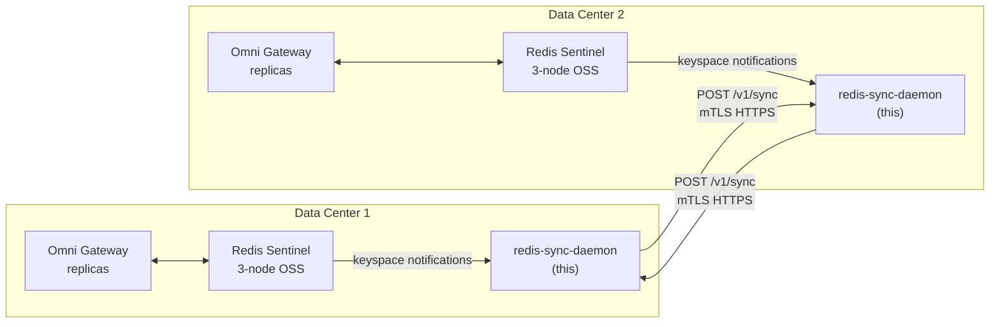

# redis-sync-daemon

Custom Go-based daemon that runs alongside a per-DC Redis Sentinel cluster and selectively replicates a subset of keys (idempotency cache + rate-limit counter deltas) to peer DC daemons over an mTLS HTTPS channel. **Avoids Redis Enterprise license** while solving the cross-DC consistency problem for the data classes that actually need it.

See [`docs/22-redis-cross-dc-sync.md`](../../../docs/22-redis-cross-dc-sync.md) for the full architecture rationale, decomposition of state, and trade-offs vs Redis Enterprise.

## Status

**Scaffold** — implementation pattern is established; needs:
- Vault SDK wiring (currently env-var fallback in `internal/redis/client.go::resolveSecret`)
- Integration tests against real Redis Sentinel cluster
- Chaos / partition testing
- Production hardening (rate-limited retries on peer failures, dead-letter for permanently-failed messages)
- Operational tooling (alerts wired to your SIEM)

Estimated remaining effort: **~140 hrs** (the build estimate in doc 22 §7 is ~276 hrs total; scaffold accounts for the first ~140).

## Architecture



## How it works

| Component | Role |
|---|---|
| **Replicator** (`internal/sync/replicator.go`) | Subscribes to Redis keyspace notifications for `idem:*` keys. On SET event, fetches value + TTL and POSTs to all peer daemons. Peer applies via SETNX so duplicate delivery is a no-op. |
| **Aggregator** (`internal/sync/aggregator.go`) | Every N seconds (default 10), scans `rl:*` counter keys, computes deltas since last cycle, and ships deltas to peers. Peer applies via INCRBY so concurrent updates in both DCs add cleanly. |
| **Peer Server** (`internal/peer/server.go`) | HTTPS endpoint receiving sync messages from peer DCs (mTLS-authenticated; rejects unsigned). |
| **Peer Client** (`internal/peer/client.go`) | HTTPS client that POSTs sync messages with mTLS, JSON payloads. |
| **Engine** (`internal/sync/engine.go`) | Orchestrates one replicator/aggregator goroutine per configured pattern. |
| **Metrics** (`internal/metrics/`) | Prometheus collectors: keys replicated, errors, lag histograms, peer call latency, aggregation cycle duration. |
| **Health** (`internal/health/`) | `/healthz` (process liveness) and `/readyz` (Redis reachable + engine ready). |

## Consistency semantics

| Data class | Replication mode | Convergence target | Behavior under partition |
|---|---|---|---|
| `idem:*` (idempotency keys) | SETNX fan-out on keyspace event | 1–2 seconds | Diverges; risk of duplicate writes for cross-DC retries |
| `rl:*` (rate-limit counters) | Periodic delta aggregation | 5–10 seconds | Each DC enforces local limits; effective global limit ≤ 2× configured |
| Everything else (config cache, request data cache) | **Not replicated** | n/a | Per-DC by design — Anypoint Control Plane repopulates config on cold start |

See [`docs/22-redis-cross-dc-sync.md §4`](../../../docs/22-redis-cross-dc-sync.md#4-eventual-consistency-semantics-the-honest-trade-offs) for the honest trade-offs vs Redis Enterprise CRDTs.

## Prerequisites

| | |
|---|---|
| **Go version** | 1.22+ for build (binary is statically linked) |
| **Redis Sentinel** | 3-node OSS Sentinel cluster per DC per [`docs/10-redis-cache.md §7`](../../../docs/10-redis-cache.md#7-install--redis-sentinel-on-rhel-on-prem-per-dc) |
| **Keyspace notifications** | `CONFIG SET notify-keyspace-events Ex$g` on each Redis node so SET / EXPIRED events fire |
| **Internal CA** | Issues mTLS certs for daemon-to-daemon communication |
| **Vault** | Stores Redis AUTH password and renews mTLS certs (per [`docs/14-redis-assumptions.md A11`](../../../docs/14-redis-assumptions.md)) |
| **Network** | Sync daemon listens on 8443 (peer-to-peer mTLS) + 8080 (health) + 9090 (Prometheus); allow inbound from peer DC's daemon CIDR only |

## Build

```bash
# Local dev build
go build -o redis-sync-daemon ./cmd/redis-sync-daemon

# Production container
docker build -t redis-sync-daemon:0.1.0 .
```

## Run

```bash
# Local — set env vars for cert paths and the auth secret stand-in
export PEER_SERVER_CA_CERT_PATH=/etc/ssl/internal-ca.crt
export PEER_SERVER_CERT_PATH=/etc/ssl/redis-sync-dc1.crt
export PEER_SERVER_KEY_PATH=/etc/ssl/redis-sync-dc1.key
export SECRET_REDIS_DC1_AUTH=replace-me
export DAEMON_DC_NAME=dc1

./redis-sync-daemon --config configs/example.yaml
```

```bash
# Container
docker run -d \
  --name redis-sync-dc1 \
  -p 8443:8443 -p 9090:9090 -p 8080:8080 \
  -v /etc/redis-sync-daemon:/etc/redis-sync-daemon:ro \
  -v /etc/ssl:/etc/ssl:ro \
  -e DAEMON_DC_NAME=dc1 \
  -e PEER_SERVER_CA_CERT_PATH=/etc/ssl/internal-ca.crt \
  -e PEER_SERVER_CERT_PATH=/etc/ssl/redis-sync-dc1.crt \
  -e PEER_SERVER_KEY_PATH=/etc/ssl/redis-sync-dc1.key \
  redis-sync-daemon:0.1.0
```

## Configuration

See [`configs/example.yaml`](configs/example.yaml). Key fields:

| Field | Purpose |
|---|---|
| `local.redis_endpoints` | The local DC's Sentinel nodes (host:port list) |
| `local.sentinel_master` | Sentinel master name (matches Redis Sentinel config) |
| `local.auth_password_secret` | `vault://` URI for Redis AUTH (scaffold uses env-var fallback) |
| `peers[].endpoint` | Peer DC daemon's HTTPS URL |
| `peers[].mtls.*` | mTLS cert paths for outbound calls |
| `sync.patterns[]` | Which key prefixes get replicated, and how (`setnx` or `counter-delta`) |
| `sync.keyspace_channel` | Redis Pub/Sub channel for keyspace notifications |

## Observability

### Prometheus metrics (scraped from `:9090/metrics`)

| Metric | Purpose | Alarm on |
|---|---|---|
| `redis_sync_keys_replicated_total{prefix,peer}` | Rate of successful replications | Drops to 0 unexpectedly |
| `redis_sync_replication_errors_total{prefix,stage}` | Errors by stage (local-get, peer-send, scan) | Sustained > 1/min |
| `redis_sync_replication_latency_seconds{prefix}` | Time from local SET to all peers ack | p99 > 5s |
| `redis_sync_peer_call_latency_seconds{peer}` | HTTPS RTT to peer | p99 > 1s |
| `redis_sync_peer_call_errors_total{peer,status}` | HTTPS errors by status code | Any 5xx |
| `redis_sync_observed_lag_seconds{origin_dc,kind}` | Wall-clock lag (peer's send time vs our receipt) | p99 > 10s |
| `redis_sync_aggregation_cycle_seconds{prefix}` | Duration of one counter aggregation cycle | p99 > interval × 1.5 |

### Health endpoints

- `GET /healthz` → 200 if process is alive
- `GET /readyz` → 200 if process is alive AND local Redis is reachable AND engine is past setup. Includes `observed_lag_seconds` in JSON.

### Logs

- Process logs to stdout (capture via container logs / systemd journal)
- Audit log (optional, via `observability.audit_log_path`) records every sync message inbound/outbound for forensic analysis

## Failure handling

| Failure | Behavior |
|---|---|
| Local Redis down | Daemon retries connect; readiness probe fails; alerts after 30s |
| Peer DC unreachable | Per-peer errors metric increments; replicator continues attempting; no in-process queue (intentional — keyspace notification is the queue, with Redis providing durability) |
| Peer DC slow | TLS timeout (default 2s); error metric; next event retries |
| Daemon crash | Systemd / Docker restart; on restart, scans local Redis and re-replicates recent keys (idempotent on peer side via SETNX) |
| Network partition between DCs | Each DC enforces locally; metrics show error spike; counters drift up to 2×; auto-heals on reconnect with next aggregation cycle |
| Cert near expiry | TLS handshake starts failing; alert on cert age externally (cert-manager metrics) |

## Testing

### Unit (not yet built)

```bash
go test ./...
```

Build out:
- Config validation tests
- Redis client TLS config tests
- Aggregator delta computation tests
- Sync message JSON round-trip tests

### Integration (not yet built)

Use Testcontainers Go to spin up two Redis Sentinel clusters in Docker and run two daemon instances against them. Verify:
- Idempotency key set on DC1 visible on DC2 within 2 seconds
- Counter delta on DC1 reflected on DC2 within 12 seconds
- Killing peer for 60s → both daemons accumulate; on reconnect, deltas catch up

### Chaos / partition (not yet built)

- Block peer network for 30 min during sustained load
- Verify gateway requests succeed (per-DC enforcement kicks in)
- Restore network
- Verify counters and idempotency cache reconcile within 30 seconds

## What's deliberately not in this scaffold

| Feature | Why deferred |
|---|---|
| Vault SDK | Scaffold uses env-var fallback; production Vault wire-up is a Phase 2 detail |
| Dead-letter handling for permanently-failed peer messages | Operational nicety; not required for correctness given peer SETNX/INCRBY idempotency |
| Multi-pattern support beyond `setnx` + `counter-delta` | Cover the two needs identified in doc 10 first; extend if new patterns emerge |
| Authentication via shared secret (HMAC) as an mTLS alternative | mTLS is the recommended approach for internal services |
| Cross-DC encryption-at-rest of in-flight messages | Already TLS-encrypted in transit; no rest period to protect |
| Web UI for status | Prometheus + Grafana cover the operator UI need |

## Maintenance burden

Per [`docs/22-redis-cross-dc-sync.md §7`](../../../docs/22-redis-cross-dc-sync.md#7-implementation-effort): **~76 hrs/year** ongoing maintenance after build.

| Activity | Hours/year |
|---|---|
| Bug fixes / feature requests | 32 |
| Go runtime version updates | 8 |
| Security patches (e.g., go-redis CVEs) | 16 |
| Compatibility re-test per Omni Gateway version | 16 |
| Quarterly "is there a native option now?" review | 4 |

## Anti-patterns to avoid

| Anti-pattern | Why bad |
|---|---|
| Treating this as a general Redis replication tool | It's purpose-built for **two specific patterns**; do not expand without revisiting consistency semantics |
| Skipping keyspace notification configuration | Replicator silently does nothing; appears healthy in logs |
| Running with `notify-keyspace-events` set to `*` (all events) | Floods the pub/sub channel; daemon CPU spikes |
| Adding more peers than 1-2 | This design is built for 2 DCs; mesh of 4+ needs different consistency thinking |
| Skipping mTLS for "convenience" | Sync channel carries idempotency keys (PII for citizen workloads); cleartext exposure unacceptable |
| Sharing the AUTH password between local Redis access and peer mTLS | Different secrets, different rotation cadences, different revocation paths |
| Building this when Redis Enterprise budget exists | Custom code is **your** maintenance burden; vendor product is theirs (with a check) |

## Related

- [`docs/10-redis-cache.md`](../../../docs/10-redis-cache.md) — base Redis architecture
- [`docs/14-redis-assumptions.md`](../../../docs/14-redis-assumptions.md) — assumptions A8, A19, A26 (updated for this approach)
- [`docs/22-redis-cross-dc-sync.md`](../../../docs/22-redis-cross-dc-sync.md) — architecture + trade-offs document
- [`docs/09-onprem-install.md §7`](../../../docs/09-onprem-install.md#7-disaster-recovery) — DR posture this daemon supports
