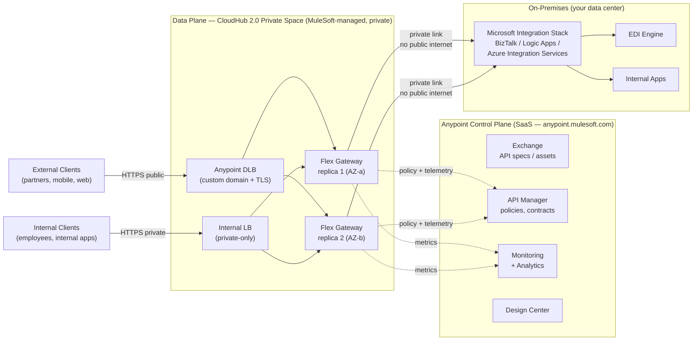
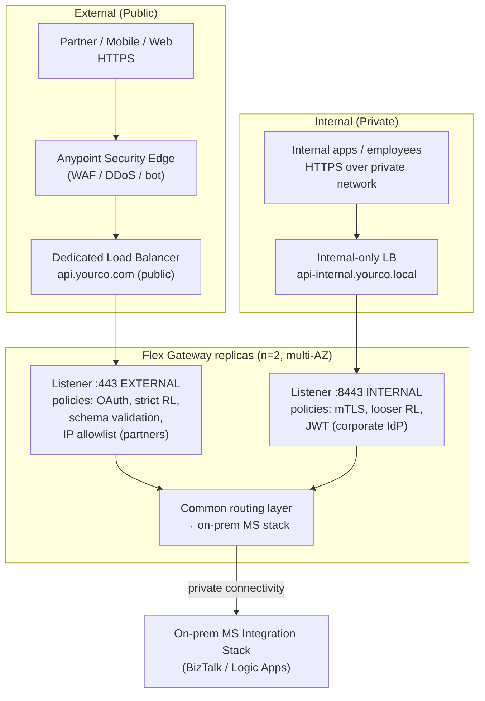
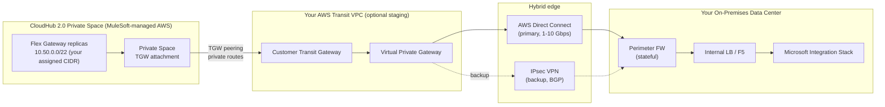

# MuleSoft API Gateway — Architecture

**Scope of this document.** A SaaS-first MuleSoft API Gateway design covering: product choice, dual internal/external traffic, SaaS-vs-on-prem trade-offs, private connectivity (no public internet) back to on-prem Microsoft integration stack, and sizing for 100K API calls/day.

**What MuleSoft does NOT do here.** Orchestration, message transformation, EDI mapping — all handled by the existing on-prem Microsoft stack (BizTalk / Logic Apps / etc.). MuleSoft is the **API edge only**.

---

## 1. Scope & Role

The gateway is responsible for the **API-edge concerns**, nothing else:

| In scope (MuleSoft gateway) | Out of scope (delegated to MS stack) |
|---|---|
| TLS termination | Message transformation (XML↔JSON, X12, EDIFACT) |
| Authentication (OAuth 2.0 / JWT / mTLS / API key) | Orchestration / process choreography |
| Authorization (scopes, RBAC, claims-based) | Long-running workflows |
| Rate limiting, throttling, quotas | Stateful sagas |
| Threat protection (schema validation, JSON/XML threat, IP allow/block) | EDI partner onboarding |
| Routing, traffic shaping (canary, weighted) | Adapter / connector logic |
| Contract enforcement (OAS / RAML validation) | Business logic |
| Observability (metrics, traces, access logs) | Data persistence |
| Caching | Retries with business-aware logic |

This **purposefully narrows** the product choice. A full Mule runtime with API Manager is overkill when there's no integration logic to host. The right tool is **Anypoint Flex Gateway** in **Connected mode**.

---

## 2. Recommended Product — Anypoint Flex Gateway (Connected Mode)

### Why Flex Gateway and not Mule Runtime + API Manager

| | Flex Gateway | Mule Runtime + API Manager |
|---|---|---|
| Purpose | Purpose-built API gateway (Envoy core) | Full integration runtime + gateway role |
| Footprint | ~50 MB process, runs on Linux/K8s | ~1 GB JVM per worker |
| Latency overhead | Single-digit ms | 10–30 ms typical |
| Cost model | Per-call or vCore (low) | vCore-only (higher) |
| Strength | Edge security, traffic management, lightweight | Connectors + DataWeave + orchestration |
| Fits "gateway only" requirement | **Yes** | Overpowered |

### Connected mode (the SaaS shape you asked for)

**Control plane = SaaS** (Anypoint Platform — anypoint.mulesoft.com)
- API design (Exchange), policy authoring (API Manager), analytics (Anypoint Monitoring), identity federation config
- MuleSoft-operated. You don't run any of this infrastructure.

**Data plane = your CloudHub 2.0 Private Space** (still MuleSoft-managed, still SaaS, but with private networking)
- Flex Gateway replicas that actually terminate TLS and enforce policies
- Lives in a MuleSoft-managed VPC, but **connected privately** to your on-prem (see §5)

**Key idea:** the SaaS *control plane* and the *data plane traffic to your backend* are **separate networks**. The policy-push and telemetry-publish channel from the data plane back to anypoint.mulesoft.com is an outbound HTTPS connection (mTLS, certificate-pinned). The **actual API request traffic** to your on-prem MS stack never traverses the internet (§5).

---

## 3. Internal + External Traffic — Dual-Listener Topology

Both internal and external consumers hit the same Flex Gateway runtime, but through **two different ingress paths** with **different policy bundles**.

### What changes between listeners

| Concern | External listener | Internal listener |
|---|---|---|
| Public DNS | `api.yourco.com` | `api-internal.yourco.local` |
| Reachability | Public DLB | Internal LB only (private network) |
| AuthN | OAuth 2.0 (B2B partner clients) + API key + IP allowlist | mTLS (service-to-service) OR JWT (corporate Okta/AAD) |
| Rate limits | Strict per-client (e.g. 100/min) | Lenient (e.g. 1000/min) |
| Threat protection | Full: JSON threat, schema validate, request size, geo-block | Schema validate only |
| WAF (Anypoint Security Edge) | Enabled | Off (internal trust boundary) |
| Logging detail | Full request meta (no body) | Sampled |
| TLS | Public CA cert (Let's Encrypt / DigiCert) | Internal CA |

### Why one runtime, two listeners (not two clusters)

- **Half the cost** — single set of replicas, no duplicate scaling.
- **One policy catalog** — same API specs in Exchange, attached with different policy *bundles* per environment/listener.
- **One observability stream** — Anypoint Monitoring shows both flows side-by-side.
- The complexity moves into *policy configuration*, which is API Manager's strength.

---

## 4. SaaS vs On-Prem — Pros & Cons

You asked for both sides. Here's the honest comparison.

### Anypoint Flex Gateway — SaaS (Connected Mode in CH 2.0 Private Space)

**Pros**
- **No infrastructure to run.** MuleSoft patches, upgrades, scales runtimes. Your team focuses on API design and policy, not OS hardening.
- **Faster time-to-value.** ~2 weeks from contract to first API live, vs months for on-prem.
- **Built-in HA.** Multi-AZ by default in CH 2.0 Private Space.
- **Auto-scale ready.** Horizontal scaling is a slider in the UI.
- **Centralized analytics + audit.** Anypoint Monitoring out of the box; tamper-resistant audit log in the SaaS control plane.
- **Consistent runtime versions.** Everyone is on the same patch level — no fragmentation.
- **Predictable OpEx** — license + private connectivity costs, no surprise hardware refresh.

**Cons**
- **Data plane runs in MuleSoft-managed AWS** (typically `us-east-1`, `eu-west-1`, etc.). Your data transits MuleSoft's VPC, even if private. May matter for **data sovereignty / residency** regulations.
- **Less customization** at the OS / JVM level. You can't sidecar arbitrary processes.
- **Outbound dependency on Anypoint Control Plane.** If `anypoint.mulesoft.com` is unreachable for an extended period, you can still serve traffic (policies cached) but can't change anything until it recovers.
- **Egress costs to your on-prem.** Private connectivity (Transit Gateway / Direct Connect) is metered AWS data transfer.
- **Cost compounds at higher TPS** — at very high volumes (millions/day) the per-call/vCore SaaS pricing can outrun an amortized on-prem cluster.

### Anypoint Flex Gateway — On-prem (in your DC / your K8s)

**Pros**
- **Full data residency.** Traffic never leaves your network. Critical for some regulated industries (financial, healthcare, sovereign-cloud requirements).
- **You own the runtime.** OS, JVM, sidecar tooling, all under your change control.
- **Lowest steady-state cost at scale.** Once amortized, on-prem is cheaper above ~10M calls/day.
- **No outbound dependency** — fully air-gapped operation possible (Local mode, see below).
- **Use existing K8s / Linux capacity** — drop into existing OpenShift / EKS-on-prem footprint.

**Cons**
- **You run it.** OS patching, upgrades, scaling, monitoring, capacity planning, backups, DR.
- **HA is your problem.** Multi-DC active-active for the gateway tier — you build and test it.
- **Slower release cadence.** You decide when to upgrade. Falling behind means missing security fixes.
- **Capacity overhead.** Have to provision for peak; can't scale to zero overnight.
- **More expensive at low volume.** Two replicas, monitoring, plus a sysadmin to keep them alive — for 100K/day this is overkill.

### Decision matrix for your case (100K/day, MS stack downstream)

| Factor | Score |
|---|---|
| 100K/day volume — too small to justify on-prem ops overhead | → **SaaS** |
| MS stack already handles the heavy data path | → SaaS is fine (gateway role only) |
| Private connectivity requirement is solvable in SaaS (§5) | → **SaaS** |
| No mention of data residency / sovereignty constraints | → **SaaS** |
| New gateway program — no legacy gateway investment | → **SaaS** |

**Recommendation: SaaS** (Connected mode, CloudHub 2.0 Private Space). Revisit at >5M calls/day or if a data-residency requirement surfaces.

---

## 5. Private Connectivity — No Public Internet to On-Prem

**The requirement:** API traffic from the SaaS gateway to your on-prem MS stack must not traverse the public internet. This is a standard ask and MuleSoft supports it via **CloudHub 2.0 Private Spaces** with several private-network options.

### Recommended pattern: Private Space + AWS Transit Gateway + ExpressRoute/Direct Connect

**No traffic over the public internet at any hop.** All routes are BGP-advertised through Transit Gateways, Direct Connect VIFs, and the customer perimeter firewall.

### Connectivity options compared (you ask "or similar" — here are all the similar)

| Option | What it is | When to use |
|---|---|---|
| **Transit Gateway peering** (recommended) | CH2.0 Private Space attaches to MuleSoft's TGW; that peers with yours; your TGW is connected to Direct Connect | Customer already on AWS, has TGW + DX |
| **AWS PrivateLink** | One-way private endpoint from CH2.0 to a specific service in your VPC | Single backend exposure (one ALB/NLB) — limited fit when MS stack has many services |
| **IPsec VPN over public internet** | Encrypted tunnel from CH2.0 Private Space to your VPN gateway | Quick start; tactical; fine for non-prod. Not "no internet" strictly — packets traverse internet but encrypted |
| **IPsec VPN over Direct Connect Public VIF** | Same VPN protocol but the IP path is through DX | Counts as "no public internet" — encrypted + private path |
| **Azure ExpressRoute / Azure Private Link** (if you'd prefer Azure) | MuleSoft offers Azure-resident Private Spaces in some regions | Customer is Azure-native and wants to avoid AWS in the path |

**For your scenario** (no internet) the right combination is **TGW-to-TGW peering + Direct Connect**. IPsec VPN is the warm-standby path; if DX fails BGP withdraws and traffic shifts to VPN — same destination, same encryption, same on-prem termination.

### What MuleSoft needs to set up Private Space + TGW

1. You allocate a **non-overlapping CIDR block** (e.g. `10.50.0.0/22`) for the Private Space.
2. Open a MuleSoft support ticket for **Private Space provisioning** — they spin it up in your chosen region.
3. Provide your **AWS account ID + Transit Gateway ID** for peering.
4. Accept the TGW attachment in your AWS account.
5. Update your TGW route tables: route Private Space CIDR → MuleSoft TGW attachment.
6. Update on-prem FW: allow inbound from Private Space CIDR on 443 to MS stack endpoints.
7. Update your DNS / Anypoint DLB config so the gateway resolves the MS stack backends via private hostnames.

**Realistic timeline:** ~2 weeks elapsed (mostly waiting on MuleSoft provisioning + your network team's change windows).

---

## 6. Sizing for 100K Calls/Day

### Traffic math

| Metric | Value | Notes |
|---|---|---|
| Daily volume | 100,000 calls | Given |
| Average TPS | **~1.16** | 100K / 86,400 seconds |
| Business-hour TPS (8h concentration) | **~3.5** | More realistic — most B2B traffic isn't 24×7 |
| Peak TPS (5× burst over business avg) | **~17** | Reasonable design point |
| Worst-case spike (10× burst) | **~35** | Headroom for promotions, year-end runs |
| Payload size assumption | 2–10 KB request, 2–20 KB response | Adjust if you have file/document APIs |

### Flex Gateway capacity reference

A **single Flex Gateway replica** at the smallest CH 2.0 size (0.1 vCore) comfortably handles:
- ~200 TPS sustained for simple proxy with OAuth validation
- ~500 TPS for API-key-only flows
- ~50 TPS for heavy JSON threat / schema-validate policies

At 35 TPS peak with full policy chain, **one replica is sufficient on capacity grounds**. HA and rolling deploys are what drive replica count, not throughput.

### Recommended configuration

| Setting | Value | Reason |
|---|---|---|
| **CH 2.0 deployment size** | **0.1 vCore per replica** | Smallest available; 10× headroom over your peak |
| **Replica count** | **2** (one per AZ) | HA — survives single-AZ failure; supports zero-downtime deploys |
| **Auto-scaling** | Enabled, min 2 / max 4 | Cheap insurance against unexpected spikes |
| **Scaling trigger** | CPU > 60% over 5 min | Conservative; tune after 30 days of real data |
| **Anypoint DLB** | 1 (shared across listeners) | Required for custom domain + TLS termination |
| **Anypoint Security Edge (WAF)** | Enabled on external listener only | Threat protection for partner-facing APIs |
| **Anypoint Monitoring** | Standard tier | Sufficient for this volume |

### Cost ballpark (USD, list pricing — yours will be lower with enterprise discount)

| Line item | Monthly (approx) |
|---|---|
| 2× Flex Gateway replicas @ 0.1 vCore | $400–800 |
| Private Space base fee | $1,500–3,000 (varies by region) |
| Dedicated Load Balancer | $250 |
| Anypoint Monitoring | $200–500 |
| Direct Connect (1 Gbps, your existing) | already in your network OpEx |
| Data transfer | ~$50 (low at 100K/day) |
| **Total (gateway-tier only)** | **~$2,400–4,600/mo** |

The numbers above are list. Real cost after enterprise discount + Titanium bundle is usually 30–50% lower. Get a quote from your MuleSoft account team — pricing is heavily negotiated.

### When to revisit sizing

| Trigger | Action |
|---|---|
| Sustained > 50% CPU on replicas | Scale replicas to 3 OR bump vCore to 0.2 |
| > 1M calls/day | Re-evaluate — consider a dedicated Anypoint Monitoring tier |
| > 10M calls/day | Reconsider SaaS vs on-prem trade-off |
| New regulatory requirement (data residency) | Reconsider topology — may force on-prem or sovereign-region deployment |

---

## Risks & open items

1. **MuleSoft Private Space regional availability** — confirm your preferred region offers Private Space + TGW peering. Some regions only support IPsec VPN.
2. **AWS account for TGW peering** — even if you're an Azure shop, MuleSoft's Private Space runs in AWS. You'll need at least a thin AWS account to host the TGW that peers with MuleSoft's. This is the most common surprise in this design.
3. **Microsoft stack identity** — what does the MS stack expect on the wire? Service account header? On-behalf-of OAuth? Affects which Flex Gateway policy you attach.
4. **Disaster recovery RTO/RPO** — single-region Private Space gives ~99.95% SLA. Multi-region DR is possible but doubles cost — out of scope until requirements clarify.
5. **API specification source of truth** — assume OAS 3.x in Anypoint Exchange, published from a Git-backed repo via CI. If your MS team owns the specs differently, we need to bridge.

---

## Related work

- [README.md](../README.md)

## Next docs to create (when you're ready)

- `02-policies.md` — policy bundles per listener (external/internal/partner), recommended order
- `03-identity.md` — OAuth/JWT/mTLS strategy + IdP integration (Okta / AAD / Ping)
- `04-cicd.md` — Anypoint CLI + GitHub Actions pipeline for spec → policy publish
- `05-observability.md` — Anypoint Monitoring + Datadog/Splunk export
