# 02 — Policy Bundles per Listener

Concrete policy stacks for the two listeners introduced in [01 — API Gateway Architecture](01-api-gateway-architecture.md#3-internal--external-traffic--dual-listener-topology). Order matters — applied top-to-bottom, fail-fast on any reject.

---

## 1. Mental model

MuleSoft policies attach in API Manager at three scopes:

| Scope | Use for |
|---|---|
| **Automatic** (org or environment-wide) | Belt-and-braces guardrails every API must have (e.g. JSON threat protection, max payload size) |
| **API-level** | Default policy bundle for that API in this environment |
| **API-instance-level** | Listener-specific overrides (external vs internal) — this is where dual-listener differences live |

In a Flex Gateway Connected-mode setup, the policies are authored centrally and pushed to the data plane. Each replica caches the bundle and applies it inline.

---

## 2. Policy order — why it matters

```mermaid
flowchart LR
    REQ["Inbound request"] --> S1["1. Threat / shape<br/>(size, JSON/XML attacks)"]
    S1 --> S2["2. IP allow/deny"]
    S2 --> S3["3. AuthN<br/>(OAuth/JWT/mTLS/API key)"]
    S3 --> S4["4. AuthZ<br/>(scopes, claims)"]
    S4 --> S5["5. Contract validation<br/>(OAS schema)"]
    S5 --> S6["6. Rate limiting / quotas"]
    S6 --> S7["7. Caching (idempotent reads)"]
    S7 --> S8["8. Routing + headers"]
    S8 --> BE["Backend (on-prem MS stack)"]
```



Principles behind the order:

- **Cheapest reject first.** Bad-IP block is microseconds; OAuth introspection might be 30 ms. Run the cheap one first.
- **AuthN before contract validation.** Don't waste schema CPU on unauthenticated traffic.
- **Rate limit after authN.** So you can throttle *per client*, not per IP.
- **Caching is the last gate before the backend.** Authenticated, validated, throttled requests are the only ones eligible.
- **Threat protection is first.** Malformed bodies should never reach a parser.

---

## 3. External listener — policy bundle

For partner / mobile / web traffic. Strict, low trust.

| # | Policy | Configuration |
|---|---|---|
| 1 | **HTTP request size** | `maxEntitySize: 256 KB` (raise for known file APIs only) |
| 2 | **JSON threat protection** | `maxContainerDepth: 8`, `maxStringLength: 4096`, `maxArrayElementCount: 1000`, `maxObjectEntryCount: 500` |
| 3 | **XML threat protection** | Same shape, only attached to APIs that accept XML/SOAP |
| 4 | **IP allowlist** | Per partner (CIDR ranges supplied by partner onboarding). Reject anything else early. |
| 5 | **OAuth 2.0 access token enforcement** | Client Credentials grant; token validated via IdP introspection OR JWT validation against JWKS (preferred — no per-request IdP call). See [03 — Identity](03-identity.md). |
| 6 | **Client ID enforcement** | `client_id` header or query param matched against Anypoint client app registry — gives per-client visibility/throttling even when OAuth identifies a service, not an end user |
| 7 | **OpenAPI / JSON schema validation** | Validate request body + path + query against the published OAS. Reject on first violation. |
| 8 | **Rate limiting — SLA-based** | Tiered per partner: Gold 1000/min, Silver 200/min, Bronze 60/min. SLA tier is read from the client app metadata. |
| 9 | **Spike control** | 100 req/sec burst per client, queue up to 200. Smooths microbursts without rejecting. |
| 10 | **Header injection** | Strip inbound `X-Forwarded-*`; inject `X-Anypoint-Trace-ID`, `X-Client-App`, `X-SLA-Tier` for the backend |
| 11 | **HTTP caching** | Cache idempotent GETs with `Cache-Control` honoring, max 60s, vary by `Authorization + Accept-Language` |

### Recommended SLA tier defaults (publish to partners as part of onboarding)

| Tier | Rate limit | Burst | Use case |
|---|---|---|---|
| Bronze | 60/min | 10 | Pilots, sandbox, low-volume partners |
| Silver | 200/min | 30 | Production, single-app integrators |
| Gold | 1000/min | 100 | Strategic partners, high-volume B2B |
| Internal-system | 5000/min | 500 | Reserved for internal listener only |

---

## 4. Internal listener — policy bundle

For internal apps / employees over private network. Higher trust, leaner stack.

| # | Policy | Configuration |
|---|---|---|
| 1 | **HTTP request size** | `maxEntitySize: 5 MB` (internal services occasionally push larger payloads) |
| 2 | **JSON threat protection** | Looser limits (`maxContainerDepth: 16`) — internal data shapes are more varied |
| 3 | **mTLS** | Client certificate required, signed by internal CA. Cert subject DN extracted into a header for downstream service routing. |
| 4 | **JWT validation** *(alt to mTLS for human users)* | Validate against corporate IdP JWKS (Okta / Azure AD). Required `iss`, `aud`, `exp`; clock skew 60s. |
| 5 | **OpenAPI / JSON schema validation** | Same as external — catches client bugs early |
| 6 | **Rate limiting** | Per-app, generous (`internal-system` tier — 5000/min); per-user JWT subject, 1000/min |
| 7 | **Header injection** | Inject `X-User-Sub` from JWT, `X-Cert-Subject` from mTLS, `X-Anypoint-Trace-ID` |

**Deliberately NOT attached on internal:**

- IP allowlist (internal CIDR is wide; SG/firewall already enforces)
- OAuth introspection (mTLS or corporate JWT covers it)
- Spike control (internal traffic patterns are predictable; saves CPU)
- Anypoint Security Edge / WAF (internal trust boundary)

---

## 5. Partner-listener variant (optional v2)

If you onboard high-value B2B partners that need dedicated paths:

| Add-on | Reason |
|---|---|
| Per-partner subdomain (`partner-acme.api.yourco.com`) | Easier rate-limit / SLA isolation |
| **Tokenized mTLS** — partner client cert + OAuth bearer | Defense in depth for sensitive data flows |
| Per-partner WAF rule set | Block partner-specific abuse patterns without affecting others |
| Dedicated SLA tier (custom) | Avoid lumping with generic tiers |

---

## 6. Where each bundle lives in Anypoint

```
Anypoint Platform
├── Business Group: yourco
│   ├── Environment: prd
│   │   ├── API Manager
│   │   │   ├── orders-public-api  (External listener bundle)
│   │   │   ├── orders-internal-api (Internal listener bundle)
│   │   │   ├── (one entry per API per listener)
│   │   │   └── Automatic Policies:
│   │   │       - JSON Threat (org-wide, all APIs)
│   │   │       - HTTP Size Limit 10MB (hard cap)
│   │   ├── Exchange  (OAS specs source of truth)
│   │   └── Runtime Manager → CH2.0 Private Space
│   ├── Environment: stg  (same shape, looser rate limits)
│   └── Environment: dev  (same shape, no SLA enforcement)
```

**Source of truth for policy config:** a YAML file per API per environment in this Git repo, applied by CI (see [04 — CI/CD](04-cicd.md)). UI-only changes are forbidden in `prd` — they get blown away on the next pipeline run, which is intentional.

---

## 7. Custom policies (when built-ins aren't enough)

Anypoint ships ~40 built-in policies. For anything not covered (e.g., custom claim mapping, partner-specific token mediation), you can build a custom policy:

```
custom-policies/
├── claims-to-headers/        # Map JWT claims to backend-friendly headers
│   ├── policy.yaml           # Manifest
│   ├── filter.yaml           # The Envoy filter config (Flex Gateway = Envoy)
│   └── README.md
└── correlation-id-stamp/     # Generate X-Correlation-ID if absent
    ├── policy.yaml
    └── filter.yaml
```

Flex Gateway custom policies are **Envoy WASM filters** under the hood. Choose this path sparingly — every custom policy is one you have to maintain across Flex Gateway version upgrades.

---

## 8. Anti-patterns to avoid

| Anti-pattern | Why it's bad |
|---|---|
| Mixing policy authoring in UI and YAML | Drift; UI changes get overwritten by CI |
| Same rate limit for all clients on external | High-value partners get throttled by low-value ones |
| Schema validation **after** rate limit | You're spending validation CPU on requests you're about to drop anyway |
| OAuth introspection per request without caching | Slow + IdP load. Use JWT validation against JWKS, cache JWKS. |
| Trusting `X-Forwarded-*` from external | Spoofable. Strip and re-inject from a trusted source. |
| No automatic policy floor (org-wide threat/size) | One mis-configured API leaves the org exposed |

---

## Related

- [01 — API Gateway Architecture](01-api-gateway-architecture.md)
- [03 — Identity](03-identity.md) — concrete OAuth / JWT / mTLS configurations
- [04 — CI/CD](04-cicd.md) — how policy YAML is applied automatically
