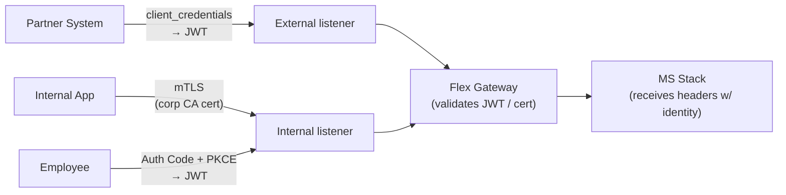
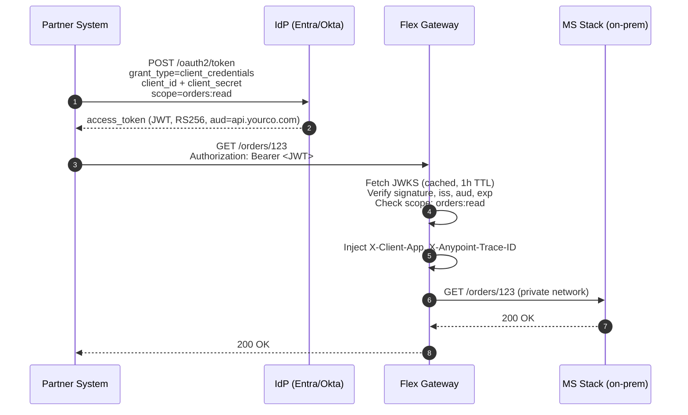
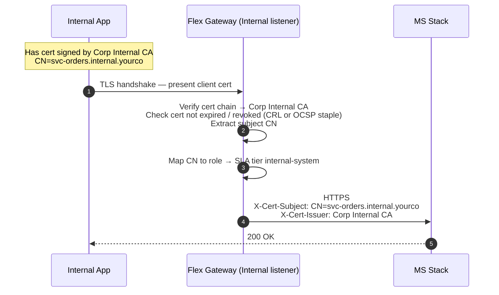
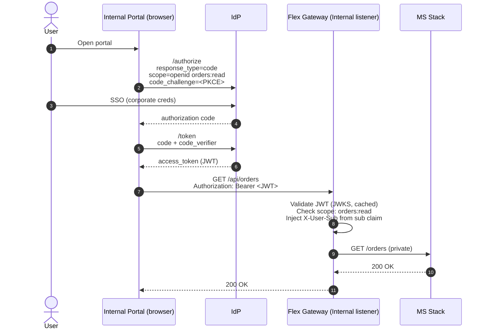

# 03 — Identity & Authentication Strategy

How the gateway authenticates callers across the three audiences — external partners, internal apps, and human users — and how that ties back to the Microsoft stack behind it.

---

## 1. Three audiences, three credentials

| Audience | Use case | Credential | Validated by |
|---|---|---|---|
| **External partner systems** | B2B API calls (orders, inventory) | OAuth 2.0 **Client Credentials** → JWT | Flex Gateway via JWKS |
| **Internal services** (service-to-service) | Internal apps calling APIs over private network | **mTLS** (cert signed by internal CA) | Flex Gateway via truststore |
| **Internal human users** | Employee-facing internal portals | **OAuth 2.0 Authorization Code (PKCE)** → JWT | Flex Gateway via JWKS |

One token type, two transport conventions. Pick the right one per listener:



---

## 2. Pick the IdP

You're already running an SSP project with an IdP. Reuse it.

| Candidate IdP | When to choose | Notes |
|---|---|---|
| **Okta** | Most common enterprise choice; cleanest OIDC; native RFC 8693 token exchange | Recommended if you're greenfield — see **[doc 21](21-okta-integration.md)** for implementation specifics |
| **Azure AD / Entra ID** | Microsoft-stack shop, already paying for E3/E5 | Most likely fit given your MS stack downstream |
| **PingFederate** | Banking / regulated; on-prem deployment available | Strong feature parity with Okta |
| **AWS Cognito** | You already use it for the AWS SSP work | Cheap and simple, but **no native RFC 8693** — limits future token-exchange options |
| **Anypoint built-in OAuth provider** | Don't choose this | Lacks SSO with corporate IdP; creates a second user store; fine for sandbox only |

**Recommendation: Azure AD / Entra ID** if you're a Microsoft shop running BizTalk/Logic Apps downstream — you already pay for it, Conditional Access policies extend naturally to API consumers, and Entra issues OAuth 2.0 + OIDC compliant JWTs with a JWKS endpoint Flex Gateway can validate against.

---

## 3. External partners — OAuth 2.0 Client Credentials → JWT

### Flow



### Token claims expected

```json
{
  "iss": "https://idp.yourco.com",
  "aud": "api.yourco.com",
  "sub": "partner-acme",
  "azp": "partner-acme-svc-app",
  "scope": "orders:read orders:write",
  "exp": 1718812800,
  "iat": 1718809200,
  "tier": "Gold"
}
```

The custom `tier` claim is mapped by Anypoint to the SLA rate-limit tier (see [02 — Policies §3](02-policies.md#3-external-listener--policy-bundle)).

### Anypoint Connected App vs IdP-issued JWT — pick one

| | Anypoint Connected App (built-in) | External IdP JWT (Entra/Okta) |
|---|---|---|
| Who issues the token | Anypoint Access Management | Your enterprise IdP |
| Where credentials live | Anypoint client app registry | IdP service principal store |
| Pro | Cleanest integration with API Manager SLA tiers | Single source of truth for all credentials |
| Con | Second credential store to manage | Slightly more policy config |

**Recommendation: External IdP JWT** for partners. One credential store, one rotation policy, one offboarding workflow. Anypoint Connected Apps are fine for sandbox/dev only.

---

## 4. Internal apps — mTLS



### Why mTLS, not JWT, for internal services

- **No token lifecycle to manage** — cert renewal is a 1–2 year cadence handled by CA tooling
- **No IdP round-trip** — cert chain validation is local
- **Strong service identity** — pinned to the cert, not bearer-token-portable
- **Already common in the MS stack** — your BizTalk / IIS hosts likely already do mTLS with internal CA

### Cert lifecycle (own this in your PKI process)

| Concern | Approach |
|---|---|
| Issuance | Cert-manager / ADCS auto-enrollment for K8s workloads; manual CSR for VMs |
| Rotation | Auto-rotate 30 days before expiry; cert-manager handles it on K8s |
| Revocation | CRL distribution point published every 12h + OCSP responder; Flex Gateway checks OCSP |
| Truststore in Flex Gateway | Corp Internal CA cert; rotate when CA rotates (every 5–10y) |

---

## 5. Internal human users — OAuth Auth Code + PKCE

For employee-facing portals that hit the API on the user's behalf.



### Why PKCE even for confidential clients

PKCE adds negligible cost and protects against code-interception in any browser-hosted flow. Make it mandatory on all OIDC flows in the IdP config — there's no good reason to omit it now.

---

## 6. JWKS caching strategy (matches [the AWS SSP project pattern](https://github.com/kantheti73/aws_ssp_webmethods_onprem/blob/main/docs/02-oauth-flow.md#jwks-caching-strategy))

| Setting | Value |
|---|---|
| JWKS fresh TTL | 1 hour |
| Stale-while-revalidate window | 6 hours |
| Refresh trigger | Cache miss OR `kid` not in cache |
| Clock skew leeway | 60 seconds |
| Algorithms accepted | RS256, RS384, ES256 (reject `none`, HS256, etc.) |

In Flex Gateway, this is configured under the **JWT Validation** policy → Advanced → JWKS URL + cache settings.

---

## 7. Backend identity propagation — what the MS stack sees

By the time Flex Gateway hands a request off to BizTalk / Logic Apps, the original credential is gone (the partner's JWT, the client's cert) and identity is conveyed via headers:

| Header | Source | Example |
|---|---|---|
| `X-Anypoint-Trace-ID` | Generated per request | `00-4bf92f3577b34da6a3ce929d0e0e4736-...` |
| `X-Client-App` | OAuth `azp` claim OR cert CN | `partner-acme-svc-app` |
| `X-User-Sub` | OAuth `sub` claim (if user flow) | `john.doe@yourco.com` |
| `X-SLA-Tier` | OAuth custom `tier` claim OR derived | `Gold` |
| `X-Cert-Subject` | mTLS cert (internal listener) | `CN=svc-orders.internal.yourco` |
| `X-Cert-Issuer` | mTLS cert issuer | `CN=Corp Internal CA` |

**Critical:** the MS stack must trust these headers **only** when received over the private network from Flex Gateway. Any direct callers should be rejected at the network layer (FW rule), and BizTalk / Logic Apps should not even listen on a public interface.

---

## 8. Token caching at the gateway

| Cache | Lifetime | Purpose |
|---|---|---|
| JWKS | 1h fresh, 6h max stale | Avoid IdP load |
| JWT validation result (per-token) | Until `exp` − 60s | Avoid re-validating the same token in tight loops |
| OAuth introspection (if used, not recommended) | 60s | Mandatory if introspection is the validation path |

JWT validation against JWKS is local and cheap — caching the validation result is optional unless you see micro-burst patterns where the same partner hammers the same token thousands of times in a few seconds.

---

## 9. Mapping to Anypoint API Manager policies

| Audience | Policy in API Manager |
|---|---|
| External partners | **JWT Validation** (JWKS-backed) + **Client ID Enforcement** (Anypoint client registry for SLA tier) |
| Internal mTLS | **Mutual TLS** (listener-level, configured on the Private Space ingress) |
| Internal JWT | **JWT Validation** (same policy, different listener + different JWKS URL if separate IdP for users vs services) |

### Why two JWT Validation policies and not one

If your partners and your employees live in different IdPs (common — Okta for partners, Entra for employees), each listener needs its own JWT Validation policy configured with the corresponding issuer + JWKS URL. The policy itself is the same; the parameters differ.

---

## 10. Open questions to confirm before implementation

1. **Which IdP is authoritative for which audience?** (Single IdP for everyone vs partners-in-Okta + employees-in-Entra)
2. **Does the MS stack require its own credential for backend systems?** (If yes, design a token-exchange or service-account injection step at Flex Gateway egress)
3. **Where does the `tier` claim come from?** (IdP-issued? Anypoint-injected based on `client_id` lookup? Backend lookup?)
4. **Corp Internal CA truststore distribution to Flex Gateway** — who provisions it and how is rotation handled?
5. **Partner onboarding workflow** — manual ticket → IdP service principal + Anypoint client app, or automated via Terraform / your IdP API?

---

## Related

- [01 — API Gateway Architecture](01-api-gateway-architecture.md)
- [02 — Policies](02-policies.md)
- [04 — CI/CD](04-cicd.md)
- **[21 — Okta Integration Specifics](21-okta-integration.md)** — when Okta is the chosen IdP, this is the implementation companion to this doc (custom authz server setup, JWKS URL gotchas, claim mapping, Terraform snippets, common errors)
