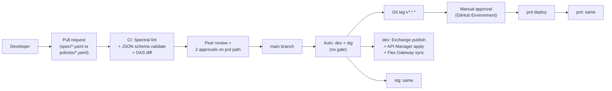

# 04 — CI/CD: Spec → Policy → Publish

Pipeline that takes an OpenAPI spec from this Git repo and lands it as a published, policy-enforced API on the Flex Gateway, across three environments (dev → stg → prd) — with no UI clicks in production.

---

## 1. Pipeline shape



---

## 2. Repo layout

```
MulesoftArchitecture/
├── specs/                          # OAS 3.x — source of truth
│   ├── orders-public-api/
│   │   ├── orders-public-api.yaml
│   │   └── examples/
│   ├── orders-internal-api/
│   │   └── orders-internal-api.yaml
│   └── inventory-public-api/
│       └── inventory-public-api.yaml
├── policies/                       # Policy bundles, per API per env
│   ├── orders-public-api/
│   │   ├── dev.yaml
│   │   ├── stg.yaml
│   │   └── prd.yaml
│   ├── orders-internal-api/
│   │   └── ...
│   └── _shared/
│       ├── external-listener-bundle.yaml
│       └── internal-listener-bundle.yaml
├── docs/
└── .github/workflows/
    ├── lint.yml
    ├── publish-dev-stg.yml
    └── publish-prd.yml
```

**Why specs and policies in the same repo?** Spec changes often need a matching policy change (new scope, new rate-limit envelope). Coupling them means PRs review both atomically.

---

## 3. Authentication — GitHub Actions → Anypoint

**No long-lived secrets in GitHub.** Use Anypoint **Connected Apps** with the Client Credentials grant:

| Step | Action |
|---|---|
| 1 | In Anypoint Access Management, create **Connected App** `github-actions-ci` |
| 2 | Grant **specific** roles per environment: `API Manager / Manage APIs`, `Exchange / Exchange Contributor`, `Runtime Manager / Manage Applications` |
| 3 | Capture client ID + secret |
| 4 | Store in GitHub Secrets as `ANYPOINT_CLIENT_ID` / `ANYPOINT_CLIENT_SECRET` |
| 5 | Optionally separate per-env secrets: `ANYPOINT_PRD_CLIENT_ID` etc. |

**Better still — OIDC trust** (when MuleSoft adds GitHub OIDC support, currently in beta): GitHub Actions presents an OIDC token; Anypoint verifies it and issues a short-lived access token. No long-lived secret in GitHub at all. Wire this when it goes GA.

---

## 4. Tooling — Anypoint CLI

`anypoint-cli-v4` is the official CLI. Install in the pipeline:

```yaml
- name: Install Anypoint CLI
  run: npm install -g anypoint-cli-v4

- name: Authenticate
  run: |
    anypoint-cli-v4 conf authentication.type client_credentials
    anypoint-cli-v4 conf client_id "$ANYPOINT_CLIENT_ID"
    anypoint-cli-v4 conf client_secret "$ANYPOINT_CLIENT_SECRET"
```

Key commands used in the pipeline:

| Command | Purpose |
|---|---|
| `exchange asset upload` | Publish OAS spec to Exchange |
| `api-mgr api manage-from-exchange` | Register API instance in API Manager |
| `api-mgr policy apply` | Attach a policy to an API |
| `api-mgr policy disable` | Detach |
| `runtime-mgr application deploy` | Deploy Flex Gateway runtime (one-time per env) |

---

## 5. Lint workflow — `.github/workflows/lint.yml`

```yaml
name: Lint
on:
  pull_request:
    paths: ['specs/**', 'policies/**']

jobs:
  lint:
    runs-on: ubuntu-latest
    steps:
      - uses: actions/checkout@v4
      - uses: actions/setup-node@v4
        with: { node-version: '20' }

      - name: Install linters
        run: |
          npm install -g @stoplight/spectral-cli ajv-cli

      - name: Spectral lint OAS specs
        run: spectral lint 'specs/**/*.yaml' --fail-severity=warn

      - name: Validate policy YAML against schema
        run: |
          for f in policies/**/*.yaml; do
            ajv validate -s policies/_schema.json -d "$f" --strict=false
          done

      - name: OAS breaking-change diff (prd only)
        if: contains(github.event.pull_request.labels.*.name, 'breaking-allowed') == false
        uses: oasdiff/oasdiff-action@main
        with:
          base: 'origin/main'
          revision: 'HEAD'
          fail-on: breaking
```

The breaking-change check is critical — without it, a contract change silently breaks partners. The `breaking-allowed` label is the explicit opt-out.

---

## 6. Auto-deploy to dev + stg — `.github/workflows/publish-dev-stg.yml`

```yaml
name: Publish dev + stg
on:
  push:
    branches: [main]
    paths: ['specs/**', 'policies/**']

jobs:
  deploy:
    strategy:
      matrix:
        env: [dev, stg]
    environment: ${{ matrix.env }}        # GitHub Environment — auto-approves
    runs-on: ubuntu-latest
    steps:
      - uses: actions/checkout@v4
      - uses: actions/setup-node@v4
        with: { node-version: '20' }

      - name: Install Anypoint CLI
        run: npm install -g anypoint-cli-v4

      - name: Authenticate
        env:
          CID: ${{ secrets.ANYPOINT_CLIENT_ID }}
          CSEC: ${{ secrets.ANYPOINT_CLIENT_SECRET }}
        run: |
          anypoint-cli-v4 conf authentication.type client_credentials
          anypoint-cli-v4 conf client_id "$CID"
          anypoint-cli-v4 conf client_secret "$CSEC"
          anypoint-cli-v4 conf environment ${{ matrix.env }}

      - name: Publish all changed specs
        run: |
          for spec in specs/*/*.yaml; do
            name=$(basename "$(dirname "$spec")")
            version=$(yq '.info.version' "$spec")
            echo "Publishing $name @ $version"
            anypoint-cli-v4 exchange asset upload \
              --name "$name" \
              --type rest-api \
              --version "$version" \
              --properties.mainFile "$(basename "$spec")" \
              "$spec"
          done

      - name: Register / update API instances
        run: |
          for spec in specs/*/*.yaml; do
            name=$(basename "$(dirname "$spec")")
            version=$(yq '.info.version' "$spec")
            anypoint-cli-v4 api-mgr api manage-from-exchange \
              --groupId "$(anypoint-cli-v4 conf get org_id)" \
              --assetId "$name" \
              --assetVersion "$version" \
              --apiInstanceLabel "${{ matrix.env }}"
          done

      - name: Apply policy bundle
        run: ./scripts/apply-policies.sh ${{ matrix.env }}

      - name: Smoke test
        run: ./scripts/smoke-test.sh ${{ matrix.env }}
```

### `scripts/apply-policies.sh` (sketch)

```bash
#!/usr/bin/env bash
set -euo pipefail
ENV="$1"

for policy_file in policies/*/${ENV}.yaml; do
  api_name=$(basename "$(dirname "$policy_file")")
  api_id=$(anypoint-cli-v4 api-mgr api list --output json \
            | jq -r ".[] | select(.assetId==\"$api_name\") | .id")

  echo "Reconciling policies for $api_name (id=$api_id) in $ENV"

  # Read declared policies from YAML
  yq -o=json '.policies[]' "$policy_file" | jq -c . | while read -r p; do
    type=$(echo "$p" | jq -r '.type')
    config=$(echo "$p" | jq -c '.config')
    anypoint-cli-v4 api-mgr policy apply \
      --apiInstanceId "$api_id" \
      --policyId "$type" \
      --config "$config" || true
  done

  # Remove any policies on the API not declared in YAML (drift cleanup)
  ./scripts/reconcile-policies.sh "$api_id" "$policy_file"
done
```

**Drift cleanup is the unsexy but critical part.** Without it, a UI hotfix that someone forgot to revert lives forever — until production breaks differently from staging.

---

## 7. Production deploy — `.github/workflows/publish-prd.yml`

Triggered only by Git tags. Requires manual approval via GitHub Environment.

```yaml
name: Publish prd
on:
  push:
    tags: ['v*.*.*']

jobs:
  deploy-prd:
    environment:
      name: prd                        # Configured in repo Settings → Environments
      url: https://anypoint.mulesoft.com/apiplatform/yourco/#/apis
    runs-on: ubuntu-latest
    # Required reviewers + 5-min wait timer configured on the prd environment
    steps:
      - uses: actions/checkout@v4
      - uses: actions/setup-node@v4
        with: { node-version: '20' }

      - name: Install + authenticate
        env:
          CID: ${{ secrets.ANYPOINT_PRD_CLIENT_ID }}
          CSEC: ${{ secrets.ANYPOINT_PRD_CLIENT_SECRET }}
        run: |
          npm install -g anypoint-cli-v4
          anypoint-cli-v4 conf authentication.type client_credentials
          anypoint-cli-v4 conf client_id "$CID"
          anypoint-cli-v4 conf client_secret "$CSEC"
          anypoint-cli-v4 conf environment prd

      - name: Diff what will change
        id: diff
        run: |
          ./scripts/diff-against-prd.sh > prd-diff.txt
          cat prd-diff.txt
          echo "diff<<EOF" >> $GITHUB_OUTPUT
          cat prd-diff.txt >> $GITHUB_OUTPUT
          echo "EOF" >> $GITHUB_OUTPUT

      # Manual approval gate is enforced by the 'environment: prd' above

      - name: Publish specs
        run: ./scripts/publish-specs.sh

      - name: Apply policies
        run: ./scripts/apply-policies.sh prd

      - name: Verify deployment
        run: ./scripts/post-deploy-verify.sh

      - name: Notify Slack
        if: always()
        uses: slackapi/slack-github-action@v1
        with:
          payload: |
            {
              "text": "prd MuleSoft deploy ${{ job.status }}: ${{ github.ref_name }}\n${{ steps.diff.outputs.diff }}"
            }
```

### What `diff-against-prd.sh` does

Pulls current prd state from Anypoint (`api-mgr api list`, `api-mgr policy list`), compares against the desired state from the repo (`specs/` + `policies/`), and emits a human-readable diff. **Reviewers approve based on this diff**, not blind trust. This is the single most important step in the prd pipeline.

---

## 8. Environment promotion model

| Env | Anypoint Environment | API audience | Auto-deploy? | Smoke test? | Manual gate? |
|---|---|---|---|---|---|
| dev | `dev` | Internal devs only | On every merge to main | Yes | No |
| stg | `stg` | QA + partner sandbox | On every merge to main | Yes | No |
| prd | `prd` | Real partners + internal | On Git tag `v*.*.*` | Yes | **Yes** (2 reviewers) |

**Same spec / same policy YAML deploys to all three.** Differences (rate limits, audiences) are environment overlays in the policy YAML:

```yaml
# policies/orders-public-api/dev.yaml
extends: ../../_shared/external-listener-bundle.yaml
overrides:
  rate-limiting:
    config: { tpm: 999999 }    # effectively unlimited in dev

# policies/orders-public-api/prd.yaml
extends: ../../_shared/external-listener-bundle.yaml
overrides:
  rate-limiting:
    config:
      tpm-bronze: 60
      tpm-silver: 200
      tpm-gold:   1000
```

---

## 9. Rollback

| Layer | Rollback mechanism | RTO |
|---|---|---|
| Spec in Exchange | Re-publish previous version (`exchange asset upload --version N-1`) | ~2 min |
| Policy bundle | Revert the Git tag, re-run pipeline against revert | ~5 min |
| Flex Gateway runtime | CH2.0 deployment history → "Restore previous deployment" | ~3 min |
| Full disaster | Same as above, in reverse order: runtime → policy → spec | ~15 min |

**Tip:** keep the last **5** versions of each spec in Exchange. Anypoint defaults to unlimited; pruning is a separate housekeeping job (`exchange asset delete --version`).

---

## 10. Secrets / sensitive config

| Item | Where it lives | Why |
|---|---|---|
| `ANYPOINT_CLIENT_ID` / `_SECRET` (CI) | GitHub Secrets, per-environment | Standard |
| Per-API runtime config (DB URLs, etc.) | Anypoint Secure Property files OR Anypoint Secrets Manager | Encrypted at rest, retrieved at app start |
| Partner client IDs/secrets they receive | IdP only — never in this repo | Single source of truth |
| Internal CA private key | HSM / internal PKI infra | Never anywhere near CI |

**Hard rule:** if a secret appears in this repo (even base64'd, even in a closed PR), rotate it. No exceptions.

---

## 11. Anti-patterns to avoid

| Anti-pattern | Why |
|---|---|
| UI-only policy changes in prd | Drift; lost on next pipeline run |
| Same Connected App for all environments | Blast radius — a compromised CI credential reaches prd |
| Skipping the prd diff step | Reviewers approve blind |
| Auto-deploying to prd on every merge | Eventually breaks during a Friday afternoon |
| Storing partner secrets in Anypoint Connected Apps | Partners' creds belong in the IdP, not Anypoint |
| One huge `policies.yaml` per env | Re-apply rewrites the world; hard to diff |

---

## Related

- [01 — API Gateway Architecture](01-api-gateway-architecture.md)
- [02 — Policies](02-policies.md) — what gets applied by `apply-policies.sh`
- [03 — Identity](03-identity.md)
- [05 — Observability](05-observability.md) — alerting that picks up where this pipeline ends
