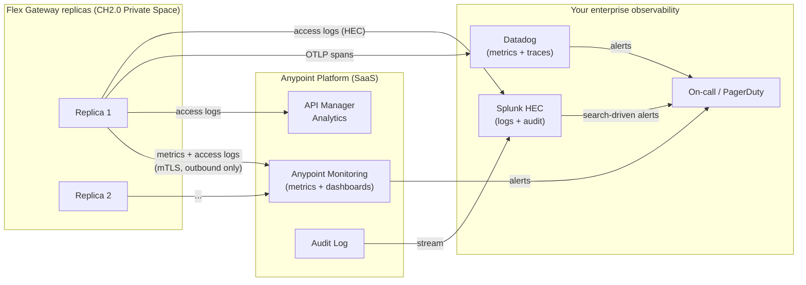
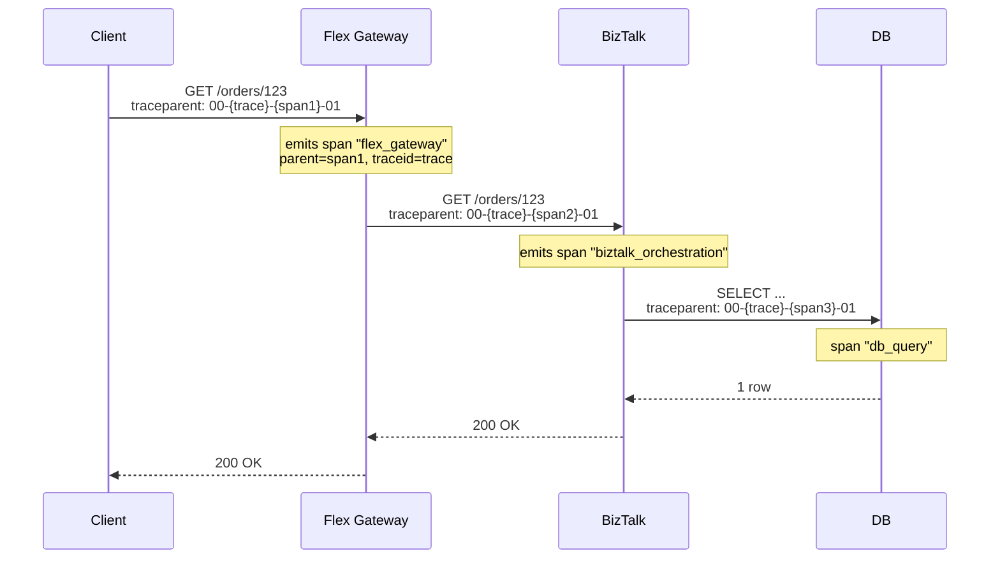
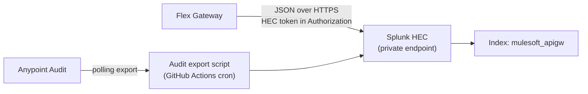

# 05 — Observability

Metrics, logs, traces, and alerts for the Flex Gateway tier. Two layers: **Anypoint-native** (always on, included in your subscription) and **enterprise SIEM/APM** (Splunk / Datadog / New Relic — where your on-call already lives).

---

## 1. The four observability signals

| Signal | Captured by | Stored in | Retention |
|---|---|---|---|
| **Metrics** (latency, RPS, error rate, policy counts) | Anypoint Monitoring agent in each Flex Gateway replica | Anypoint Monitoring (Titanium tier) + exported to enterprise APM | Anypoint: 30–90 days; APM: per your policy |
| **Access logs** (one line per request) | Flex Gateway native | Anypoint API Manager Analytics + streamed to SIEM | Anypoint: 90 days; SIEM: 1+ year |
| **Traces** (W3C `traceparent`) | Flex Gateway propagates and emits OTLP spans | Enterprise APM (Datadog / New Relic / Jaeger) | Per APM policy |
| **Audit events** (config changes, policy updates) | Anypoint Access Management | Anypoint Audit Log + SIEM stream | 1 year minimum |

---

## 2. Topology



**Dual-shipping is intentional.** Anypoint Monitoring is great for MuleSoft-specific views (policy counts, SLA tier breakdowns); your enterprise stack is great for correlation across services (Flex Gateway + MS stack + database). Don't pick one — ship to both.

---

## 3. The SLO set

Start with three. Add more once you have 60 days of baseline data.

| SLO | Target | Window | Source metric | Why |
|---|---|---|---|---|
| **Availability** | 99.9% | rolling 30 days | `non_5xx_requests / total_requests` | The "is the gateway working" answer |
| **Latency** | p95 < 200 ms, p99 < 500 ms (gateway overhead only) | rolling 7 days | Anypoint `response.time` minus backend time | Catches policy/runtime regressions independent of backend health |
| **Error rate** | < 1% | rolling 1 hour | `5xx / total` | Fast signal — pages within minutes |

99.9% over 30 days = 43 minutes of unavailability budget. Track burn rate, not just point-in-time.

### Alert thresholds derived from SLO

| Alert | Burn rate | Severity |
|---|---|---|
| Error rate > 5% for 5 min | 14.4×  | **Page on-call** |
| Error rate > 2% for 30 min | 5.7×  | **Page on-call** |
| Error rate > 1% for 6 hours | 1× | Ticket |
| p99 latency > 1s for 15 min | n/a | **Page on-call** |
| Replica count below desired for 5 min | n/a | Ticket |

Multi-window burn rate alerts (5min/1h, 30min/6h) catch both fast burns and slow leaks. Single-window thresholds miss one or the other.

---

## 4. Metrics — what to capture

| Metric | Type | Tags | Used for |
|---|---|---|---|
| `flex.requests` | counter | `api`, `listener`, `method`, `status_code`, `client_id`, `sla_tier` | RPS, error rate per audience |
| `flex.request.duration` | histogram | `api`, `listener`, `policy_chain_outcome` | Latency SLOs |
| `flex.policy.outcome` | counter | `api`, `policy`, `result` (allow/deny) | "Why are tokens getting rejected?" |
| `flex.upstream.duration` | histogram | `api`, `upstream_host` | Isolates gateway overhead from backend latency |
| `flex.upstream.errors` | counter | `api`, `upstream_host`, `error_type` | Backend health from the gateway's POV |
| `flex.replicas.active` | gauge | `space`, `az` | Capacity tracking |
| `flex.tls.handshakes` | counter | `listener`, `result`, `cipher` | mTLS health on internal listener |
| `flex.rate_limit.rejections` | counter | `client_id`, `sla_tier` | Capacity / abuse signal |
| `flex.jwks.fetches` | counter | `result` (hit/miss/refresh/fail) | IdP load + JWKS cache health |

All metrics carry `env`, `region`, `space` tags by default. Use them to slice by environment in dashboards.

---

## 5. Dashboards (build these on day one)

### 5.1 Gateway operations dashboard

| Row | Widgets |
|---|---|
| Headline | RPS (1h), error rate (1h), p95/p99 latency (1h), replicas active |
| SLO burn | Availability burn rate (1h, 6h, 24h), latency burn rate |
| Per-listener | RPS + error rate split by `listener=external` vs `internal` |
| Per-API | Top 10 APIs by RPS, top 10 by error rate, top 10 by latency |
| Backends | Upstream p95 latency by `upstream_host`, upstream 5xx rate |

### 5.2 Security & identity dashboard

| Row | Widgets |
|---|---|
| AuthN | JWT validations: success vs fail rate; reason breakdown (sig/exp/aud/iss) |
| AuthZ | Scope rejections per API |
| Threat | Threat policy hits per type (size, JSON depth, schema) |
| Rate limits | Top 10 clients hitting rate limit; SLA tier saturation |
| mTLS | Internal handshake success rate; cipher distribution |
| JWKS | Cache hit ratio (should be > 99%); fetch failures (should be 0) |

### 5.3 Per-partner dashboard (filterable by `client_id`)

| Widget | Purpose |
|---|---|
| RPS over 24h | Pattern recognition |
| Error rate | Self-inflicted vs platform |
| p95 latency | What this partner experiences |
| Top error codes | Which API + reason |
| Rate-limit rejections | Are they hitting their SLA tier? |
| Calls per scope | What they're actually using |

Share read-only versions of this with high-value partners. Halves your support load.

---

## 6. Access logs

### Format

JSON only. One log line per request. Schema:

```json
{
  "ts": "2026-05-18T14:32:11.482Z",
  "trace_id": "4bf92f3577b34da6a3ce929d0e0e4736",
  "span_id": "00f067aa0ba902b7",
  "env": "prd",
  "listener": "external",
  "api": "orders-public-api",
  "api_version": "1.4.0",
  "method": "GET",
  "path": "/orders/123",
  "status": 200,
  "client_ip": "203.0.113.42",
  "client_app": "partner-acme-svc-app",
  "client_sla_tier": "Gold",
  "user_sub": null,
  "duration_ms": 47,
  "upstream_duration_ms": 38,
  "upstream_host": "biztalk-prod.internal.yourco",
  "policy_decisions": {
    "jwt-validation": "allow",
    "rate-limit": "allow",
    "schema-validation": "allow"
  },
  "request_size_bytes": 0,
  "response_size_bytes": 1842
}
```

**Never log:**

- `Authorization` header value (the JWT itself)
- Request body
- Response body
- Cookies / session tokens
- Customer PII (email, name, account numbers) — even hashed; hash collisions + correlation attacks make this risky in long-term storage

**Do log:** trace IDs, client identifiers, sizes, durations, policy decisions. Enough for a "what happened to this request" investigation without leaking content.

### Log retention

| Storage | Retention | Cost concern |
|---|---|---|
| Anypoint API Manager Analytics | 90 days | Included in license |
| Splunk hot | 7 days | High |
| Splunk warm | 90 days | Medium |
| Splunk cold (S3) | 1 year | Low |
| Compliance archive (S3 Glacier) | 7 years if regulated | Very low |

7 years is the typical regulatory floor for financial / healthcare audit. Less if you're unregulated. Confirm with your compliance team.

---

## 7. Tracing — W3C `traceparent` end-to-end

Flex Gateway honors and propagates the `traceparent` header automatically. The full trace looks like:



End-to-end, one trace ID lights up Datadog from gateway → BizTalk → DB → back.

### Sampling

| Tier | Rate |
|---|---|
| Error responses (4xx/5xx) | 100% (always) |
| `client_sla_tier=Gold` | 100% |
| Other prd traffic | 10% head-based + 100% tail-based on slow requests (> p95) |
| Non-prd | 100% |

**Tail-based sampling on slow requests** is the high-value setting. You don't need every fast happy path, but every slow request needs a trace.

### OTLP target

Flex Gateway emits OTLP via the OpenTelemetry exporter. Point it at:

- **Datadog Agent in your VPC** (via PrivateLink from CH2.0 Private Space), OR
- **OTel Collector** you run in your VPC that fans out to Datadog / Jaeger / New Relic

Don't ship OTLP straight to Datadog SaaS over public internet — defeats the no-internet requirement and costs egress.

---

## 8. Log forwarding pipeline

### Splunk HEC (for access logs + audit)



Flex Gateway has a native log exporter config — point it at the HEC endpoint. HEC token in Anypoint Secrets Manager.

### Datadog (for metrics + traces)

| Path | Notes |
|---|---|
| Anypoint Monitoring → Datadog **metrics** integration | Built-in connector — pulls Anypoint metrics into Datadog. Connect once. |
| Flex Gateway → Datadog Agent **OTLP** | For traces. Agent runs in your VPC, reaches it over PrivateLink. |
| Flex Gateway → Datadog Agent **logs** | Optional; if you prefer Datadog over Splunk for logs. Pick one — dual-shipping logs is expensive. |

---

## 9. Alerting matrix

| Alert | Owner | Channel | Runbook |
|---|---|---|---|
| Error rate > 5% for 5 min | Platform on-call | PagerDuty + #ops | [Link to runbook] |
| p99 latency > 1s for 15 min | Platform on-call | PagerDuty | [Link] |
| Replicas < desired for 5 min | Platform on-call | PagerDuty | [Link] |
| JWKS fetch failures > 0 in 5 min | Platform on-call | PagerDuty | [Link] — usually means IdP down |
| Rate limit rejections > 10/min for a partner | API product owner | Slack #api-partners | Reach out, offer SLA upgrade |
| Schema validation rejections spike | API product owner | Slack #api-product | Likely a client deployment bug — proactive partner outreach |
| Audit log shows policy change outside CI | Security | PagerDuty | Out-of-band change — investigate immediately |

Alert fatigue kills response quality. Don't create alerts that fire more than ~once a week unless they're page-worthy. Everything else is a ticket or dashboard widget.

---

## 10. Synthetic monitoring

Real users only call your APIs unpredictably. Synthetic checks ensure you find out about outages before they do.

| Check | Frequency | From | Asserts |
|---|---|---|---|
| `GET /health` (no auth) | Every 30s | Datadog synthetic, 3 regions | 200 + < 100ms |
| `POST /orders` (canary, auth) | Every 5 min | Internal synthetic runner | 201 + valid order id returned |
| Full happy path: auth → create → fetch | Every 15 min | Internal | End-to-end < 2s |
| Per-partner sandbox call | Every 10 min | Datadog synthetic | 200 + correct response shape |

The "per-partner sandbox call" catches IdP issues, mTLS cert expiry, and partner-specific config drift before the real partner notices.

### Health endpoint design

```yaml
GET /health
Response:
{
  "status": "ok",
  "version": "flex-1.6.2",
  "checks": {
    "self": "ok",
    "jwks_cache": "ok",
    "upstream_biztalk": "ok"
  }
}
```

Each check is shallow (no business logic). Returns 200 if all are `ok`; 503 otherwise. **Critical:** do not require auth on `/health`. Defeats the purpose.

---

## 11. Runbook template (one per alert)

```
# Runbook: Error rate > 5% for 5 min

## Symptoms
- PagerDuty alert from Anypoint Monitoring
- Dashboard: <link>

## First checks (in order)
1. Anypoint Status page — is MuleSoft having an incident?
2. Datadog dashboard: which API + status code?
3. Splunk: search `mulesoft_apigw status>=500 | stats by api, status, upstream_host`
4. If concentrated on one upstream → check MS stack health
5. If across many upstreams → check Flex Gateway runtime (replica count, recent deploys)

## Mitigation
- If recent prd deploy → roll back per [04-cicd.md]
- If upstream issue → notify MS stack team; consider failover if multi-region
- If JWKS failure → flip JWKS cache to "extended stale" mode while IdP recovers

## Escalation
- 15 min unresolved → escalate to platform lead
- 30 min unresolved → declare incident, page comms
```

Every alert links to a runbook. No runbook → no alert. Forces you to think about response before the page fires at 3am.

---

## 12. Cost notes for 100K calls/day volume

| Signal | Tier | Cost ballpark |
|---|---|---|
| Anypoint Monitoring | Included with Titanium subscription | $0 incremental |
| Splunk indexing | ~50 MB/day of access logs | Lost in the noise of existing Splunk bill |
| Datadog metrics | ~50 custom metrics × replicas | ~$50/mo |
| Datadog traces | At sampled rates above, ~30k traces/day | ~$30/mo |
| Synthetic checks | ~5 checks at typical frequency | ~$50/mo |
| **Total observability uplift** | | **~$150/mo** |

At higher volumes the trace + log costs scale roughly linearly — revisit at 1M+ calls/day.

---

## Related

- [01 — API Gateway Architecture](01-api-gateway-architecture.md)
- [02 — Policies](02-policies.md) — `policy_decisions` field in access logs comes from here
- [03 — Identity](03-identity.md) — JWKS metrics + JWT validation outcomes
- [04 — CI/CD](04-cicd.md) — audit log feed comes from policy changes made by this pipeline
