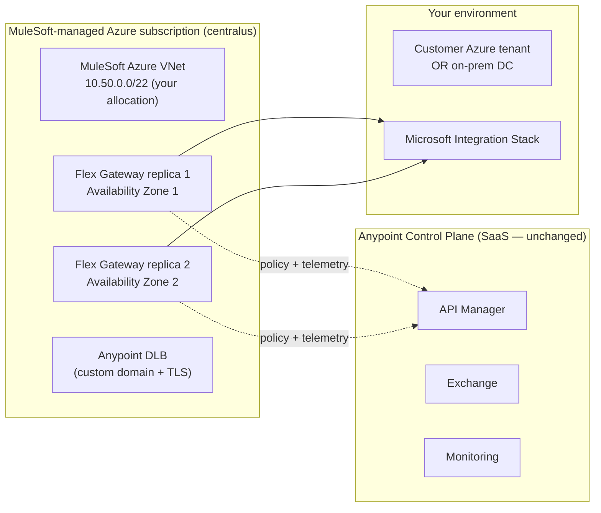
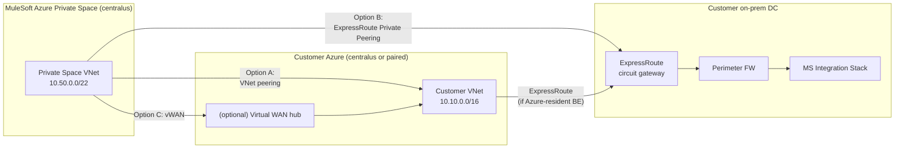
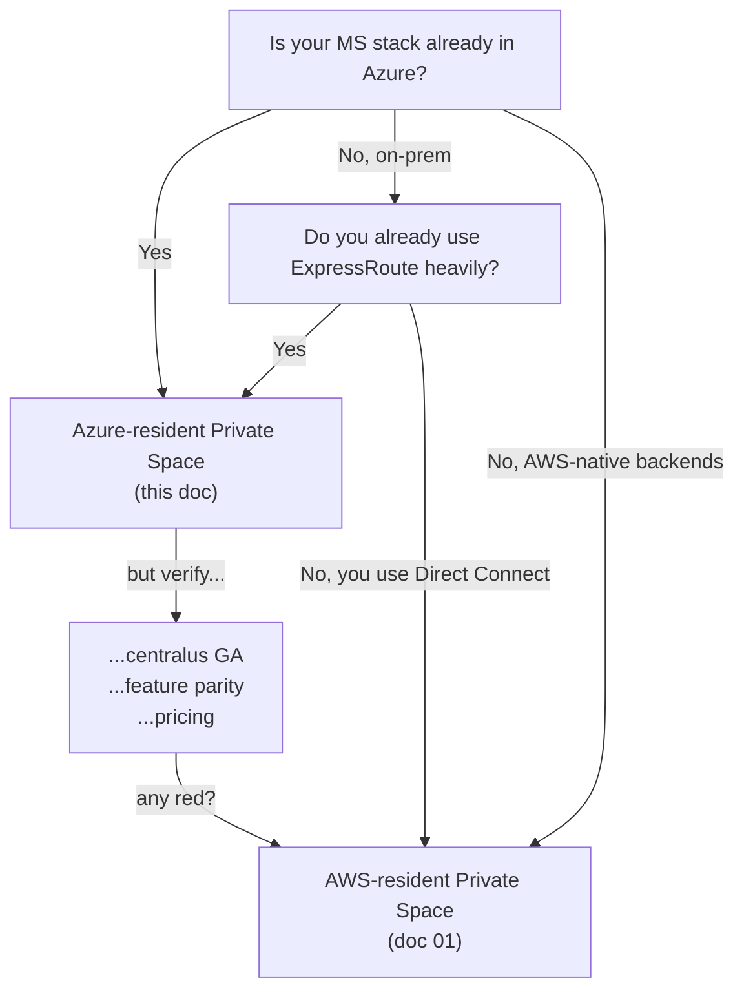

# 06 — Azure-Resident Anypoint Private Space (US Central)

Extends [01 §5 — Private Connectivity](01-api-gateway-architecture.md#5-private-connectivity--no-public-internet-to-on-prem) for the case where you'd prefer the data plane to run in **Azure** rather than AWS.

---

## ⚠ Verify with MuleSoft sales first

MuleSoft's Azure-resident Private Spaces have been rolling out **incrementally**, region by region, since their GA. Three things you MUST confirm with your MuleSoft account team **before** anchoring this design:

1. **Region availability** — that `centralus` is currently GA (not preview) for Anypoint Private Spaces on Azure. If `centralus` isn't open yet, your nearest viable regions are typically `eastus2` or `southcentralus`.
2. **Feature parity** with AWS Private Spaces — capabilities like Anypoint Security Edge, custom DLB, and some auto-scale thresholds have historically landed on AWS first. Get a written confirmation of what's GA on Azure today.
3. **Pricing** — Azure-resident Private Spaces are typically priced differently than AWS-resident; the base fee and data-egress meters differ. Treat any cost numbers in this doc as illustrative.

The rest of this document assumes those three come back green. If they don't, fall back to the AWS-resident pattern in doc 01.

---

## 1. What "Azure-resident Private Space" means

Same product, different cloud underneath:



The control plane (`anypoint.mulesoft.com`) is **unchanged** — it's still MuleSoft-operated SaaS, region-independent. Only the data plane moves to Azure.

---

## 2. Why Azure-resident vs AWS-resident

Pick Azure-resident when **any** of these hold:

| Reason | Detail |
|---|---|
| You're an Azure-native shop | Your hybrid connectivity is already ExpressRoute; AWS account just for TGW peering would be technical debt |
| Data residency requires Azure | Some sovereign-cloud / regulatory regimes accept Azure but not AWS |
| Your BizTalk / Logic Apps already runs in Azure | Backend stays in the same cloud — lowest egress + lowest latency |
| Existing Azure governance / cost-center is mature | Spinning up an AWS account adds tooling burden |
| Microsoft EA committed-spend pressure | Keeps the workload in Azure for committed-spend draw-down |

Pick AWS-resident if **none** of the above and AWS has the feature parity you need today.

---

## 3. US Central (`centralus`) specifics

| Attribute | Value |
|---|---|
| Azure region code | `centralus` |
| Location | Des Moines, Iowa |
| Availability Zones | 3 (1, 2, 3) — Anypoint Private Space deploys replicas across 2+ AZs |
| Paired region (Azure) | `eastus2` (Virginia) — relevant for DR & inter-region failover |
| ExpressRoute peering locations nearest centralus | Chicago, Dallas, Denver (verify with your carrier) |
| Typical RTT from on-prem (Chicago carrier hotel → centralus) | ~5–10 ms |
| Service availability concerns | Confirm Private Space GA in this region — see top warning |

**DR consideration:** If you want regional failover, the natural pair is `centralus` ↔ `eastus2`. MuleSoft will provision a second Private Space in `eastus2` — you'd run Flex Gateway active/active across both, fronted by **Azure Traffic Manager** or **Azure Front Door** for failover routing. Cost roughly doubles.

---

## 4. Connectivity options (Azure-side)



### Option matrix

| Option | Path | When |
|---|---|---|
| **A. VNet Peering** (Azure-to-Azure) | MuleSoft VNet ↔ your customer VNet | Customer Azure-native and the MS Integration Stack lives in Azure too (Logic Apps, AKS-hosted BizTalk migration, etc.) |
| **B. ExpressRoute Private Peering** | MuleSoft VNet → ER circuit → on-prem DC | Backend is **on-prem** (your stated situation); cleanest "no internet" path |
| **C. Azure Virtual WAN attachment** | MuleSoft VNet attaches to your vWAN hub; hub fans out to spokes + ER | You already use vWAN hub-spoke as your standard topology |
| **D. Site-to-Site IPsec VPN** | Over Azure VPN Gateway | Fallback / DR when ER circuit is down |
| **E. Azure Private Link** | One-way private endpoint to a specific service | Limited fit; works only when the MS stack is exactly one HTTPS endpoint |

### Recommended for your situation (MS stack on-prem + Azure-resident Private Space)

**Option B: ExpressRoute Private Peering** — primary.
**Option D: Site-to-Site VPN over the ExpressRoute circuit's Microsoft Peering** — warm backup.

This is the Azure analog of the AWS pattern in doc 01 §5 (TGW + Direct Connect primary, IPsec VPN backup). Same shape, different acronyms.

```mermaid
flowchart LR
    subgraph MS_Azure["MuleSoft Azure Private Space (centralus)<br/>10.50.0.0/22"]
        PS["Flex Gateway replicas"]
        PSGW["Private Space<br/>peering attachment"]
    end

    subgraph Cust_Azure["Customer Azure (centralus)"]
        ERGW["ExpressRoute<br/>Gateway"]
    end

    subgraph CarrierHotel["Carrier hotel (Chicago / Dallas)"]
        ER["ExpressRoute circuit<br/>1-10 Gbps, dual provider"]
    end

    subgraph OnPrem["On-prem DC"]
        VPN_GW["VPN gateway<br/>(backup path)"]
        FW["Perimeter FW"]
        F5["Internal LB"]
        MS["MS Integration Stack"]
    end

    PS --> PSGW
    PSGW -- "VNet peering" --> ERGW
    ERGW -- "Private Peering<br/>BGP" --> ER
    ER --> FW
    PSGW -. "IPsec over ER Microsoft Peering<br/>(failover)" .-> VPN_GW
    VPN_GW -. .-> FW
    FW --> F5 --> MS
```

---

## 5. Networking shape — what you'll actually configure

| Concern | Detail |
|---|---|
| **CIDR allocation** | You provide a `/22` (or larger) block for the Private Space. Must not overlap with your VNet, ExpressRoute prefixes, or on-prem CIDRs. |
| **DNS** | Private DNS zones in Azure can be linked to the Private Space VNet so Flex Gateway resolves `bizt-prod.internal.yourco` to internal IPs |
| **NSG rules** | MuleSoft manages the inbound NSG on Private Space subnets. You manage your side: allow 443 inbound from `10.50.0.0/22` to MS stack |
| **Route propagation** | BGP via ExpressRoute Private Peering. MuleSoft advertises Private Space CIDR; you advertise your on-prem CIDRs back |
| **Egress** | Outbound from Flex Gateway to your backend traverses the peering — no NAT, no public internet |
| **MTU** | Default 1500; ExpressRoute supports up to 1500. Not an issue for HTTPS traffic |
| **Encryption in transit** | TLS everywhere; ER Private Peering itself is not encrypted at L2/L3, so rely on TLS termination at Flex Gateway and on the backend |

---

## 6. Setup workflow (Azure side)

1. **Pre-allocate CIDR**: assign a `/22` (e.g. `10.50.0.0/22`) in your IPAM that doesn't overlap with any existing VNet, ER prefix, or on-prem subnet.
2. **Open MuleSoft Private Space request**: support ticket including target region (`centralus`), CIDR allocation, and intended connectivity option (B = ExpressRoute).
3. **MuleSoft provisions** the Private Space in `centralus`. They'll respond with their VNet ID + a peering offer.
4. **Accept the VNet peering** on your side (Azure Portal → your ExpressRoute Gateway VNet → Peerings → Accept). Set **"Allow gateway transit"** on MuleSoft's side, **"Use remote gateway"** on yours.
5. **Update ExpressRoute Gateway route table** to advertise the Private Space CIDR to on-prem via BGP.
6. **Update on-prem perimeter FW**: allow 443 from `10.50.0.0/22` (Private Space) to the MS stack internal hostnames/IPs.
7. **Private DNS zone link**: link your `internal.yourco` Private DNS zone to the Private Space VNet so Flex Gateway resolves backend hostnames privately.
8. **Smoke test**: deploy a tiny test API in the Private Space, hit it from a partner sandbox over the DLB, confirm the request reaches the MS stack via ER (verify in your FW logs, not the gateway logs).
9. **Document the CIDR allocation** in your central IPAM so the next team doesn't accidentally reuse `10.50.0.0/22` for something else two years from now.

**Realistic timeline:** ~3 weeks elapsed — slightly longer than AWS-resident because of the ExpressRoute coordination with your Azure networking team.

---

## 7. AWS-resident vs Azure-resident — gotchas table

| | AWS-resident (doc 01) | Azure-resident (this doc) |
|---|---|---|
| Customer needs an AWS account for peering | Yes (TGW attachment) | **No** — VNet peering is the path |
| Hybrid connectivity primitive | Direct Connect + TGW | ExpressRoute |
| Backup path | IPsec VPN over public internet OR DX Public VIF | IPsec VPN over ER Microsoft Peering |
| Cross-region pair | `us-east-1` ↔ `us-west-2` (your choice) | `centralus` ↔ `eastus2` (Azure-paired) |
| Anypoint Security Edge (WAF) | GA | **Confirm GA on Azure** — historically lagged |
| Custom DLB hostname/cert | GA | **Confirm GA on Azure** |
| Feature parity overall | Reference implementation | Catching up — ask for current parity matrix |
| Cost pattern | Per-vCore + DX data transfer | Per-vCore + ER egress (similar overall, different bill lines) |
| Most common surprise | "I need an AWS account?" | "Feature X isn't on Azure yet" |

---

## 8. Sizing notes specific to Azure (centralus)

For **5M calls/day** (current target — per doc 01 §6):

| Setting | Value | Note |
|---|---|---|
| Replicas | 4 (spread across AZ 1 + AZ 2) | `centralus` has 3 AZs — pick any two; failover is automatic |
| vCore size | 0.2 vCore per replica | Same as AWS sizing — same Omni Gateway under the hood |
| Auto-scale | min 4 / max 8 | Same |
| ExpressRoute circuit | 1 Gbps comfortable; share with other Azure traffic | 5M calls/day at ~5 KB avg = ~290 GB/day = ~27 Mbps avg, ~80 Mbps peak |
| Egress cost | ~$250/mo Prod data transfer at this volume | Re-evaluate at >25M calls/day |
| Service Bus tier (if used) | Premium, 1 MU sufficient for 5M events/day | See [doc 11 §11](11-azure-service-bus-integration.md#11-cost-considerations) |

**Egress note:** Azure egress through ExpressRoute is metered separately from VNet-to-VNet peering. Numbers vary by circuit type and ER tier — ask your Azure account team for the rate card.

---

## 9. Risks specific to this Azure path

| Risk | Likelihood | Mitigation |
|---|---|---|
| Private Space not yet GA in centralus | Possible — verify first | If only preview, either wait or fall back to `eastus2` |
| Feature gap vs AWS (Security Edge, advanced DLB) | Has happened historically | Get written parity matrix from MuleSoft; design without the feature if it's not there |
| ExpressRoute change window dependencies | Your network team's CAB cycle | Plan for 2-3 weeks of network change coordination |
| Routing loop on dual-path (ER + VPN) | If misconfigured | BGP local-pref + AS path prepending on the backup path; standard ER+VPN HA pattern |
| Cross-region DR cost doubling | Real concern at scale | Start single-region; add `eastus2` only when RTO requirements demand it |

---

## 10. Decision flowchart — Azure vs AWS Private Space for this project



For your specific situation (MS stack **on-prem**, no strong Azure preference signaled yet) — both work. Azure-resident wins if you already have ExpressRoute terminating in `centralus` or nearby. AWS-resident wins if you have an established AWS account + DX presence.

---

## Related

- [01 — API Gateway Architecture §5](01-api-gateway-architecture.md#5-private-connectivity--no-public-internet-to-on-prem) — AWS-resident equivalent
- [04 — CI/CD](04-cicd.md) — pipeline is cloud-independent
- [05 — Observability](05-observability.md) — OTLP / Splunk HEC paths apply equally (just over ExpressRoute instead of Direct Connect)
