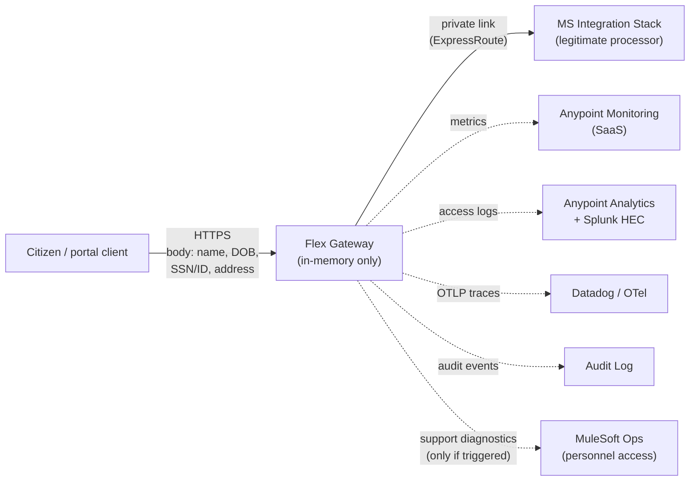

# 07 — Citizen Data on a SaaS API Gateway

The gateway handles **citizen data** — personally identifiable information that, if leaked, has legal and reputational consequences. This doc analyses the exposure surface of running the gateway on Anypoint SaaS (Azure-resident Private Space, `centralus`), enumerates concrete data-bleed vectors, and lists the mandatory controls and contractual commitments.

This is a **PII-bearing architecture**, not a generic-API architecture. Different rules apply.

---

## 1. What "data bleed" means here

Three distinct failure modes, all to be prevented:

| Mode | Example |
|---|---|
| **Persistent leak** | Citizen ID lands in a log line, log retained in Splunk for 1 year, anyone with Splunk read access can grep for it |
| **Side-channel leak** | High-cardinality metric tagged by citizen ID — visible in Anypoint Monitoring to anyone with org-level read |
| **Privileged-access leak** | MuleSoft support engineer takes a memory dump during incident response; the dump contains in-flight request bodies |

All three are reachable in a default Anypoint SaaS configuration. All three are preventable with explicit configuration + contract.

---

## 2. Inventory — where citizen data exists at each hop

Citizen data touches each of these places. Some are unavoidable (the request body must pass through Flex Gateway memory to be forwarded), some are configuration choices (whether the path containing an ID lands in logs), and some are operational (whether MuleSoft sees a memory dump during a P1).

---

## 3. The 12 specific bleed vectors

Numbered so they can be ticked off in a security review.

| # | Vector | Without controls | With controls (this doc) |
|---|---|---|---|
| 1 | Request **body** in access logs | Full body logged | Body never logged (doc 05 §6) |
| 2 | Request **path** containing IDs (`/citizens/{ssn}`) | Raw `ssn` in logs | Tokenize ID in path OR redact in log pipeline |
| 3 | **Query parameters** with PII | Raw in logs | Strip or hash in log shipper before HEC |
| 4 | **Authorization** header value (JWT) | Token logged | Never logged (doc 05 §6); JWT itself may also contain PII claims |
| 5 | **Response body** | Logged on errors | Never logged — even 5xx errors get a redacted log line |
| 6 | **Trace spans** auto-capturing URL / headers | Span attributes include full URL incl. IDs | Span attribute redaction list at OTel collector |
| 7 | **Metrics cardinality** — per-citizen tag | One metric series per citizen → effectively PII | Hard ban: never tag metrics by citizen ID, even hashed |
| 8 | **HTTP caching** at gateway | Cached response sitting in Flex memory | `Cache-Control: private, no-store` on all PII responses |
| 9 | **Error responses** echoing input | "User abc123 not found" leaks input | Generic error messages; details in correlated server log only |
| 10 | **JWT claims** containing PII (name, email) | Token is PII | Use opaque `sub` (UUID); don't put name/email in token |
| 11 | **Memory dumps / heap snapshots** during MuleSoft support | Diagnostic dump contains live request bodies | Contractually require MuleSoft to redact before review; or opt out of MS-initiated dumps |
| 12 | **Anypoint Control Plane analytics** | Aggregated metrics across your APIs land in `anypoint.mulesoft.com` | Confirm what flows up + contractually scope it (DPA) |

---

## 4. Cloud-specific surfaces (what's different vs on-prem)

| Surface | On-prem | Anypoint SaaS |
|---|---|---|
| Who runs the OS / JVM | Your sysadmins | MuleSoft SREs |
| Who can read runtime logs from the host | Your team | MuleSoft Ops (during support cases) |
| Who can take a memory dump | Your team | MuleSoft Ops (during P1 diagnosis, per their runbook) |
| Where backups live | Your storage | MuleSoft Azure subscription |
| Who has root on the underlying compute | You | MuleSoft (it's their Azure subscription) |
| Audit log of operator actions | Your SIEM | MuleSoft's internal SOC 2 controls — you don't see this audit log directly |
| Hypervisor / cloud-provider access | N/A (your bare metal or your hypervisor) | Microsoft Azure (CLOUD Act applicable) |

Two of these are **inherent SaaS residual risks**:

- **MuleSoft personnel access** during incident response. They commit to SOC 2 controls but you don't get per-incident transparency by default.
- **CLOUD Act exposure.** MuleSoft is owned by Salesforce (US company); Azure is Microsoft (US company). For US-citizen data on US infrastructure this is not a problem. For non-US citizens or specific contracts requiring no-US-government-access, this can be a hard blocker.

---

## 5. Compliance landscape — pick what applies

The right controls depend on **what kind of citizen data** and **what regulatory regime** is in scope. Confirm with your privacy/legal team:

| Regime | Triggers if… | Anypoint posture | What you'll need from MuleSoft |
|---|---|---|---|
| **HIPAA** | Health-related citizen data | MuleSoft offers a **BAA** (Business Associate Agreement) on request | Sign BAA before any PHI traffic |
| **GDPR** | EU citizens involved (even one) | MuleSoft has a **Data Processing Agreement** (DPA) | DPA + verify data stays in chosen region; document lawful basis |
| **CCPA / CPRA** | California consumers | Standard contractual; less prescriptive than GDPR | Privacy notice updates; honor deletion requests |
| **State PII laws** | Most US states have breach-notification rules | Encryption-in-transit + at-rest satisfies most | Document the controls in your incident response plan |
| **FedRAMP Moderate** | US federal civilian data | MuleSoft Anypoint has FedRAMP Moderate auth | Verify your specific Anypoint org is provisioned under it |
| **FedRAMP High** | Sensitive US federal data | Requires **Anypoint Government Cloud** (separate offering) | Different procurement; different region (GovCloud) |
| **StateRAMP** | State/local government data | Some states accept FedRAMP Moderate; verify | State-specific verification |
| **PCI-DSS** | Card data crossing the gateway | If gateway sees PAN, you become in-scope | **Don't let card data cross the gateway** — pass tokens, not PANs |

**For US citizen data in `centralus`**, the typical baseline is: standard Anypoint SaaS + DPA + your own state-law obligations. HIPAA layered on if any field is health-related.

---

## 6. Shared responsibility matrix (you vs MuleSoft)

| Control | Owner | Where it lives |
|---|---|---|
| TLS at the public edge | **You** (cert lifecycle), MuleSoft (termination) | Anypoint DLB config |
| Cert rotation for backend mTLS | **You** | Your PKI |
| Encryption in transit (gateway ↔ backend) | **You** (enforce via private DNS + cert validation) | Flex Gateway upstream config |
| Encryption at rest (Anypoint storage) | **MuleSoft** | Azure platform-level |
| Encryption at rest (your Splunk / SIEM after log shipping) | **You** | Your Splunk |
| Access control to Anypoint Platform UI | **You** (RBAC + SSO with corp IdP + MFA) | Anypoint Access Management |
| Access control to underlying Azure | **MuleSoft** (you can't access it) | MuleSoft Azure RBAC |
| Patching Flex Gateway runtime | **MuleSoft** | Their release pipeline |
| Patching your custom policy bundles | **You** | This repo |
| Audit of platform admin actions | **MuleSoft** (SOC 2) | Their internal audit |
| Audit of your team's admin actions | **You** (Anypoint Audit Log + Splunk forwarding) | Anypoint Audit + Splunk |
| Vulnerability scanning of Flex Gateway | **MuleSoft** | Their security org |
| Penetration testing of your APIs | **You** | Your security team's program |
| Incident detection on the gateway | Joint | MuleSoft for platform; you for app-layer |
| Incident response coordination | Joint | Your IR runbook should name MuleSoft escalation contact |
| Data subject access requests (GDPR Art 15) | **You** | You're the controller; MuleSoft is processor |
| Right-to-erasure (GDPR Art 17) | **You** + MuleSoft | You request; they purge from their logs per DPA |
| Breach notification | **You** are accountable; MuleSoft notifies you | DPA defines their notification SLA |

**Critical:** in regulator's view, **you are the data controller** even when MuleSoft is the processor. That accountability does not transfer with the SaaS contract.

---

## 7. Mandatory controls bundle (citizen-data version)

Layered on top of the policy bundle from [02 — Policies](02-policies.md):

### 7.1 At ingress (Flex Gateway external listener)

| Control | Configuration |
|---|---|
| TLS 1.3 only (drop 1.2 if you can) | DLB cipher policy |
| HSTS header on responses | Header injection policy |
| `Cache-Control: private, no-store` on all PII responses | Header injection policy (default for citizen APIs) |
| Schema validation that rejects unexpected fields | OAS `additionalProperties: false` |
| Request size limit aligned to expected payload | Schema-aware; reject anything 2× expected |
| DLP scan for PII patterns in request (catch caller mistakes) | Anypoint Security Edge — flag SSN-shaped fields in unexpected locations |

### 7.2 At observability boundaries

| Control | How |
|---|---|
| Access log schema: never include body, query params, full path | Doc 05 §6 |
| Path tokenization: replace IDs with `{id}` in logged path | OTel collector path-templating rule + log shipper sed |
| Trace span attribute deny-list | OTel collector `attributesProcessor` strips `http.request.body`, `db.statement`, etc. |
| Metric cardinality cap | Don't allow tags with > 100 distinct values; alert if a tag explodes |
| Audit log forwarding to Splunk with **30-min** ship-to-disk SLA | Per the DPA — ensures MuleSoft platform-side log retention isn't your sole audit copy |
| Encryption of Splunk indexes containing access logs | Splunk-level KMS-backed encryption |

### 7.3 At the contract / vendor layer

| Item | Status (verify with your procurement) |
|---|---|
| MuleSoft DPA signed | Required |
| MuleSoft BAA signed (if HIPAA in scope) | Required |
| Right-to-audit clause | Best-effort; MuleSoft offers SOC 2 reports, not direct customer audits |
| Sub-processor list disclosed | DPA requires this; Microsoft Azure will be on it |
| Breach notification SLA | Typically 72 hours per GDPR; verify wording |
| Data residency commitment | Written confirmation that `centralus` data does not transit to other regions for backup |
| Personnel access logging commitment | Ask for the policy on memory dumps + log access during support cases |

### 7.4 At identity / token layer

| Control | How |
|---|---|
| JWT `sub` claim is opaque UUID, not email/name/SSN | IdP configuration |
| No PII in any JWT claim | IdP claim mapping audit |
| Token TTL ≤ 15 min for citizen-facing APIs | IdP token lifetime policy |
| Refresh tokens revocable on logout | IdP session management |
| Audit log: every token validation outcome | Doc 05 §10 |

### 7.5 At backend handoff

| Control | How |
|---|---|
| `X-Citizen-Id` header (when needed) carries an internal opaque ID, not SSN | Flex Gateway claim-mapping policy |
| mTLS gateway → MS stack | mutual cert; cert rotation owned by you |
| MS stack rejects requests not bearing the gateway's client cert | NSG + application-level check |
| MS stack never logs the inbound `Authorization` value | Reinforce in MS stack ops runbook |

---

## 8. The "can I get a memory dump?" question

When MuleSoft Ops opens a P1 diagnostic on your Private Space, they may need to capture a heap or memory dump of a Flex Gateway replica to investigate. That dump contains **in-flight request bodies** — citizen data.

Three viable positions:

| Position | What you ask MuleSoft for | Trade-off |
|---|---|---|
| **A. Allow with redaction** | Written commitment: dumps are sanitized (PII patterns redacted) before any human reviews them | Slows their incident response; may resolve P1 slower |
| **B. Allow with consent** | Per-incident written consent before any dump is taken / reviewed | Adds approval latency to every P1; your security team is on-call |
| **C. Prohibit** | No memory dumps under any circumstance; rely on logs/metrics only | Some incidents become un-diagnosable; you accept extended outages |

**Recommendation: B**, with named approvers and a 30-minute SLA for response so it doesn't paralyze incident response. Document this in the DPA addendum.

---

## 9. Pros / cons — citizen data lens

Specifically with PII workload, the SaaS vs on-prem trade-off in [01 §4](01-api-gateway-architecture.md#4-saas-vs-on-prem--pros--cons) gains weight on these rows:

### SaaS (Anypoint Private Space) — additional PRO

- **Inherited compliance posture.** MuleSoft holds SOC 2 Type II, ISO 27001, and FedRAMP Moderate (Anypoint Government Cloud). For a small in-house team, matching that audit posture independently would cost ~$500K/yr+.
- **24/7 security operations.** MuleSoft SOC monitors platform-level threats; your team focuses on app-layer.
- **DPA, BAA available.** Standard enterprise vendor paperwork — not a surprise.
- **Built-in encryption at rest** for Anypoint-managed storage. You don't have to build that.

### SaaS (Anypoint Private Space) — additional CON

- **MuleSoft personnel have privileged access** to the runtime infrastructure (Azure side). You manage this contractually, not technically.
- **Memory-dump risk during incident response.** Live citizen data sits in Flex Gateway process memory. A diagnostic dump captures it.
- **Audit visibility gap.** You see *your* admin actions in Anypoint Audit Log. You **don't** see MuleSoft's internal operator actions. SOC 2 attestation is the only assurance.
- **CLOUD Act exposure.** US-jurisdiction provider on US-jurisdiction cloud. Acceptable for US-citizen data. Not acceptable for non-US-citizen data with cross-border restrictions.
- **No customer-controlled HSM / customer-managed keys (CMK) by default.** Anypoint's encryption-at-rest uses platform-managed keys. CMK is an enterprise add-on — confirm availability + price.
- **Data-residency lock-in.** Once Private Space is provisioned in `centralus`, moving to another region is a migration project, not a slider.

### On-prem (Flex Gateway in your DC) — when citizen-data risk tips you toward this

- Regulatory regime mandates on-prem (rare in US private sector; common in EU sovereign-cloud contexts)
- Your security team's risk appetite cannot accept any MuleSoft personnel access to data plane
- You already have a hardened on-prem PII platform (HSM, DLP, SIEM, dedicated SOC) — adding the gateway is incremental
- Volume is > 5M calls/day (where the on-prem cost amortization wins)

---

## 10. Residual risks — what you accept by going SaaS

After all the controls above are in place, these remain:

1. **MuleSoft insider threat.** Mitigated by their SOC 2 controls; not eliminated. Risk model: same as any major SaaS (Salesforce CRM, Microsoft 365). Comparable risk to your existing M365 footprint.
2. **Bug in Flex Gateway that leaks data across tenants.** Private Space is dedicated infrastructure, but the control plane is multi-tenant. A platform-level bug could theoretically expose metrics across tenants. Mitigated by MuleSoft's release engineering + bug bounty.
3. **Subpoena to MuleSoft.** US legal process can compel MuleSoft to produce data without notifying you first (per CLOUD Act). Document this in your data subject notice.
4. **Long-term retention of audit logs by MuleSoft.** Even after you delete an API, MuleSoft retains audit logs per their internal retention. Specify in DPA.

**Acceptable for US citizen data in most US-jurisdiction contexts.** Not acceptable for: foreign sovereign data, classified data, or contexts where any US-government access is forbidden.

---

## 11. Recommendation for this project

For citizen data on a SaaS gateway in `centralus`, with the controls above + DPA + (if applicable) BAA:

| | Verdict |
|---|---|
| **Technically viable?** | Yes |
| **Compliantly viable?** | Yes, for US citizen data under standard state-PII regimes; layered on with HIPAA BAA if health-related |
| **Acceptable residual risk?** | Yes, for most public-sector and private-sector use cases. Equivalent to risk profile of M365 / Salesforce. |
| **When to reject SaaS** | If your sovereignty/sensitivity regime forbids ANY US-jurisdiction processor access — go on-prem. |

The full controls bundle is non-negotiable. Going SaaS for citizen data without §7 controls is the architecture that ends up in a breach disclosure.

---

## 12. Pre-go-live security checklist

Print this. Tick before first prd traffic:

- [ ] DPA signed by both parties
- [ ] BAA signed (if any health data in scope)
- [ ] Data residency commitment in writing for `centralus`
- [ ] Memory-dump policy agreed (option B or stricter)
- [ ] CMK option evaluated — purchased or risk-accepted
- [ ] All access logs verified PII-free in stg (no body / query / path PII)
- [ ] All metrics audited for cardinality (no per-citizen tags)
- [ ] All trace span attributes audited (deny-list applied)
- [ ] HTTP cache disabled on PII responses (`no-store`)
- [ ] DLP rule active in Anypoint Security Edge
- [ ] JWT claims audited — no PII in claims
- [ ] Backend identity propagation uses internal opaque IDs, not SSN/email
- [ ] Splunk indexes encrypted with customer-managed KMS keys
- [ ] Splunk access RBAC reviewed — only authorized roles can read PII indexes
- [ ] Incident response runbook names MuleSoft escalation contact
- [ ] Data subject access request workflow documented
- [ ] Right-to-erasure workflow documented (including MuleSoft purge request path)
- [ ] Privacy notice updated to disclose SaaS processor
- [ ] Pen test scheduled before go-live and annually thereafter
- [ ] Security review sign-off from CISO / DPO

---

## Related

- [01 — API Gateway Architecture §4](01-api-gateway-architecture.md#4-saas-vs-on-prem--pros--cons) — updated to reflect citizen-data lens
- [02 — Policies](02-policies.md) — the policy stack referenced by §7.1
- [05 — Observability](05-observability.md) — log/metric/trace PII rules referenced by §7.2
- [06 — Azure-Resident Private Space](06-azure-private-space.md) — region-specific (centralus) considerations
