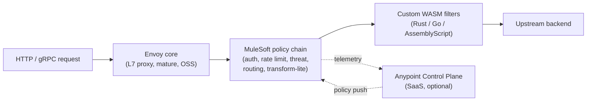

# 08 — Anypoint Flex Gateway: Product Deep-Dive

Honest evaluation of the product itself — what it is, where it shines, where it falls short, and what to verify before you commit. This is product-level, not deployment-level (deployment is doc 01 §2).

---

## 1. What it is, in one paragraph

Anypoint Flex Gateway is MuleSoft's **purpose-built API gateway**, separate from the full Mule runtime. It's an **Envoy-proxy-based** edge component (the same data-plane technology behind Istio, AWS App Mesh, and many CDNs), wrapped with MuleSoft's policy framework so it can be managed centrally from Anypoint Platform. It runs as a single binary on Linux, in Docker, in Kubernetes, or as a managed service in CloudHub 2.0. It is **not** a full integration runtime — there is no DataWeave, no Flow Designer, no orchestration. By design.

The "Anypoint" half is MuleSoft's value-add: centralized policy authoring, API catalog, analytics, SLA management. The "Flex" half is Envoy doing what Envoy is famously good at — high-throughput L7 proxying.

---

## 2. High points

### 2.1 Architecture

| | Why it matters |
|---|---|
| **Envoy under the hood** | Battle-tested at Lyft, Google, AWS scale. You inherit Envoy's stability, performance, and ecosystem. |
| **Purpose-built for gateway role** | No layers of unused integration runtime. Smaller attack surface, smaller blast radius, simpler mental model. |
| **Stateless replicas** | Scale horizontally without coordination. No cluster state to back up. Replicas are cattle, not pets. |
| **Cloud-agnostic** | Same binary on Linux VM, Docker, EKS, AKS, GKE, OpenShift, RHEL, or CloudHub 2.0. No lock-in to a specific runtime substrate. |
| **Two deployment modes** | **Connected** (managed by Anypoint) for SaaS-style ops, or **Local** (standalone) for fully air-gapped operation. Same binary, different config. |
| **Open standards alignment** | Native OpenAPI 3.x, OAuth 2.0, OIDC, JWT, mTLS, OpenTelemetry, W3C trace context. No proprietary token format. |

### 2.2 Performance

| | Concrete number |
|---|---|
| **Process footprint** | ~50 MB resident, ~100 MB peak — vs ~1 GB for a Mule runtime worker |
| **Cold start** | < 5 seconds to ready |
| **Per-request overhead** | Single-digit milliseconds with full policy chain (auth + rate limit + schema validation) |
| **Throughput per replica** | Hundreds to thousands of TPS at 0.1 vCore; tens of thousands at 1 vCore |
| **Memory profile** | Predictable, mostly steady-state. No GC pauses like a JVM runtime. |
| **HTTP/2 and gRPC native** | First-class — not bolted on |

### 2.3 Operations

| | What it gives you |
|---|---|
| **Hot policy reload** | Change a rate limit in API Manager → live in seconds, no restart |
| **Single binary** | One process to monitor, one log to tail. Compare to Mule runtime's JVM + multiple deployable apps. |
| **Built-in observability** | Prometheus-format metrics, JSON access logs, OpenTelemetry traces — all out of the box, no agent install |
| **Declarative config** | Policy YAML is diffable, reviewable in PRs. Less click-to-configure than Mule runtime. |
| **WebAssembly extensibility** | Custom logic via Wasm filters — sandboxed, language-agnostic (Rust, Go, AssemblyScript), modern extensibility model |
| **CloudHub 2.0 managed option** | Same binary deployed as a SaaS — auto-patching, auto-scale, multi-AZ HA by default |

### 2.4 Cost

| | Why it matters |
|---|---|
| **Cheaper vCore consumption** | A Flex Gateway replica at 0.1 vCore handles what a Mule runtime would need 0.5–1 vCore for |
| **Per-call pricing tier available** | In some Anypoint subscription bundles — better economics at low-to-moderate volumes |
| **No JVM heap to oversize** | You don't pay for memory headroom that a JVM warm-up requires |

### 2.5 Cloud-native fit

| | Why it matters |
|---|---|
| **Kubernetes-native deployment** | Helm chart, CRD-friendly, sidecar-compatible — fits modern platform engineering |
| **Multi-arch images** | Runs on amd64 + arm64; ARM compute is materially cheaper on AWS Graviton / Azure Ampere |
| **GitOps-compatible** | Declarative policy config + binary deployment = clean Flux/ArgoCD story |
| **Service mesh adjacency** | Same Envoy core as Istio's sidecars — your platform team's existing Envoy skills transfer |

---

## 3. Low points

Same honest treatment. These are real issues — not deal-breakers individually, but you should walk in with eyes open.

### 3.1 Maturity

| | Detail |
|---|---|
| **Younger product** | GA'd ~2022. Less battle-tested than full Mule runtime (15+ years). Some rough edges still being smoothed. |
| **Smaller community** | Stack Overflow tag count is a fraction of `mulesoft` general. Vendor docs are your primary support resource. |
| **Documentation gaps** | The basics are well-covered. Advanced scenarios (complex WASM filters, multi-listener configs, custom analytics) sometimes need a support ticket. |
| **Smaller talent pool** | "MuleSoft developer" on LinkedIn is common; "Flex Gateway specialist" is rare. Most Mule devs have to ramp up. |

### 3.2 Capabilities

| | Detail |
|---|---|
| **No orchestration / DataWeave** | By design, but a hard limit. If your needs grow into transformation/orchestration, you'll need to add Mule runtime alongside — not migrate into Flex. |
| **Smaller built-in policy catalog** | ~20 built-in policies vs ~40+ on Mule runtime + API Manager. Most common needs covered, but check edge cases. |
| **Body inspection is limited** | Without a custom WASM filter, you can't inspect or transform request/response bodies deeply. Header- and metadata-level work only. |
| **No native SOAP-over-JMS** | Legacy SOAP-over-HTTP works fine. SOAP over MQ/JMS needs a Mule runtime adapter in front. |
| **Granular routing within an API is awkward** | Policy attachment is per-API or per-API-instance. Per-route policy differentiation requires either splitting APIs or custom WASM logic. |
| **Limited inbound protocol mediation** | If a partner sends form-encoded and your backend wants JSON, Flex Gateway can't bridge that — needs Mule runtime or upstream service to do it |

### 3.3 Custom development

| | Detail |
|---|---|
| **Custom policies = WASM** | New skill: Rust / Go / AssemblyScript + Envoy's `proxy-wasm` SDK. Your existing MuleSoft developers (DataWeave / Flow / Java) cannot reuse those skills here. |
| **Debugging WASM is harder** | No equivalent of Anypoint Studio's flow debugger. You log, deploy, observe. Iteration loop is slower. |
| **Long-term WASM maintenance burden** | Every custom policy is one you carry across Flex Gateway version bumps. Choose them sparingly. |
| **Local emulation is tricky** | Spin-up a meaningful local test of a WASM policy + Anypoint policy chain requires effort. Most teams test in dev environment, not laptop. |

### 3.4 Operational

| | Detail |
|---|---|
| **Connected mode requires periodic Control Plane reachability** | Policies are cached locally so brief outages are fine, but extended (24h+) Anypoint outages eventually stop policy updates. Acceptable risk, but plan for it. |
| **Local mode loses central management** | Trade-off: full air-gap operation, but you give up the SaaS analytics, central policy push, and SLA management. Different ops story. |
| **Vendor lock-in to MuleSoft control plane** | The Anypoint policy format and the WASM SDK extensions are MuleSoft-specific. Migrating to a different gateway (Kong, Apigee) is a re-platforming, not a config-port. |
| **Auto-scaling latency on CH 2.0** | ~1–2 minutes for new replicas to come up. Fine for steady traffic; risky for sub-minute spike scenarios. Use spike-control policies to smooth. |
| **Early-version memory leaks** | Versions 1.0 / 1.1 had reports of memory leaks under sustained load. Resolved in 1.3+. Make sure your deploy targets a current LTS-equivalent release. |
| **Limited GUI for advanced configuration** | Many things require declarative config files (good for IaC, bad for ops engineers used to GUI-driven tooling). |

### 3.5 Cost (yes, also a low point)

| | Detail |
|---|---|
| **Anypoint license is the meaningful cost driver** | Flex Gateway itself is cheap to run, but the Anypoint Platform subscription (which you need to use Connected mode) is enterprise-priced. At low volumes the all-in cost per API is high. |
| **Per-call pricing tier isn't universally available** | Only in certain Anypoint bundles. Verify before assuming the economics. |
| **vCore pricing not as granular as you'd like** | The smallest CH 2.0 size is 0.1 vCore. For ultra-low workloads you're still paying that floor × replica count × HA. |

---

## 4. Where Flex Gateway is *right* — and where it isn't

| Scenario | Right fit? | Why |
|---|---|---|
| Pure API gateway role, no orchestration | **Yes** | Sweet spot |
| Cloud-native / Kubernetes shop | **Yes** | First-class K8s deployment, GitOps-friendly |
| Multiple downstream protocols (REST + gRPC + WebSocket) | **Yes** | Envoy excels here |
| Multi-cloud (need same gateway across AWS, Azure, on-prem) | **Yes** | Cloud-agnostic binary |
| Need DataWeave / transformations at the edge | **No** | Mule runtime is the right tool — or do it downstream |
| Need orchestration / saga / process logic at the edge | **No** | Wrong tool entirely; Mule runtime or another integration engine |
| Heavy SOAP / EDI / legacy protocols at the edge | **Mixed** | REST/SOAP-HTTP fine; SOAP-MQ / EDI needs another layer |
| 100% air-gapped, no internet at all | **Mixed** | Local mode works, but you lose central management; consider alternatives |
| Very low budget shop, < 50K API calls/month | **No** | Anypoint license floor makes per-call cost high; consider open-source alternatives |
| Mission-critical Day 1 with no MuleSoft expertise on staff | **Caution** | Bring in implementation partner; ramp-up is real |

---

## 5. How it compares to other gateways

Quick orientation — not a full evaluation. Use this to know when *not* to choose Flex Gateway.

| Gateway | Best at | Where Flex Gateway is better | Where it's better than Flex Gateway |
|---|---|---|---|
| **Kong Gateway** (OSS / Konnect) | Cloud-native, large plugin ecosystem, OSS | Better central policy + analytics in Anypoint | Larger plugin community, OSS option, more mature WASM tooling |
| **Apigee** (Google) | Strong API product management, monetization | Lighter runtime, cheaper per-call at moderate volumes | Better developer portal, deeper analytics, longer pedigree |
| **AWS API Gateway** | Tight AWS integration, serverless | Multi-cloud, more policy depth | Cheaper for AWS-only stacks; native Lambda integration |
| **Azure API Management** | Tight Azure integration, mature developer portal | Multi-cloud, no Azure lock-in | Better Azure-native experience, mature Developer Portal |
| **Mule Runtime + API Manager** | When you also need orchestration/DataWeave | Cheaper, lighter, faster for pure gateway role | Has DataWeave, Flow, Connectors — full integration capabilities |
| **NGINX Plus / Envoy raw** | Maximum control, minimum vendor | More managed (less DIY) | Lower license cost, more low-level control |

**The honest summary:**
- For **MuleSoft customers** doing API management: Flex Gateway over Mule runtime when the role is purely "gateway."
- For **green-field, cloud-native shops**: a real evaluation against Kong / Apigee / Azure APIM is worth doing.
- For **established MS-stack shops** (your context): Flex Gateway integrates well with the Anypoint platform you're already buying, and avoids the OSS-ops overhead of Kong.

---

## 6. Verification checklist before committing

Before you sign the SOW, verify these in your specific Anypoint org / region:

- [ ] Flex Gateway version available is **≥ 1.4** (older releases had operational issues — see §3.4)
- [ ] Required policies are in the catalog (audit your needed policies against the documented catalog for your version)
- [ ] WASM custom policy support is enabled in your subscription tier
- [ ] Connected mode is required to be available in your target region (it usually is, but verify)
- [ ] Local mode availability + license terms (in case you need air-gap fallback)
- [ ] LTS / release support window for the version you'd deploy (avoid being stuck on an EOL minor)
- [ ] If you're considering custom WASM: do you have a Rust/Go developer who'd own it long-term?
- [ ] Documented upgrade path for major versions (1.x → 2.x when it lands)

---

## 7. My architect-level take

For your stated requirements (API-edge only, 100K/day, MS stack downstream handles the data path) Flex Gateway is the **right tool, full stop**. The weaknesses in §3 are real but mostly orthogonal to your needs:

- §3.2 "no orchestration" — you've explicitly delegated that to the MS stack
- §3.3 "custom WASM" — you may not need any custom policies given the built-in catalog
- §3.5 "license cost floor" — you're a MuleSoft customer paying for the bundle anyway

The weaknesses that *do* apply:

- §3.1 maturity — manageable; document your version requirement and your patch cadence
- §3.4 vendor lock-in — real but accepted as part of the SaaS decision
- §3.4 auto-scale latency — mitigate with spike-control policies (already in [doc 02 §3](02-policies.md#3-external-listener--policy-bundle))

**Verdict:** the case for Flex Gateway in this architecture is strong. The case for *also evaluating* Apigee or Azure API Management is worth doing **only if** your org isn't already committed to Anypoint. If you're already an Anypoint customer (or strongly leaning that way), the evaluation cycle isn't worth the months it would take.

---

## Related

- [01 — API Gateway Architecture §2](01-api-gateway-architecture.md#2-recommended-product--anypoint-flex-gateway-connected-mode) — why Flex Gateway over Mule runtime + API Manager
- [02 — Policies](02-policies.md) — uses Flex Gateway's policy catalog
- [04 — CI/CD](04-cicd.md) — declarative deployment fits Flex Gateway's config model
