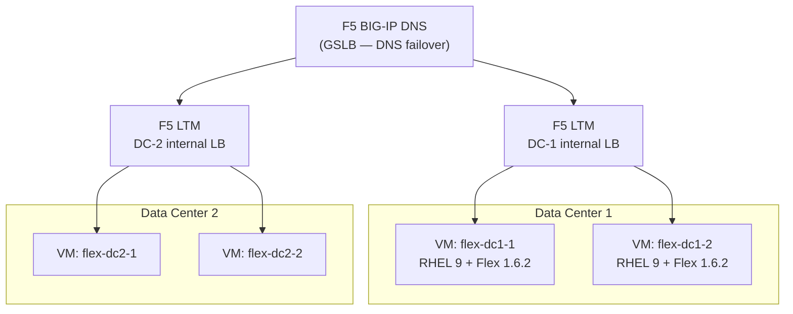
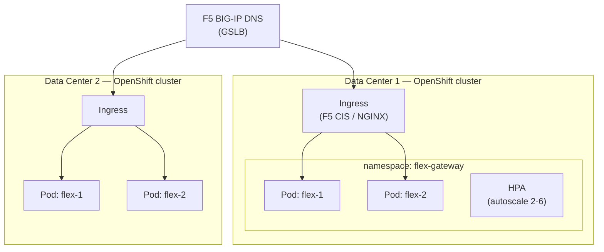
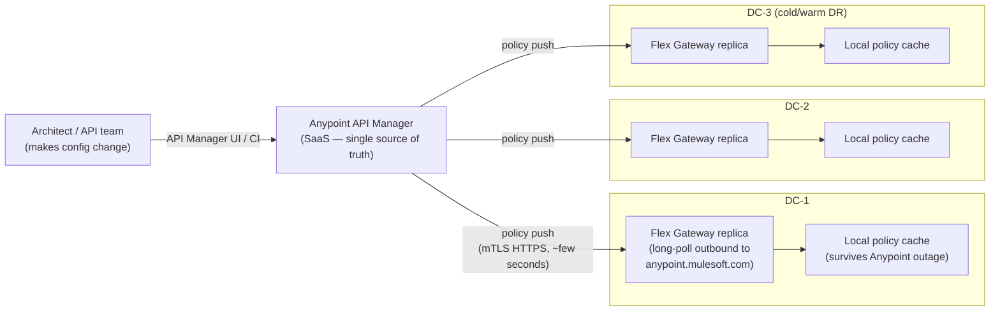
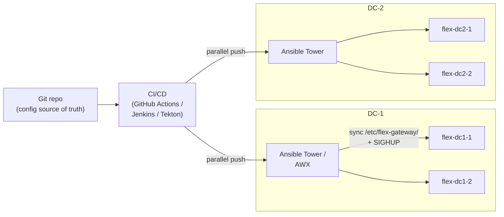
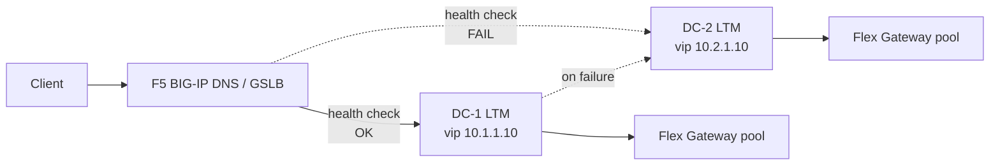

# 09 — On-Prem Install Guide for Anypoint Flex Gateway

End-to-end install guide for deploying Anypoint Flex Gateway in your own data center. Covers two viable deployment options (standalone VM vs Kubernetes), real disaster-recovery strategies with config replication mechanics, and hardware sizing keyed to the 100K calls/day target from [doc 01 §6](01-api-gateway-architecture.md#6-sizing-for-100k-callsday).

This doc is the **on-prem counterpart** to the SaaS path described in docs 01–08. If you're still deciding SaaS vs on-prem, read [doc 01 §4](01-api-gateway-architecture.md#4-saas-vs-on-prem--pros--cons) and the citizen-data lens in [doc 07](07-data-protection.md) first.

---

## 1. Scope & assumptions

- Target product: **Anypoint Flex Gateway 1.4+** (single binary; same image whether VM or K8s)
- Deployment mode: **Connected mode** by default (policies pushed from Anypoint Control Plane). Local mode notes called out where they differ.
- Topology: **two on-prem data centers** (DC-1 + DC-2), active/active by default
- Citizen-data workload — IdP federation per [doc 03](03-identity.md), policies per [doc 02](02-policies.md), observability per [doc 05](05-observability.md)
- OS baseline: **RHEL 8/9** or **Ubuntu 22.04 LTS** (both supported); RHEL is the typical enterprise default
- Kubernetes baseline: **OpenShift 4.12+** OR vanilla K8s 1.27+ (e.g. EKS-Anywhere, Rancher RKE2)

---

## 2. Prerequisites (both paths)

| Item | Owner | Note |
|---|---|---|
| Anypoint Platform subscription with Flex Gateway entitlement | MuleSoft account | Required even for Local mode (license key) |
| Anypoint **Connected App** for runtime registration | You (Anypoint admin) | One per environment; client_id + client_secret in your secrets store |
| **Outbound HTTPS to `anypoint.mulesoft.com`** (Connected mode only) | Network team | Allow 443 from each gateway host/pod. Local mode does not need this. |
| **Inbound traffic ports** | Network team | 443 external listener, 8443 internal listener (per [doc 02](02-policies.md)) |
| TLS certificates | PKI team | Public CA cert for external; internal CA for mTLS internal + backend |
| DNS — public + private records | DNS team | `api.yourco.com` (external) + `api-internal.yourco.local` (internal) |
| F5 GSLB (or NS1 / Akamai GTM) for cross-DC failover | Network team | See §7 |
| Time sync — NTP | Sysadmins | Critical for JWT `exp`/`nbf` validation; max skew 60s |
| Patching pipeline (OS + container image) | Platform team | Tie into your existing patching cadence |
| SIEM forwarding endpoint (Splunk HEC or equivalent) | Observability | Per [doc 05](05-observability.md) |
| Backup of `/etc/flex-gateway/` (config) | Backup team | Daily; survives node loss |
| **Redis Sentinel 3-node cluster per DC** (**required for Connected mode**) | Platform team | Per [MuleSoft docs](https://docs.mulesoft.com/gateway/latest/flex-security-best-practices#secure-redis-shared-storage), Omni/Flex Gateway in **Connected mode uses Redis shared storage to cache request data and runtime configurations**. Also backs distributed rate-limit counters. Not required for Local mode. Full design in [doc 10](10-redis-cache.md). |

---

## 3. Option A — Standalone Linux VM install

The simplest install path. One Flex Gateway process per VM, scaled by adding VMs.

### 3.1 RPM install (RHEL 8/9)

```bash
# 1. Add MuleSoft yum repository
sudo rpm --import https://flex-packages.anypoint.mulesoft.com/rpm/flex-gateway/gpg.key
sudo tee /etc/yum.repos.d/flex-gateway.repo <<'EOF'
[flex-gateway]
name=Anypoint Flex Gateway
baseurl=https://flex-packages.anypoint.mulesoft.com/rpm/flex-gateway/
enabled=1
gpgcheck=1
gpgkey=https://flex-packages.anypoint.mulesoft.com/rpm/flex-gateway/gpg.key
EOF

# 2. Install (pin a known LTS-equivalent version; do not rely on 'latest')
sudo dnf install -y flex-gateway-1.6.2

# 3. Register with Anypoint Control Plane (Connected mode)
sudo flexctl registration create \
  --token=<runtime-registration-token-from-anypoint> \
  --connected=true \
  --output-directory=/etc/flex-gateway/conf.d \
  fg-dc1-replica1

# 4. Enable + start
sudo systemctl enable --now flex-gateway

# 5. Verify
sudo systemctl status flex-gateway
flexctl version
```

### 3.2 Deb install (Ubuntu 22.04)

Same flow, swap repo + `apt`:

```bash
curl -fsSL https://flex-packages.anypoint.mulesoft.com/deb/flex-gateway/gpg.key | sudo gpg --dearmor -o /usr/share/keyrings/flex-gateway.gpg
echo "deb [signed-by=/usr/share/keyrings/flex-gateway.gpg] https://flex-packages.anypoint.mulesoft.com/deb/flex-gateway stable main" | sudo tee /etc/apt/sources.list.d/flex-gateway.list
sudo apt update
sudo apt install -y flex-gateway=1.6.2
```

### 3.3 systemd hardening (production)

```ini
# /etc/systemd/system/flex-gateway.service.d/hardening.conf
[Service]
User=flex
Group=flex
NoNewPrivileges=true
PrivateTmp=true
ProtectSystem=strict
ReadWritePaths=/etc/flex-gateway /var/log/flex-gateway /var/lib/flex-gateway
ProtectHome=true
LimitNOFILE=65536
TimeoutStopSec=30
Restart=on-failure
RestartSec=5
```

### 3.4 Topology — VM-based HA



| Pros (VM path) | Cons (VM path) |
|---|---|
| **Simple operational model** — your existing sysadmins already know Linux + systemd + F5 | **HA is manual** — you build active/active with F5 LTM + GSLB; no native self-healing |
| **No Kubernetes expertise required** | **Scaling is slow** — provisioning a new VM is minutes; can't scale on demand |
| **Standard Linux troubleshooting** — `journalctl`, `ss`, `tcpdump`, `strace` all work | **Rolling upgrades are manual** — orchestrated by your patching tool (Ansible / Tower / Satellite) |
| **Fits existing patching + monitoring pipelines** — same as any other Linux service | **Larger blast radius per change** — one misconfigured VM serves until you pull it from the LB |
| **Lower compute overhead** — no Kubernetes control-plane tax (~0.5 vCPU + 1 GB RAM per worker node saved) | **Config drift risk** — keeping all VMs identical depends on your config-management discipline |
| **Easier integration with existing F5** — VMs as backend pool members, classic pattern | **No native cross-VM service discovery** — backend routing is hardcoded or DNS-driven |
| **Easier to air-gap fully** (Local mode + no Anypoint) | **Self-healing requires F5 health checks + cron-based restarts**, not built in |

---

## 4. Option B — Kubernetes install

Helm-based deployment to OpenShift / EKS-Anywhere / Rancher RKE2 / vanilla K8s.

### 4.1 Helm install

```bash
# 1. Add MuleSoft Helm repo
helm repo add flex-gateway https://flex-packages.anypoint.mulesoft.com/helm
helm repo update

# 2. Register the gateway with Anypoint and get the registration secret
flexctl registration create \
  --token=<runtime-registration-token> \
  --connected=true \
  --platform=kubernetes \
  --output-directory=./reg-secrets \
  fg-dc1

# 3. Create namespace + secret
kubectl create namespace flex-gateway
kubectl -n flex-gateway create secret generic flex-gateway-credentials \
  --from-file=./reg-secrets/

# 4. Install via Helm (pin chart version)
helm install flex-gateway flex-gateway/flex-gateway \
  --namespace flex-gateway \
  --version 1.6.2 \
  --values values-prd.yaml
```

### 4.2 Production `values-prd.yaml` (excerpt)

```yaml
gateway:
  mode: connected
  replicaCount: 2                          # per DC; HPA can scale up
  resources:
    requests: { cpu: "1", memory: "1Gi" }
    limits:   { cpu: "2", memory: "2Gi" }
  podAntiAffinity:
    enabled: true                          # spread across nodes / AZs
  service:
    type: LoadBalancer                     # F5 BIG-IP CIS will catch this
    externalListener:  { port: 443 }
    internalListener:  { port: 8443 }

autoscaling:
  enabled: true
  minReplicas: 2
  maxReplicas: 6
  targetCPUUtilizationPercentage: 60

podDisruptionBudget:
  enabled: true
  minAvailable: 1                          # never drop below 1 during voluntary disruption

networkPolicy:
  enabled: true
  egress:
    - to: anypoint.mulesoft.com           # control plane
      ports: [443]
    - to: backend-ms-stack.internal       # MS stack
      ports: [443]

observability:
  prometheus: { enabled: true }
  openTelemetry:
    enabled: true
    endpoint: "otel-collector.observability.svc.cluster.local:4317"
```

### 4.3 Topology — K8s-based HA



| Pros (K8s path) | Cons (K8s path) |
|---|---|
| **Native HA** — replica failures self-heal in seconds (pod restart); no manual VM rebuild | **K8s expertise required** — cluster ops is a real specialization |
| **Self-healing** — liveness/readiness probes + restart policy out of the box | **More moving parts** — etcd, CNI, ingress controller, cert-manager, CSI all need monitoring |
| **Declarative + GitOps-friendly** — `values.yaml` + ArgoCD/Flux = clean reproducibility | **Resource overhead** — K8s control plane ~0.5 vCPU + 1 GB per worker node |
| **Horizontal Pod Autoscaler** — scales by CPU/memory or custom metrics in seconds | **Networking complexity** — CNI plugin choice, NetworkPolicy, ingress controller config |
| **Rolling upgrades native** — Helm + deployment rollout strategy | **Steeper learning curve** for traditional sysadmins |
| **Resource isolation** via namespaces / quotas / limit ranges | **Cluster upgrades are an ops project** — quarterly, with rollback plan |
| **Standard observability** — Prometheus + OTel collector pattern | **More attack surface** — kubelet API, kube-proxy, dashboards if exposed |
| **Multi-arch friendly** (arm64 + amd64 in one cluster) | **Persistent state needs CSI** — Flex is mostly stateless, but logs/buffers benefit from local SSDs |

---

## 5. VM vs K8s — when each wins

| You should pick… | When |
|---|---|
| **Standalone VM** | Your team owns Linux + F5 already; no existing K8s footprint; you want fewest moving parts; smaller scale (< 1M calls/day); air-gap simplicity matters |
| **Kubernetes** | You already operate K8s (OpenShift / Rancher) at scale; cloud-native / GitOps is your platform standard; you anticipate scale + autoscaling needs; you're consolidating onto a K8s platform anyway |
| **Hybrid (rare)** | Multi-stage migration — VM first for speed, migrate to K8s later when platform team is ready |

**Honest take:** for 100K calls/day specifically, both work. VM is faster to stand up if your team isn't already running OpenShift. K8s is the better strategic bet if you're betting on cloud-native long-term. Don't move to K8s solely for this workload — its overhead only pays off when you have multiple workloads sharing the cluster.

---

## 6. Hardware sizing

### 6.1 Minimums (any deployment)

| Component | Minimum (dev/test) | Recommended (prd) |
|---|---|---|
| vCPU per replica/pod | 2 | 4 |
| RAM per replica/pod | 2 GB | 8 GB |
| Disk per VM | 10 GB | 50 GB SSD (root + logs + working dir) |
| NIC | 1 Gbps | 10 Gbps (separate mgmt + data plane preferred) |
| OS | RHEL 8.6+ / Ubuntu 22.04 | RHEL 9 / Ubuntu 22.04 LTS |
| Kernel | 4.18+ | 5.14+ (better TCP performance) |

### 6.2 For 100K calls/day (our target)

| Setting | Value | Rationale |
|---|---|---|
| Replicas per DC | **2** | HA + rolling-upgrade headroom |
| Number of DCs | 2 (active/active) | DR + horizontal capacity |
| Total replicas | **4** | 2 per DC × 2 DCs |
| Per-replica spec | **2 vCPU / 4 GB RAM** | Well over 35 TPS worst-case spike |
| Per-replica storage | 50 GB SSD | Plenty for log rotation |
| Compute footprint | 8 vCPU + 16 GB RAM total | Across 4 VMs/pods |
| Network | 1 Gbps per VM is more than enough | Spike upper-bound is ~25 Mbps |

**Headroom check:** a single 2 vCPU replica sustains 200+ TPS at default config. With 4 replicas the cluster handles ~800 TPS — a 23× cushion over the 35 TPS worst-case spike.

### 6.3 Sizing curve — when to upsize

| Volume | Replicas / DC | Per-replica | Total compute |
|---|---|---|---|
| ≤ 100K/day (now) | 2 | 2 vCPU / 4 GB | 8 vCPU + 16 GB |
| 1M/day | 2 | 4 vCPU / 8 GB | 16 vCPU + 32 GB |
| 5M/day | 4 | 4 vCPU / 8 GB | 32 vCPU + 64 GB |
| 10M/day | 4 | 8 vCPU / 16 GB | 64 vCPU + 128 GB |
| 50M/day | 8+ | 8 vCPU / 16 GB + kernel tuning | 128+ vCPU + 256+ GB |

### 6.4 K8s-specific extras

- **Cluster nodes:** at least 3 worker nodes per cluster (anti-affinity + rolling upgrades)
- **Per-node minimum:** 4 vCPU + 8 GB RAM (leaves room after K8s overhead)
- **Persistent volumes:** not strictly required (Flex is mostly stateless), but a local SSD-backed PV for `/var/log/flex-gateway/` smooths log shipping under burst
- **Ingress controller:** F5 BIG-IP CIS, NGINX Plus, or HAProxy — your platform team's standard

---

## 7. Disaster recovery

### 7.1 DR posture options

| Posture | Description | RTO | RPO | Cost |
|---|---|---|---|---|
| **A. Cold standby** | DC-2 has VMs/pods provisioned but stopped; manual failover | 30–60 min | Zero for config (declarative) | 1.1× single DC |
| **B. Warm standby** (active/passive) | DC-2 running but at idle; GSLB sends 100% to DC-1; on failure flips to DC-2 | 1–5 min | Zero | 1.8× single DC |
| **C. Active/active across DCs (recommended)** | Both DCs serve traffic; GSLB weighted round-robin; DC failure = GSLB removes it | < 60s | Zero | 2× single DC |
| **D. Multi-region active/active** | DCs in different cities/regions (lat > 50ms apart) | < 60s | Near-zero (config) / backend-dependent (data) | 2.2× single DC |

**Recommendation for citizen-data workload:** **C (active/active across DC-1 + DC-2 within the same metro)**. RTO < 60s is achievable with F5 GSLB + 30s DNS TTL. Multi-region (D) only when geographic resilience is in your DR requirement.

### 7.2 Config replication — how it works in real time

This is the meat of the DR question. The replication mechanism depends on which mode you're running:

#### Connected mode (recommended) — Anypoint Control Plane is the source of truth



**Mechanics:**
- Every Flex Gateway replica registers with Anypoint Control Plane and maintains an **outbound long-polled HTTPS connection** to `anypoint.mulesoft.com`.
- Policy changes in API Manager are **pushed to all connected replicas within seconds** (typically 2–10s).
- The replica caches the policy locally so it can keep serving traffic if Anypoint is temporarily unreachable.
- **No replication tooling on your side** — Anypoint Control Plane IS the replication mechanism.
- DC failover is purely traffic routing (GSLB); config is already identical everywhere.

**RPO for config: zero.** Anypoint is the source of truth — no risk of half-replicated state.

#### Local mode (air-gapped) — you implement replication



**Mechanics (recommended pattern):**
- Config (declarative YAML) lives in a Git repo — single source of truth.
- CI pipeline pushes to **both DCs in parallel** on merge to `main`.
- Per-DC Ansible Tower / AWX runs the actual file deploy + `flex-gateway` reload (SIGHUP — hot reload, no restart).
- Reconciliation: periodic Ansible run drift-detects and corrects.

**Alternative patterns and their trade-offs:**

| Pattern | RPO | RTO (DR failover) | Operational burden | Verdict |
|---|---|---|---|---|
| GitOps + per-DC ArgoCD/Flux (K8s) | Near-zero | < 60s | Low | **Best for K8s** |
| GitOps + Ansible AWX (VM) | < 30s | < 60s | Medium | **Best for VM** |
| `rsync` from primary DC to DR | Minutes | < 60s | Low | OK; audit trail weaker |
| NFS/CIFS shared mount across DCs | Zero | < 60s | Low (but SPOF: shared FS) | **Not recommended** — shared FS is the new SPOF |
| Manual scp on each change | Hours | Variable | High | **Don't** |

#### Secrets + TLS keys (both modes)

| Secret | Replication mechanism | RPO |
|---|---|---|
| TLS server certs (public CA) | Distributed via your existing PKI / cert-manager / Venafi | < 1h after rotation |
| Internal CA certs (mTLS) | Same | < 1h |
| Anypoint Connected App secret (Connected mode) | Per-DC secret store (HashiCorp Vault with cross-DC replication, or Azure Key Vault with HA) | Real-time via Vault replication |
| Backend service credentials | Same Vault / Key Vault | Real-time |

**Hard rule:** never bake secrets into VM images or container images. Always pull at runtime from a properly-replicated secret store.

### 7.3 DNS failover (the actual cross-DC switch)



- GSLB does HTTPS health checks (`GET /health`) every 5–15s against each DC's LTM.
- TTL on the GSLB record: **30s** (balance: lower TTL = faster failover, higher DNS load).
- 3 consecutive failed checks (typical) = mark DC down + remove from rotation.
- Total RTO: GSLB detection (~30s) + DNS TTL expiry (~30s) = **~60s worst case**.
- Persistent-connection clients (long-lived TLS) may need TCP RST or DLB-level connection draining to fail over cleanly.

### 7.4 DR runbook — failing over DC-1 → DC-2

1. GSLB detects DC-1 health-check fail → automatically removes DC-1 from rotation (no human action).
2. On-call receives PagerDuty alert; opens incident bridge.
3. Validate the failure: is it DC-1 network, F5 LTM, or Flex Gateway itself?
4. If recovery > 30 min expected: declare DR; communicate to stakeholders.
5. Verify DC-2 is absorbing all traffic without saturation (CPU / latency / error rate dashboards).
6. If DC-2 saturating: scale replicas in DC-2 (K8s: `kubectl scale`; VM: power on warm-standby VMs from the F5 pool).
7. Begin DC-1 root-cause investigation in parallel.
8. Once DC-1 healthy: gradual re-add to GSLB rotation (start at 10% weight, ramp over 30 min).

---

## 8. Pre-install checklist

Print and tick before first `dnf install` / `helm install`:

- [ ] Flex Gateway version chosen (≥ 1.4; LTS-equivalent preferred)
- [ ] Connected vs Local mode decided
- [ ] Anypoint Connected App created per environment
- [ ] Runtime registration token retrieved and stored in secrets manager
- [ ] All 4 (or 2-per-DC) VMs or K8s pods provisioned at correct sizing
- [ ] OS hardening baseline applied (CIS benchmark or your equivalent)
- [ ] NTP configured + verified (`chronyc tracking` shows < 100ms offset)
- [ ] Outbound 443 to `anypoint.mulesoft.com` open (Connected mode)
- [ ] Inbound 443 + 8443 open from upstream LB
- [ ] Outbound to MS stack on 443 open + tested (`curl https://biztalk-prod.internal/health`)
- [ ] TLS certs deployed and validated
- [ ] Public DNS + private DNS records in place
- [ ] F5 LTM virtual server + pool configured per DC
- [ ] F5 GSLB record with health checks + 30s TTL
- [ ] Splunk HEC endpoint reachable + tested with sample log
- [ ] SIEM index created with appropriate retention
- [ ] PagerDuty + alert routing tested with a synthetic alarm
- [ ] DR runbook reviewed with on-call team
- [ ] Backup of `/etc/flex-gateway/` (or `helm get values`) on a daily cadence
- [ ] Patching cadence documented (monthly for OS, quarterly for Flex)
- [ ] Penetration test scheduled before go-live

---

## 9. Validation — first-traffic smoke tests

```bash
# 1. Each replica is running and registered
flexctl status                                 # VM
kubectl -n flex-gateway get pods,deploy,svc    # K8s

# 2. Health endpoint
curl -sS https://flex-dc1-1.internal/health    # local
curl -sS https://api.yourco.com/health         # through GSLB+LTM

# 3. Verify policy propagation latency (Connected mode)
#    Make a no-op policy change in API Manager → time how long until
#    a curl shows the new behaviour. Expect < 30s.

# 4. Cross-DC failover drill
#    Disable Flex Gateway on DC-1 → confirm GSLB shifts to DC-2 within 60s
sudo systemctl stop flex-gateway       # on DC-1 VMs
# … observe traffic shift in monitoring …
sudo systemctl start flex-gateway      # restore

# 5. Hot policy reload (Local mode)
#    Edit /etc/flex-gateway/conf.d/*.yaml → SIGHUP → verify reload
sudo systemctl reload flex-gateway
```

---

## 10. Risks & gotchas

| Risk | Mitigation |
|---|---|
| Network outage to Anypoint Control Plane > 24h | Local policy cache survives 24h+; alarm if cache age > 6h; document failover-to-Local-mode procedure |
| F5 LTM is single point of failure within a DC | Standard F5 HA pair (active/passive in same DC) |
| GSLB itself becomes SPOF | Multi-site GSLB (F5 BIG-IP DNS deployed in both DCs with sync) |
| OS patching window forces all-replica restart | Roll one VM at a time; never patch both DCs simultaneously |
| Flex Gateway version skew across DCs after upgrade | Roll one DC fully before starting the second; validate end-to-end at each step |
| Kubernetes cluster upgrade vs Flex upgrade collision | Decouple — never upgrade both in the same change window |
| Local mode config drift between DCs | GitOps + drift-detection (Ansible) on a daily schedule |
| Secrets sync lag between DCs | HashiCorp Vault performance replication (sub-second) or Vault Enterprise DR replication |

---

## Related

- [01 — API Gateway Architecture](01-api-gateway-architecture.md) — SaaS counterpart
- [04 — CI/CD](04-cicd.md) — pipeline that pushes policy YAML (relevant for Local mode)
- [05 — Observability](05-observability.md) — what to ship from the on-prem runtime
- [07 — Data Protection](07-data-protection.md) — when on-prem is the right choice for citizen data
- [08 — Flex Gateway Deep-Dive](08-flex-gateway.md) — product strengths/weaknesses
- [10 — Redis Cache for Flex Gateway](10-redis-cache.md) — when and how to add Redis for distributed rate limiting
