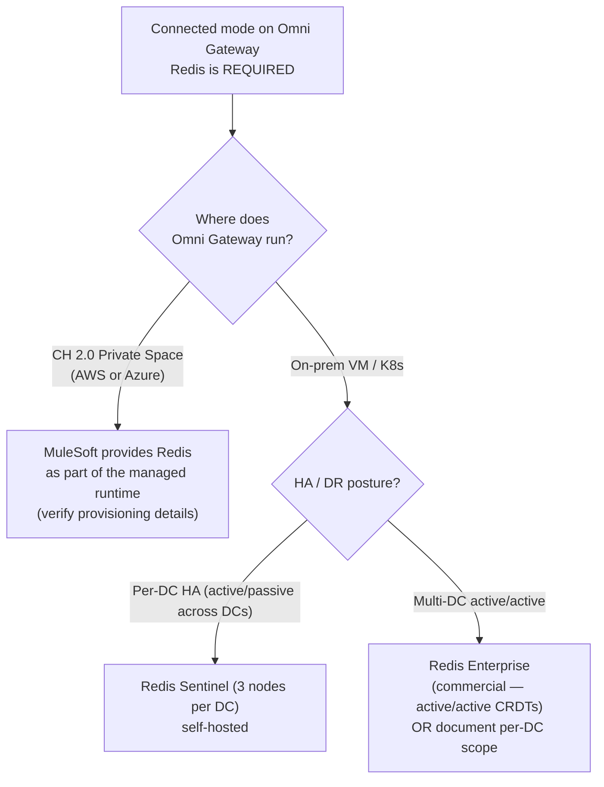
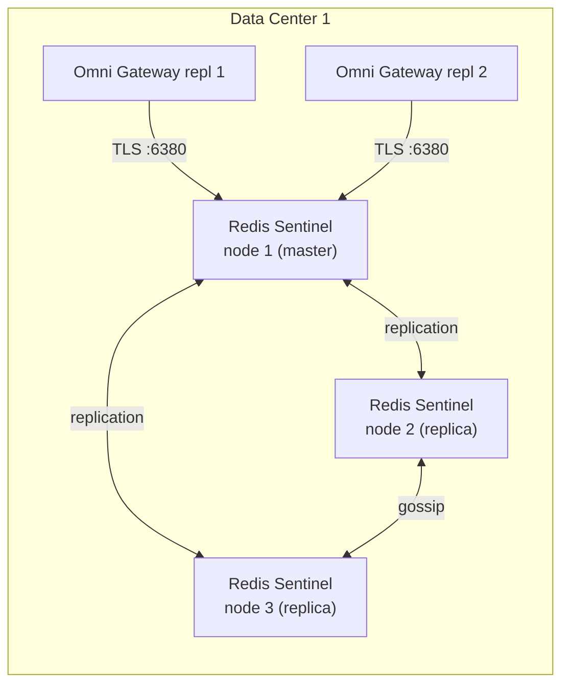

# 10 — Redis Shared Storage for Omni Gateway (Connected Mode)

This doc covers Redis usage with **Anypoint Omni Gateway** (the rebranded name for what was previously called Flex Gateway). It explains where Redis is required vs optional, what it stores, sizing, deployment shape, install, and DR.

> **Naming note.** MuleSoft has rebranded **Flex Gateway → Omni Gateway** in current documentation. The product, binary, and capabilities are the same; the name has changed. Throughout this repo, references to "Flex Gateway" and "Omni Gateway" are equivalent. Where we cite MuleSoft documentation, we use their current term ("Omni Gateway"). Where this repo's earlier docs (01–09) refer to "Flex Gateway", read as Omni Gateway — that's the same product.

---

## 1. The bottom line

Per the MuleSoft security best-practices documentation:

> "Omni Gateway uses Redis shared storage to cache request data and runtime configurations in **Connected Mode only**."

| Deployment mode | Redis required? | What Redis stores |
|---|---|---|
| **Connected Mode** (on-prem or CH 2.0 Private Space) | **Yes — required** | Request data cache + runtime configurations + distributed policy state (e.g. rate-limit counters) |
| **Local Mode** (fully air-gapped) | No | All state lives in declarative YAML files + in-process memory per replica |

If you're deploying Connected mode on-prem (the path we've been designing), Redis is a **mandatory** prerequisite — not optional.

---

## 2. What Redis stores in Connected mode

| Data | Why it's shared (and not per-replica) |
|---|---|
| **Runtime configurations** pushed by Anypoint Control Plane | Replicas need consistent policy state; Redis is the convergence point so a config push doesn't have to wait for every replica to ack |
| **Request data cache** | Response caching, OAuth introspection cache, any policy that benefits from a shared lookup across replicas |
| **Rate-limit counters** | Without shared counters, "1000 req/min per partner" silently becomes 1000 × N replicas |
| **Custom WASM policy state** (if any) | Any stateful custom policy uses the same shared store |

The exact list of caches Omni Gateway maintains in Redis is not enumerated field-by-field in the public docs, but the security best-practices guidance is clear that **both runtime configurations and request-level data flow through Redis** in Connected mode. Treat it as a first-class infrastructure component, not a "nice to have for rate limiting" add-on.

### Implication for our architecture

For the on-prem design in [doc 09](09-onprem-install.md) (Connected mode, 4 replicas across 2 DCs), Redis is **required infrastructure**, equal in stature to F5 GSLB, HashiCorp Vault, and the gateway VMs/pods themselves. Treat it that way in capacity planning, change management, and DR.

---

## 3. SaaS path (CloudHub 2.0 Private Space) — who provides Redis?

For CH 2.0 Private Space (the SaaS path from [doc 01](01-api-gateway-architecture.md) / [doc 06](06-azure-private-space.md)):

- The Private Space deployment is **MuleSoft-managed**. They are responsible for providing the Redis shared storage as part of the managed runtime — you don't provision it yourself.
- This is one of the reasons SaaS is operationally lighter: you don't run Redis, Anypoint runs Redis.
- **Verify with your MuleSoft account team** how Redis is provisioned in your specific Private Space (per-tenant Redis, shared regional pool, encryption posture, backup commitments). The data classification of citizen data ([doc 07](07-data-protection.md)) makes "exactly what runs in MuleSoft's Redis with my request data" a fair due-diligence question.

---

## 4. Securing the Redis instance (per MuleSoft guidance)

Direct quotes from the [Flex/Omni security best practices page](https://docs.mulesoft.com/gateway/latest/flex-security-best-practices#secure-redis-shared-storage):

> "You must secure the Redis service to prevent unauthorized access."
>
> "Enable access control to limit Redis access from sources other than Omni Gateway."
>
> "Deploy the Redis as close as possible to the Omni Gateway deployment to further limit vulnerabilities."

Why this matters specifically: per the same MuleSoft page, an unauthorized user with Redis access "could potentially obtain cached configuration data, such as Omni configuration or request processing caches, and can disrupt the runtime." For citizen-data APIs this is a **direct PII exposure surface** — request data caches can hold elements of in-flight requests.

### Concrete controls (translation of the guidance into action)

| Control | Implementation |
|---|---|
| **Network isolation** | Redis nodes accessible only from the gateway SG/CIDR; no operator laptops; jumpbox only |
| **TLS in transit** | Redis TLS port (6380); certs signed by internal CA; `tls-auth-clients yes` |
| **AUTH password** | Strong rotating password held in HashiCorp Vault, pulled by the gateway at startup |
| **Co-location** | Redis nodes in the same DC as the gateway replicas they serve — minimizes attack path AND latency |
| **No persistence** | `appendonly no` + small `maxmemory` — minimizes data-at-rest exposure window |
| **Disable dangerous commands** | `rename-command FLUSHALL ""` + `CONFIG ""` + `KEYS ""` in `redis.conf` |
| **Monitor for unexpected commands** | Audit log via `MONITOR` (sampled) → SIEM |

---

## 5. Sizing for our 5M/day workload

> Volume target updated to 5M calls/day (was 100K). At this volume Redis state grows from "trivially small" to "small-but-meaningful" — still nowhere near a Redis sizing problem, but the per-instance spec recommendation moves up one tier.

### Working set at 5M/day

| Item | Size estimate |
|---|---|
| 4 SLA tiers × ~250 distinct clients = ~1,000 rate-limit counter keys | ~150 KB |
| Runtime configuration cache (policy bundles per API per replica) | ~5–20 MB depending on policy count |
| Request data cache (response cache, OAuth introspection cache, etc.) | ~200–500 MB at 5M/day depending on cache TTLs |
| Idempotency cache (24h window for write APIs / event endpoints) | ~50–100 MB |
| **Total steady-state working set** | **~500 MB – 1 GB safe estimate** |
| Read/write ops at peak (matches gateway TPS, both read + write) | ~2,000–2,500 ops/sec |

**The smallest production Redis tier still has 5–10× headroom.** Sizing is still driven by HA topology more than load — but the working set has grown enough that the very-smallest instance tiers are no longer the right pick.

### Recommended instance specs (updated for 5M/day)

| Deployment | Per-instance spec | Notes |
|---|---|---|
| AWS ElastiCache Redis | **`cache.t4g.medium`** (3.2 GB) — or `cache.m6g.large` (6.4 GB) for headroom | medium is the right floor; small was fine at 100K/day, no longer |
| Azure Cache for Redis | **Standard C2** (2.5 GB) — or Premium P1 (6 GB) for VNet + persistence | C1 was fine at 100K/day; bump one tier |
| Self-hosted on RHEL/Ubuntu | **2 vCPU / 4 GB RAM** / 40 GB SSD per node, 3 nodes minimum (was 2 GB RAM) | 4 GB leaves room for OS + Redis + tooling without thrashing |

### Per-environment Redis sizing (matches the 4-env matrix in [doc 09 §6.5](09-onprem-install.md#65-environment-matrix--dev--qa--acceptance--prod))

| Env | Redis topology | Per-node spec | Total nodes | Notes |
|---|---|---|---|---|
| **DEV** | single node, no Sentinel | 1 vCPU / 1 GB | 1 | Dev-only; data loss tolerable |
| **QA (= Prod)** | Sentinel 3-node per DC × 2 DCs | 2 vCPU / 4 GB | **6** | Must mirror Prod for accurate load testing |
| **Acceptance / UAT** | Sentinel 3-node, single DC | 2 vCPU / 2 GB | **3** | Production-shape HA, smaller capacity |
| **PROD** | Sentinel 3-node per DC × 2 DCs | **2 vCPU / 4 GB** | **6** | Per §6 deployment recommendations |

---

## 6. Deployment options



### Recommendation by deployment shape

| Omni Gateway runs on… | Redis recommendation |
|---|---|
| CH 2.0 Private Space on AWS | MuleSoft-provided (verify provisioning + isolation) |
| CH 2.0 Private Space on Azure (`centralus`) | MuleSoft-provided (verify) |
| **On-prem single DC** | **Redis Sentinel** with 3-node quorum, self-hosted |
| **On-prem two DCs active/active** | **Redis Enterprise** (active-active multi-master) — the only OSS-compatible option for correct shared state across DCs |
| On-prem two DCs active/passive | Redis Sentinel in DC-1 + async replica in DC-2; failover by reconfiguring Sentinel + LB |

### Honest framing for OSS-only shops

If Redis Enterprise budget isn't available for true active/active multi-DC, **the gateway design has to accept one of two trade-offs**:

1. **Per-DC Redis scope** — rate limits and config caches scoped per DC. Gold partner = 1000/min per DC = 2000/min globally. **Document this explicitly in your partner SLA.**
2. **Active/passive Redis with cross-DC async replica** — full RTO < 60 s requires LB reconfiguration during DR cutover; rate-limit counters reset on failover. Brief partner-visible SLA reset window.

Neither is wrong — both are common in production. The wrong move is shipping multi-DC active/active without thinking through which Redis topology you're committing to.

---

## 7. Install — Redis Sentinel on RHEL (on-prem, per DC)

Three nodes minimum for quorum. Dedicate the VMs — don't share with other workloads (per [§10 anti-patterns](#10-anti-patterns-to-avoid)).

```bash
# On each of 3 nodes: redis-sent-1, redis-sent-2, redis-sent-3
# Recommended spec per node: 2 vCPU / 2 GB RAM / 20 GB SSD

# 1. Install Redis 7
sudo dnf install -y epel-release
sudo dnf install -y redis

# 2. Configure /etc/redis/redis.conf
sudo tee -a /etc/redis/redis.conf <<'EOF'
bind 0.0.0.0
protected-mode yes
port 0                                  # disable plaintext; force TLS
tls-port 6380
tls-cert-file /etc/redis/tls/server.crt
tls-key-file  /etc/redis/tls/server.key
tls-ca-cert-file /etc/redis/tls/ca.crt
tls-auth-clients yes
requirepass <strong-random-password>
masterauth <strong-random-password>
maxmemory 256mb
maxmemory-policy allkeys-lru
appendonly no                           # caches are ephemeral; no persistence

# Disable dangerous commands per MuleSoft security guidance
rename-command FLUSHALL ""
rename-command FLUSHDB ""
rename-command CONFIG ""
rename-command KEYS ""
rename-command DEBUG ""
EOF

# 3. Configure /etc/redis/sentinel.conf
sudo tee /etc/redis/sentinel.conf <<'EOF'
port 26379
sentinel monitor omni-gw-shared redis-sent-1.internal 6380 2
sentinel down-after-milliseconds omni-gw-shared 5000
sentinel failover-timeout omni-gw-shared 30000
sentinel parallel-syncs omni-gw-shared 1
sentinel auth-pass omni-gw-shared <strong-random-password>
EOF

# 4. Enable + start
sudo systemctl enable --now redis redis-sentinel

# 5. Verify
redis-cli -h redis-sent-1.internal -p 6380 -a <pass> --tls --cacert /etc/redis/tls/ca.crt ping
redis-cli -h redis-sent-1.internal -p 26379 sentinel masters
```

### Topology



**3 Sentinel nodes — not 2.** With 2 nodes you can't establish quorum during a partition; Sentinel won't fail over.

---

## 8. Omni Gateway config — pointing at Redis

In Connected mode, the Omni Gateway runtime registration includes the shared-storage endpoint configuration. Provide your Sentinel endpoints + auth at registration time OR via the runtime's declarative config:

```yaml
# Shared-storage block on the gateway runtime config
sharedStorage:
  type: redis-sentinel
  sentinels:
    - host: redis-sent-1.internal
      port: 26379
    - host: redis-sent-2.internal
      port: 26379
    - host: redis-sent-3.internal
      port: 26379
  masterName: omni-gw-shared
  tls:
    enabled: true
    caCertSecret: redis-ca-cert        # mounted from Vault
  auth:
    passwordSecret: redis-auth-password # mounted from Vault
  connectionPool:
    size: 10
    timeoutMs: 100
  fallbackOnError: local                # if Redis unreachable, degrade per-replica
```

`fallbackOnError: local` is critical for production — a brief Redis outage should not become a gateway outage. With `local`, you degrade to per-replica counters and per-replica config cache until Redis recovers (rate limits become relaxed; no traffic dropped). Verify the exact field name + behavior against your Omni Gateway version's docs — naming has shifted between minor releases.

---

## 9. Disaster recovery for Redis itself

| Scenario | Behavior with Sentinel | Mitigation |
|---|---|---|
| Master node fails | Sentinel elects new master in 5–10 s; Omni Gateway reconnects via sentinel endpoints | Built-in; no action |
| Quorum loss (2 of 3 nodes down) | Cluster goes read-only; Omni Gateway falls back to local cache per `fallbackOnError` | Restore quorum; review failure mode |
| **DC1 lost entirely (single-DC Redis)** | Replicas in DC2 lose access to their config + rate-limit state; per-replica fallback engages | Plan: provision Redis in **both** DCs per §6 |
| Network partition Omni ↔ Redis | `connectionPool.timeoutMs: 100` → fallback-on-error kicks in within 100 ms | Tuned timeout prevents request latency stalls |
| Redis Enterprise CRDT replication lag | Counters may briefly double- or under-count across DCs during convergence | Documented as expected; rate limits are best-effort during partition |

### Backup

For pure rate-limit counters + transient request cache: don't bother backing Redis up — state is ephemeral with short TTLs.

**For the runtime-configuration cache specifically, backup is also unnecessary** because Anypoint Control Plane is the authoritative source — on Redis cold-start, Omni Gateway repopulates from Anypoint within seconds. Local mode is the only case where you'd ever want Redis backup, and Local mode doesn't use Redis anyway.

---

## 10. Components to provision (delta added to doc 09)

These are now **mandatory** for our Connected-mode on-prem deployment, not optional:

| Component | Owner | Purpose |
|---|---|---|
| Redis Sentinel 3-node cluster per DC (or Redis Enterprise for active/active) | Platform team | Shared storage for runtime config + request data cache + rate-limit counters |
| TLS certs for Redis nodes (signed by internal CA) | PKI team | mTLS between Omni Gateway and Redis (also protects cached PII) |
| Redis AUTH password in HashiCorp Vault | Security team | Credential rotation; pulled by gateway at startup |
| Firewall rules: gateway SG/CIDR → Redis 6380 TLS only | Network team | Allow gateway to reach Redis; deny everything else |
| Monitoring: Redis exporter → Prometheus / Datadog | Observability | Connection count, evictions, replication lag, failover events |
| Dedicated VMs (NOT shared with other workloads) | Platform team | Noisy-neighbor isolation; security blast radius |

---

## 11. Anti-patterns to avoid

| Anti-pattern | Why |
|---|---|
| Single Redis node (no Sentinel) | One node fail = either all rate limits fail-open OR gateway degrades to local — undermines the reason you added Redis |
| 2-node Sentinel "for cost savings" | Can't establish quorum during partition. Either 3-node or skip Sentinel entirely. |
| Sharing Redis with other workloads | Noisy-neighbor risk; one tenant blows up and your gateway state goes with it; expands the security blast radius for PII-bearing caches |
| `appendonly yes` (persistence enabled) | Wasted IO; the state is ephemeral by design; **and** persistence creates a data-at-rest exposure surface for cached request data (PII risk) |
| Skipping TLS between gateway and Redis | AUTH password sniff-able; cached request data sniff-able; defeats the purpose of network-level controls |
| Direct `redis-cli` access from operator laptops to prod | Bypasses audit; force jumpbox; restrict by SG to gateway hosts only |
| Disabling `fallbackOnError: local` | Redis blip = production outage |
| Not disabling `FLUSHALL` / `KEYS` / `CONFIG` via `rename-command` | One stray operator command nukes shared state across all replicas instantly |
| Skipping the §4 security controls because "it's internal-only" | The Redis cache holds in-flight request data including citizen data — treat it as a PII tier of the architecture |

---

## Related

- [02 — Policies](02-policies.md) — rate-limit policy that consumes the shared store
- [07 — Data Protection](07-data-protection.md) — Redis is a PII surface for citizen-data workloads (request data caching)
- [09 — On-Prem Install Guide](09-onprem-install.md) — Redis now sits in the prerequisites table as required
- MuleSoft docs: [Secure Redis Shared Storage](https://docs.mulesoft.com/gateway/latest/flex-security-best-practices#secure-redis-shared-storage) — the official source
