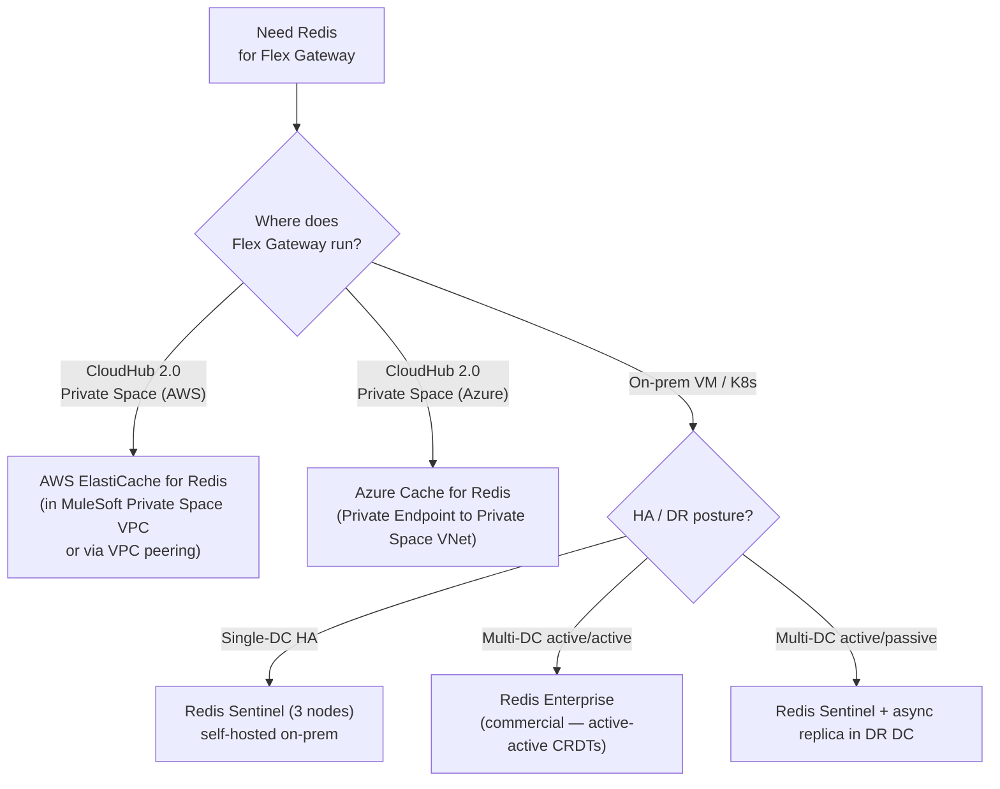
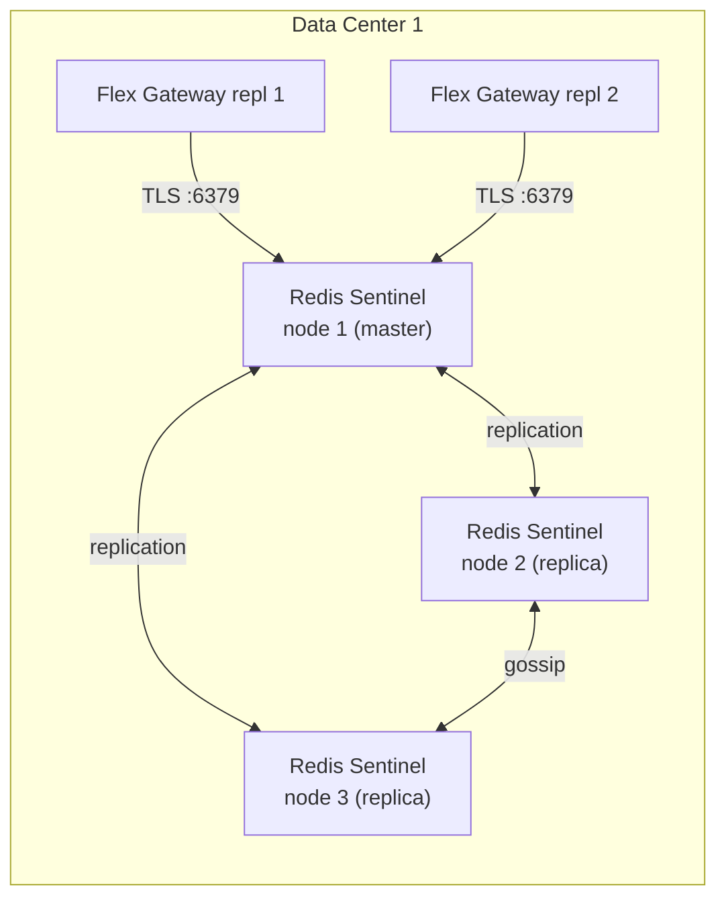

# 10 — Redis Cache for Flex Gateway (Optional but Recommended)

This doc settles a common architecture question: does Anypoint Flex Gateway require Redis? **Short answer: no for config, no for basic request caching, yes for distributed rate limiting across replicas.** This doc covers what Redis is actually used for, sizing, deployment shape, install instructions, and DR.

---

## 1. What Flex Gateway uses Redis for (and what it doesn't)

| Capability | Needs Redis? | Why |
|---|---|---|
| Policy configuration storage | **No** | Anypoint Control Plane pushes policies (Connected mode) or local YAML files (Local mode); each replica caches in-memory |
| Policy push / hot-reload | **No** | Long-polled HTTPS from Anypoint OR `SIGHUP` from Ansible AWX |
| Request body buffering | **No** | Envoy buffers in-memory per replica |
| HTTP response cache (default) | **No** | Envoy in-memory cache per replica — fine for most use cases |
| HTTP response cache (shared across replicas) | Optional | Only if you want a single shared cache pool; rarely worth the complexity for gateway-tier caching |
| **Distributed rate limiting across replicas** | **Yes (recommended)** | Without Redis, every replica counts independently → effective limit = configured × N replicas |
| OAuth 2.0 introspection cache | Optional | Only if you use opaque tokens + introspection. JWT-with-JWKS doesn't need it (we don't use introspection) |
| Custom WASM policy state | Depends | If you build a stateful custom policy. Not in our architecture today |
| Token exchange (RFC 8693) cache | Yes — if implementing | Different architecture; relevant only if you adopt the pattern from `aws_ssp_webmethods_onprem` |

**Reads like:** "the gateway itself is stateless; Redis is for the small number of policies that genuinely need shared state across replicas."

---

## 2. The "do I actually need Redis?" decision

Use this short rubric.

| Condition | If yes → |
|---|---|
| You have more than 1 Flex Gateway replica behind the same logical gateway | Continue ↓ |
| You apply per-partner / per-client rate limits AND those limits are meaningful for SLA fairness | **Yes, add Redis** |
| All rate limits are "best-effort fairness" with no SLA contract | Skip Redis; per-replica counters are good enough |
| You want a **single shared HTTP response cache** across replicas | Yes, add Redis (rarely required) |
| You're considering RFC 8693 token exchange at the gateway tier | Yes — same Redis can serve double duty |

For our architecture (4 replicas across 2 DCs + SLA tiers Bronze/Silver/Gold from [doc 02 §3](02-policies.md#3-external-listener--policy-bundle)) → **add Redis**. Without it, a Gold partner's "1000 req/min" allowance becomes 4000 req/min in practice — and worse, the 4000 isn't evenly distributable because LB hash collisions mean some replicas get more partner traffic than others.

---

## 3. Sizing Redis for our 100K/day workload

The data that lives in Redis is tiny — it's rate-limit counters, not request payloads.

| Item | Size |
|---|---|
| 4 SLA tiers × ~100 distinct clients = ~400 counter keys | Trivial |
| Per-counter (key + value + TTL metadata) | ~150 bytes |
| Total steady-state working set | ~60 KB |
| Read/write ops at peak (matches gateway TPS) | ~35 ops/sec |
| Worst-case spike | ~100 ops/sec |
| Latency budget added by Redis lookup | 1–3 ms |

**The smallest Redis instance you can buy will handle this with 100× headroom.** Sizing is driven by HA topology (3 nodes minimum for Sentinel quorum), not by load.

| Deployment | Per-instance spec | Cost ballpark |
|---|---|---|
| AWS ElastiCache Redis | `cache.t4g.small` (1.5 GB) | ~$25/mo per node |
| Azure Cache for Redis | Basic C1 (1 GB) | ~$50/mo per node |
| Self-hosted Redis on Linux VM | 2 vCPU / 2 GB RAM | Existing VM capacity |

---

## 4. Deployment options



### Recommendation by deployment shape

| Flex Gateway runs on… | Recommended Redis |
|---|---|
| CH 2.0 Private Space on AWS | **AWS ElastiCache Redis 7**, multi-AZ, in-transit + at-rest TLS, in the same Private Space VPC or peered |
| CH 2.0 Private Space on Azure (`centralus`) | **Azure Cache for Redis** (Standard tier, multi-AZ in `centralus`), accessed via Private Endpoint |
| **On-prem, single DC (or per-DC isolated)** | **Redis Sentinel** with 3-node quorum, self-hosted |
| **On-prem, two DCs active/active** | **Redis Enterprise** (active-active multi-master) — only commercial option that handles concurrent writes across DCs without CRDT conflicts |
| On-prem two DCs active/passive | Redis Sentinel in DC-1 + async replica in DC-2; failover by reconfiguring Sentinel + LB |

**Honest call-out:** for our on-prem active/active design from [doc 09 §7](09-onprem-install.md#71-dr-posture-options), Redis Enterprise is the only clean answer. OSS Redis with two active masters across DCs **does not give you correct rate-limit counts** under split-brain. If Redis Enterprise budget isn't available, two options:

1. Run **per-DC Redis Sentinel** and accept that rate limits are scoped per-DC (Gold partner = 1000/min per DC = 2000/min globally — document this in your partner SLA).
2. Use **per-DC Sentinel + active/passive** with manual failover during DR. Partners may see a brief rate-limit reset during DR cutover.

---

## 5. Install — Redis Sentinel on RHEL (on-prem path)

Three nodes minimum for quorum. Run on dedicated VMs or shared with other low-traffic services.

```bash
# On each of 3 nodes: redis-sent-1, redis-sent-2, redis-sent-3
# Recommended spec per node: 2 vCPU / 2 GB RAM / 20 GB SSD

# 1. Install Redis 7 from EPEL / Remi or distro packages
sudo dnf install -y epel-release
sudo dnf install -y redis

# 2. Configure /etc/redis/redis.conf
sudo tee -a /etc/redis/redis.conf <<'EOF'
bind 0.0.0.0
protected-mode yes
port 6379
requirepass <strong-random-password>
masterauth <strong-random-password>
maxmemory 256mb
maxmemory-policy allkeys-lru
appendonly no                           # rate-limit counters don't need persistence
tls-port 6380
tls-cert-file /etc/redis/tls/server.crt
tls-key-file  /etc/redis/tls/server.key
tls-ca-cert-file /etc/redis/tls/ca.crt
tls-auth-clients yes
EOF

# 3. Configure /etc/redis/sentinel.conf (each node)
sudo tee /etc/redis/sentinel.conf <<'EOF'
port 26379
sentinel monitor flex-rate-limit redis-sent-1.internal 6379 2
sentinel down-after-milliseconds flex-rate-limit 5000
sentinel failover-timeout flex-rate-limit 30000
sentinel parallel-syncs flex-rate-limit 1
sentinel auth-pass flex-rate-limit <strong-random-password>
EOF

# 4. Enable + start
sudo systemctl enable --now redis redis-sentinel

# 5. Verify
redis-cli -h redis-sent-1.internal -p 6379 -a <pass> --tls ping
redis-cli -h redis-sent-1.internal -p 26379 sentinel masters
```

### Topology



**3 Sentinel nodes** — not 2. With 2 nodes you can't establish quorum during a partition; the cluster won't fail over. Sentinel needs ≥3 voters.

---

## 6. Flex Gateway config — point rate-limit policy at Redis

In API Manager (Connected mode) or in your local policy YAML (Local mode), set the rate-limit policy's backend to Redis:

```yaml
# Example: external-listener-bundle.yaml (snippet)
policies:
  - policyRef:
      name: rate-limiting-sla
    config:
      tier-resolution-claim: tier               # from JWT 'tier' claim
      tier-limits:
        Bronze: { rpm: 60,   burst: 10 }
        Silver: { rpm: 200,  burst: 30 }
        Gold:   { rpm: 1000, burst: 100 }
      # ↓ The bit that matters for distributed counting ↓
      backend:
        type: redis
        endpoints:
          - host: redis-sent-1.internal
            port: 6379
          - host: redis-sent-2.internal
            port: 6379
          - host: redis-sent-3.internal
            port: 6379
        sentinel-master: flex-rate-limit
        tls: { enabled: true, ca-cert-secret: redis-ca-cert }
        auth-secret: redis-auth-password
        connection-pool: { size: 10, timeout-ms: 100 }
        fallback-on-error: local                 # if Redis unreachable, fall back to per-replica counters
```

The `fallback-on-error: local` flag is critical — without it, Flex Gateway will reject requests when Redis is unreachable (fail-closed). With it, you degrade to per-replica counting until Redis recovers (fail-open with relaxed limits). For non-critical SLA enforcement, `local` fallback is the right default.

---

## 7. Disaster recovery for Redis itself

| Scenario | Behavior with Sentinel | Mitigation |
|---|---|---|
| Master node fails | Sentinel elects new master in 5–10 s; Flex Gateway reconnects via sentinel endpoint | Built-in; no action needed |
| Quorum loss (2 of 3 nodes down) | Cluster goes read-only; Flex Gateway falls back to local counters | Restore quorum; review failure mode |
| DC1 lost entirely (single-DC Redis) | Rate limits effectively reset; Flex Gateway in DC2 uses local counters until Redis is restored | Plan: provision Redis in BOTH DCs (per recommendation §4) |
| Network partition between Flex Gateway and Redis | Per-replica `connection-pool.timeout-ms` (100ms) → fallback-on-error kicks in | Tuned timeout prevents long latency stalls |
| Redis Enterprise CRDT replication lag | Counts may briefly double-count or under-count across DCs | Documented as expected behavior — rate limits are best-effort during partition |

### Backup

For pure rate-limit counters: **don't bother backing Redis up.** The state is ephemeral (TTLs typically 60s for "per-minute" counters). A complete data loss means partners briefly get higher-than-SLA rates for one window. Not worth the operational overhead of RDB snapshots + offsite copy.

If you ever store anything in Redis that's NOT ephemeral (e.g., custom WASM policy state), revisit this decision.

---

## 8. Components to provision (delta to add to doc 09)

Add these to the components-to-provision table in [doc 09 §2](09-onprem-install.md#2-prerequisites-both-paths):

| Component | Owner | Purpose |
|---|---|---|
| Redis Sentinel 3-node cluster per DC (or Redis Enterprise for active/active) | Platform team | Distributed rate-limit counters across Flex Gateway replicas |
| TLS certs for Redis nodes (signed by internal CA) | PKI team | mTLS between Flex Gateway and Redis |
| Redis AUTH password in HashiCorp Vault | Security team | Credential rotation |
| Firewall rules: Flex Gateway SG/CIDR → Redis 6379/6380 | Network team | Allow gateway to reach Redis only |
| Monitoring: Redis exporter → Prometheus / Datadog | Observability | Connection count, evictions, replication lag, failover events |

---

## 9. Cost / footprint summary

For our 4-replica × 2-DC design with Redis Sentinel per DC:

| Item | Per DC | Total |
|---|---|---|
| Redis VMs (3 for Sentinel quorum) | 3× (2 vCPU / 2 GB / 20 GB SSD) | 6 VMs |
| Compute footprint | 6 vCPU + 6 GB RAM | 12 vCPU + 12 GB RAM |
| Storage | 60 GB total | 120 GB total |
| Operational burden | Minimal — Redis is famously low-maintenance | — |
| Approx monthly cost (existing VM capacity) | $0 incremental | $0 incremental |

Redis Enterprise (multi-DC active-active) is meaningfully more expensive — get a quote from Redis Inc. for your call volume + DCs.

---

## 10. Anti-patterns to avoid

| Anti-pattern | Why |
|---|---|
| Using a single Redis node (no Sentinel) | One node fail = rate limiting either fails-open (no limits) or fails-closed (all requests rejected). Both are bad. |
| 2-node Sentinel "for cost savings" | Can't establish quorum. Sentinel won't fail over. Either go 3-node or don't bother. |
| Sharing Redis with other workloads (cache for the corporate CMS, etc.) | Noisy-neighbor risk; one tenant blows up and rate limiting goes with it |
| Persisting rate-limit counters to disk (`appendonly yes`) | Wasted IO; the counters are ephemeral by design |
| Skipping TLS between Flex Gateway and Redis on the internal network | Auth password leaks become a foothold |
| Allowing direct `redis-cli` access from operator laptops to the prod cluster | Bypasses audit; force jumpbox or read-only replicas |
| Disabling `fallback-on-error: local` in production | Redis blip = production outage |

---

## Related

- [02 — Policies §3 + §4](02-policies.md#3-external-listener--policy-bundle) — the rate-limiting policy that consumes Redis
- [09 — On-Prem Install Guide](09-onprem-install.md) — Redis is now in the prerequisites table
- [08 — Flex Gateway Deep-Dive §3.2](08-flex-gateway.md#32-capabilities) — Flex Gateway is stateless; Redis is the only state we introduce
