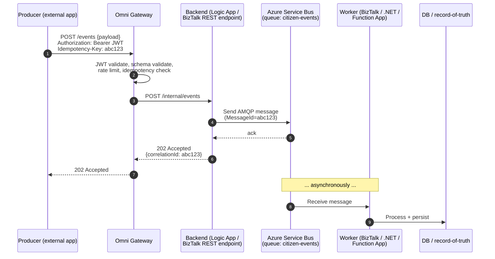
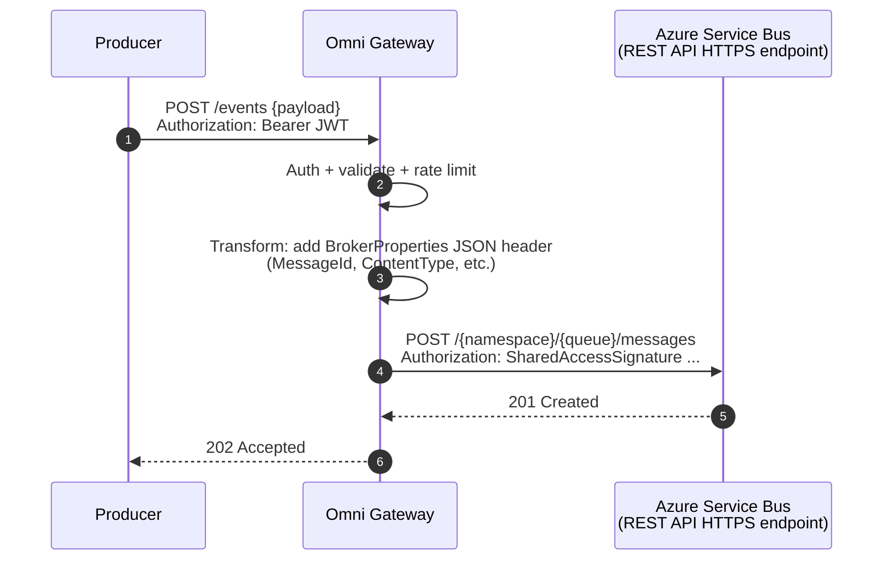
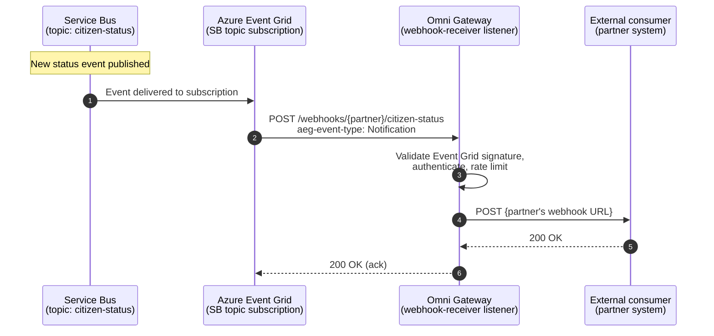
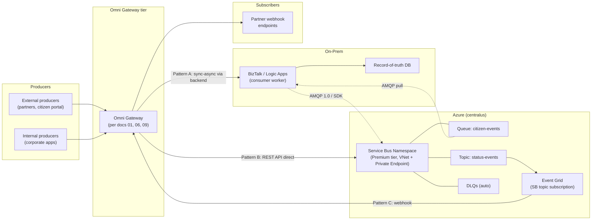
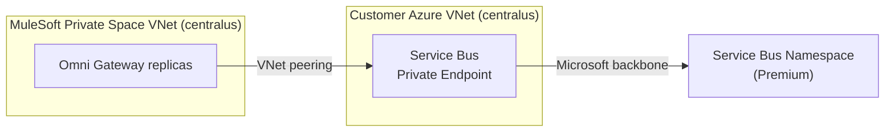
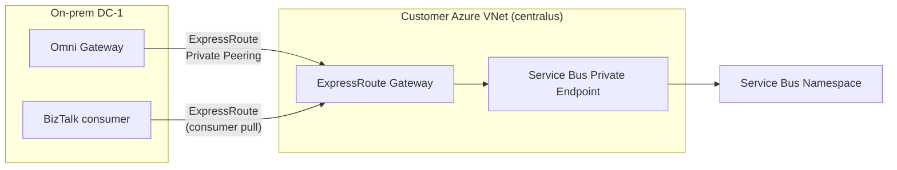
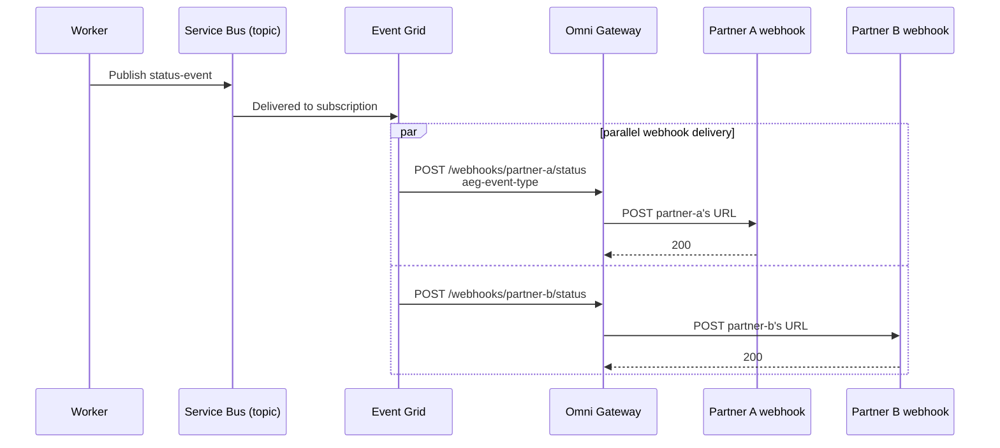
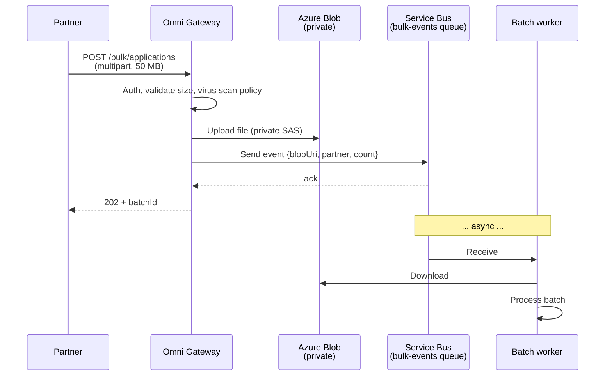

# 11 — Azure Service Bus Integration (Event-Driven)

How Anypoint Omni Gateway fits into an event-driven integration with **Azure Service Bus**, given that the gateway is HTTP-native and Service Bus speaks AMQP. Covers patterns, architecture, auth, private connectivity, use cases, and the failure modes.

> Per [doc 10](10-redis-cache.md), "Omni Gateway" is MuleSoft's current name for what was Flex Gateway. Same product.

---

## 1. Scope & honest framing — what the gateway can and can't do

Omni Gateway is an **HTTP / gRPC / WebSocket / GraphQL** edge proxy. Service Bus is an **AMQP 1.0** message broker (also supports HTTPS via its REST API + the Event Grid integration). The gateway cannot natively:

| Native AMQP capability | Available in Omni Gateway? |
|---|---|
| Speak AMQP 1.0 to Service Bus | **No** |
| Subscribe to a queue / topic as a consumer | **No** — gateway is not a consumer; it's request-response |
| Long-polling / peek-lock consumption | **No** |
| Session-aware ordered consumption | **No** |
| Dead-letter queue management | **No** |
| Receive an event push from Service Bus | **Yes** — via Service Bus → Event Grid → HTTPS webhook |

What the gateway **can** do (and does well):

1. **Front the Service Bus REST API** for HTTP-only producers (auth, rate limit, threat protection, schema validation, contract enforcement)
2. **Receive HTTPS webhooks** from Service Bus → Event Grid integration (event push to external consumers)
3. **Synchronous-to-asynchronous bridging** — accept a sync HTTP call, validate, and forward to a backend that publishes to Service Bus (the backend, not the gateway, speaks AMQP)
4. **Authenticate + meter event-ingestion APIs** — every event coming in still hits the same policy chain from [doc 02](02-policies.md)

So the architecture is **"Omni Gateway as the HTTP edge, with Service Bus REST API (or a thin .NET/Logic Apps relay) as the actual broker integration."** It is NOT "Omni Gateway connects to Service Bus directly via AMQP."

---

## 2. Integration patterns (3 viable shapes)

### Pattern A — Sync-to-async bridge (most common)

Producer makes a synchronous REST call. Gateway authenticates, validates, forwards to a backend that drops the request onto a Service Bus queue. The backend immediately responds with `202 Accepted` and a correlation ID; downstream processing is asynchronous.



**When to use:** the producer doesn't need a synchronous business result (notification, audit event, fire-and-forget integration), but does need to know the platform accepted the event.

### Pattern B — Direct gateway → Service Bus REST API

Gateway forwards the request directly to the Service Bus REST API, skipping the intermediate backend. Suitable for thin event-ingestion APIs where the gateway is the only thing that needs to happen before the message lands on the queue.



**When to use:** lightweight, no business logic between gateway and queue. Fewer hops, lower latency. **But:** gateway holds the Service Bus SAS token / Managed Identity, which increases the gateway's privilege scope. Audit accordingly.

### Pattern C — Service Bus → Event Grid → gateway webhook

External consumers receive event notifications via webhooks pushed through the gateway's egress.



**When to use:** push notifications to external partners, third-party integrations, fan-out from a Service Bus topic to many HTTP-based consumers. Requires Event Grid subscription on the Service Bus topic.

---

## 3. Architecture — for our deployment

For our reference architecture (Omni Gateway in CH 2.0 Private Space at Azure `centralus`, OR on-prem; backend MS stack on-prem), the recommended event-driven topology:



**Key design decisions** built into the picture:

- **Premium tier Service Bus** — gives VNet integration + private endpoints. Standard tier doesn't support private endpoints. For citizen-data workloads, this is non-negotiable.
- **Gateway never speaks AMQP.** Either Pattern A (HTTPS to a backend that owns AMQP) or Pattern B (HTTPS to Service Bus REST API).
- **BizTalk / Logic Apps is the AMQP consumer.** It has native Service Bus support and handles peek-lock, session ordering, retry, DLQ inspection — all the things a gateway can't do.
- **Event Grid bridges Service Bus → webhooks** when you need outbound push to external consumers.

---

## 4. Authentication to Service Bus — pick one

The gateway (or its backend, in Pattern A) needs credentials to talk to Service Bus. Two viable options:

| Approach | When | Pros | Cons |
|---|---|---|---|
| **SAS token (Shared Access Signature)** | Quickest, works anywhere | Simple; no Entra setup | Manual rotation; secret in your secret store; broader blast radius if leaked |
| **Entra ID Managed Identity** | Gateway/backend runs in Azure (CH 2.0 Private Space on Azure, or Azure-hosted backend) | No secrets to rotate; per-resource RBAC; auditable in Entra | Doesn't work for on-prem gateway/backend (no managed identity available) |
| **Entra ID Service Principal (cert-based)** | On-prem gateway/backend that needs Entra auth | Cert-based, no shared secret; auditable | Cert rotation overhead; needs Entra setup |

**Recommendation matrix:**

| Where does the sender (gateway or backend) run? | Use |
|---|---|
| CH 2.0 Private Space on Azure | **Managed Identity** (system-assigned to the Private Space if MuleSoft supports it, else service principal) |
| Azure-hosted backend (Logic Apps, Function App, AKS) | **Managed Identity** |
| On-prem gateway or backend | **Service Principal with cert auth** (preferred) OR **SAS token from Vault** (fallback) |

**Per-resource RBAC**, always: don't grant `Azure Service Bus Data Owner` at the namespace level. Grant **`Azure Service Bus Data Sender`** scoped to the specific queue/topic the gateway/backend needs to write to. Receiver roles likewise scoped.

---

## 5. Private connectivity — no public internet to Service Bus

For citizen-data workloads, all Service Bus traffic must traverse private network paths. Two scenarios:

### 5.1 Omni Gateway in CH 2.0 Private Space (Azure `centralus`)



- Create a **Private Endpoint** for the Service Bus namespace in your customer VNet (peered to the Private Space VNet per [doc 06](06-azure-private-space.md)).
- The namespace's public access is **disabled** at the namespace level.
- DNS: link the `privatelink.servicebus.windows.net` Private DNS Zone to the Private Space VNet so the gateway resolves the namespace to the private endpoint IP.

### 5.2 Omni Gateway on-prem (per doc 09)



- ExpressRoute Private Peering carries gateway → SB private-endpoint traffic AND backend-worker → SB AMQP traffic over the same circuit.
- Service Bus namespace public access **disabled**.
- DNS — your on-prem DNS resolver needs the `privatelink.servicebus.windows.net` zone records (either conditional forwarder to an Azure-resident DNS resolver, or static records).

---

## 6. Event schema — adopt CloudEvents 1.0

Standardize event shape with **[CloudEvents 1.0](https://github.com/cloudevents/spec)**. It's a CNCF spec; Service Bus supports it natively as a schema for messages.

### Mandatory fields

```json
{
  "specversion": "1.0",
  "type":        "com.yourco.citizen.application.submitted",
  "source":      "/citizen-portal/intake",
  "id":          "abc-123-def-456",
  "time":        "2026-06-05T14:32:11.482Z",
  "datacontenttype": "application/json",
  "subject":     "application/9876",
  "data": {
    "applicationId": "9876",
    "submittedBy":   "user-opaque-uuid",
    "category":      "license-renewal"
  }
}
```

### Required field discipline for citizen data

- `id` — **always a UUID v4** (or stable hash). Used as the Service Bus `MessageId` for idempotency.
- `subject` — the **resource path**, not the citizen identity. Never `subject: "ssn:123-45-6789"`. Use opaque internal IDs only.
- `data` — same PII deny-list as [doc 07 §3](07-data-protection.md) — no SSN, no full name, no DOB in clear. Use tokenized internal IDs.
- `type` — reverse-DNS naming. Stable contract that consumers depend on.

The gateway enforces this schema as part of the request-validation policy on the event-ingestion endpoint. Reject anything that doesn't conform — don't sanitize silently.

---

## 7. Use cases (concrete examples)

### 7.1 Citizen application submission (Pattern A)

```mermaid
sequenceDiagram
    participant C as Citizen
    participant Portal as Web portal
    participant G as Omni Gateway
    participant BT as BizTalk
    participant SB as Service Bus<br/>(citizen-events queue)
    participant W as Worker (.NET)
    participant DB as DB

    C->>Portal: Submit license renewal
    Portal->>G: POST /events/applications<br/>(CloudEvent payload)
    G->>G: JWT validate, schema validate,<br/>rate limit, idempotency check
    G->>BT: POST /internal/intake
    BT->>SB: Send (MessageId=event.id)
    SB-->>BT: ack
    BT-->>G: 202 + correlationId
    G-->>Portal: 202 + correlationId
    Portal-->>C: "Submitted; we'll notify you"
    Note over SB,W: ... async ...
    SB->>W: Receive
    W->>DB: Persist application
    W->>SB: Publish status-event<br/>(topic: status-events)
```

### 7.2 Status notification fan-out to partners (Pattern C)



### 7.3 Bulk file submission (Pattern A + reference)

Partner posts a bulk file. Gateway uploads it to blob storage, drops a reference event on Service Bus. Background worker fetches the blob, processes batch.



### 7.4 Audit-log event for every privileged API call

Every authenticated call hits the gateway → gateway publishes an audit event to Service Bus → SIEM consumer drains it. Decouples gateway latency from SIEM ingestion rate.

### 7.5 Decoupled retry buffer when backend is degraded

When BizTalk is down, the gateway can short-circuit certain idempotent event APIs straight to Service Bus (Pattern B). Backend recovers, drains queue. Producer experiences zero downtime.

### 7.6 Webhook receiver for third-party integrations

External SaaS (e.g. a payment provider) calls a webhook URL hosted on the gateway. Gateway validates signature, drops onto Service Bus, an internal worker processes. The external SaaS sees a fast 200 OK; processing is decoupled.

---

## 8. Gateway policies for event-ingestion endpoints

Add to the policy bundle from [doc 02](02-policies.md) for any route whose backend is "publish to Service Bus":

| Policy | Configuration specific to events |
|---|---|
| **Schema validation** | Strict CloudEvents 1.0 schema; reject unknown event types early |
| **Idempotency** | `Idempotency-Key` header MUST equal CloudEvent `id`; gateway dedupes via Redis ([doc 10](10-redis-cache.md)) for 24h window |
| **Rate limiting** | Per-partner per-event-type; bulk-event endpoints get separate (lower) quotas |
| **Payload size limit** | Set to Service Bus message size limit (256 KB Standard, 1 MB Premium) **minus headroom** for BrokerProperties — recommend 200 KB / 800 KB |
| **Header pass-through allow-list** | Only `traceparent`, `Idempotency-Key`, `Content-Type`, `Accept` reach the backend; strip everything else (per `aws_ssp_webmethods_onprem` header filter pattern) |
| **Async response shape** | `202 Accepted` with `{correlationId, statusUrl}` — never block the producer |

---

## 9. Failure modes

| Failure | Behavior | Mitigation |
|---|---|---|
| Service Bus namespace unavailable | Pattern A: backend's SB SDK retries with exponential backoff, eventually 5xx to gateway. Pattern B: gateway gets 5xx from SB REST API. | Circuit-break at the gateway after N failures; return 503 to producer with `Retry-After`. Async producers can replay later. |
| Service Bus throttling (Premium MU exhausted) | 429 from SB | Backpressure to producer (429 from gateway); scale Service Bus messaging units; tune partition count |
| Network path Service Bus → backend down | Backend can't drain queue; messages pile up | Service Bus DLQ + age-based alarms; backend retries with backoff; manual replay from DLQ |
| Message exceeds size limit | SB rejects | Gateway enforces payload-size policy BEFORE forward; reject at edge with 413 |
| Duplicate event submission | SB dedupes by MessageId within `RequiresDuplicateDetection` window (10 min default; configurable up to 7 days) | Set `requiresDuplicateDetection: true` + `duplicateDetectionHistoryTimeWindow: PT24H` on the queue; gateway also dedupes via idempotency cache |
| Webhook receiver (Pattern C) returns 5xx | Event Grid retries with exponential backoff up to 24h, then drops to dead-letter | Configure DLQ on Event Grid subscription; alarm on DLQ events |
| Partner webhook endpoint unreachable for hours | Event Grid retries fill | Configure Event Grid retry policy + DLQ + on-call alarm; suspend partner if persistently failing |

---

## 10. Observability — what to add to doc 05

Extend the metrics catalog from [doc 05 §4](05-observability.md#4-metrics--what-to-capture) with these Service Bus-specific signals:

| Metric | Source | Why |
|---|---|---|
| `sb.send.duration_ms` | Gateway (Pattern B) or backend (Pattern A) | Detect SB latency degradation early |
| `sb.send.errors` | Same | Throttling, auth failures, network errors |
| `sb.queue.depth` | Azure Monitor → exported to Datadog | Producer outpacing consumer → DLQ risk |
| `sb.dlq.depth` | Azure Monitor | Should be 0 in healthy state; alarm at any value |
| `sb.activeMessageCount` | Azure Monitor | Consumer lag visibility |
| `sb.throttledRequests` | Azure Monitor | Premium MU exhaustion |
| `eventgrid.delivery.failed_count` | Azure Monitor (Pattern C only) | Webhook receiver health |
| `gateway.idempotency.cache_hits` | Gateway → Redis stats | Duplicate-event rate; high values = misbehaving producer |

Alarms:
- DLQ depth > 0 for 5 min → page on-call
- `sb.throttledRequests` > 1% over 15 min → scale Premium MU
- `sb.queue.depth` growing at rate > consumer rate for 15 min → page consumer team

---

## 11. Cost considerations

| Item | Approximate cost |
|---|---|
| Service Bus Premium (1 MU minimum) | ~$700/mo per messaging unit (centralus, list) |
| Service Bus Standard | ~$10/mo + per-operation — but **no private endpoint support**, so not viable for citizen data |
| Private Endpoint for SB | ~$10/mo + small per-GB charge |
| ExpressRoute data egress (on-prem path) | Existing OpEx, marginal addition |
| Event Grid (Pattern C only) | $0.60 per million events |

**Premium tier is required** for our citizen-data + private-endpoint requirement. The $700/mo per MU is real money — but the alternative (public Service Bus endpoint with SAS-only auth for PII workloads) is not architecturally acceptable.

For 100K events/day (matching gateway scale from [doc 01 §6](01-api-gateway-architecture.md#6-sizing-for-100k-callsday)), 1 MU is enormously over-sized — 1 MU handles thousands of msgs/sec sustained. Premium minimum is 1 MU; scale up only at sustained > 1000 msgs/sec.

---

## 12. Risks & gotchas

| Risk | Mitigation |
|---|---|
| Treating gateway as the Service Bus consumer | Gateway is fundamentally request-response. AMQP consumption belongs in BizTalk / Logic Apps / .NET worker / Function App. |
| Standard tier for production | No private endpoints. PII traffic over public endpoint is not acceptable for citizen data. Go Premium. |
| SAS tokens with broad RBAC scope | Always per-queue / per-topic Sender or Receiver role. Never `Data Owner` at namespace level. |
| Forgetting message-size limits | 256 KB Standard / 1 MB Premium. Gateway must reject oversized BEFORE forwarding — saves a round trip and surfaces a clean 413 to the producer. |
| No idempotency contract | Producers retry on timeout → duplicates. Set MessageId from CloudEvent `id` + enable SB duplicate detection. |
| Webhook signature not verified (Pattern C) | Anyone with the gateway URL can publish bogus events. Verify Event Grid `aeg-event-type` + signature header. |
| Missing DLQ alarms | Dead-letters silently accumulate; you find out when a consumer team finds out. Alarm on DLQ depth > 0. |
| PII in event payloads | CloudEvent `data` field is the same deny-list as request bodies. See [doc 07 §3](07-data-protection.md#3-the-12-specific-bleed-vectors). |
| Cross-region latency if Service Bus is in a different region than the gateway | Co-locate. Service Bus in `centralus` for Omni in `centralus`. |
| Forgetting to also drop the `Authorization` header before forwarding to SB REST API | The Service Bus SAS-token Authorization replaces the inbound JWT — strip the inbound auth or you leak the user JWT to Azure logs. |

---

## Related

- [02 — Policies](02-policies.md) — idempotency, schema validation, rate limit policies for event endpoints
- [05 — Observability](05-observability.md) — add Service Bus metrics to the dashboard
- [06 — Azure Private Space](06-azure-private-space.md) — private endpoint connectivity to SB
- [07 — Data Protection](07-data-protection.md) — Service Bus + Event Grid are PII surfaces too
- [10 — Redis Cache](10-redis-cache.md) — idempotency cache is backed by Redis
