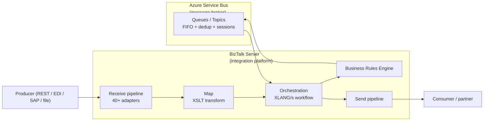
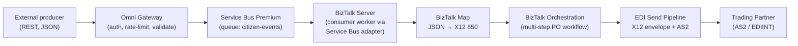

# 12 — Azure Service Bus Premium vs Microsoft BizTalk Server

A common architect question: they're both Microsoft, both "messaging-adjacent" — are they the same thing? **No.** They solve different problems and share almost nothing under the covers. This doc explains why and how they fit together in our architecture rather than as alternatives.

---

## 1. TL;DR

| | Azure Service Bus (Premium) | Microsoft BizTalk Server |
|---|---|---|
| **What it is** | A **message broker** (transport) | An **integration platform** (transport + transformation + orchestration + B2B) |
| **Where it runs** | Microsoft-managed Azure PaaS (dedicated MUs in Premium) | Your Windows Server VMs, on-prem (or IaaS) |
| **Primary job** | Move messages reliably between producers and consumers | Receive, transform, orchestrate, route, transform-again, deliver across protocols/partners |
| **Tech stack** | Custom Microsoft service code + Azure-managed storage, .NET runtime | .NET apps + **SQL Server** (MessageBox + Management DBs) + Windows Services + MSDTC |
| **Speaks** | AMQP 1.0, HTTPS REST | HTTP, FTP, SFTP, SOAP, MQ, AS2, X12, EDIFACT, SAP, SQL, file, MSMQ, JMS, REST, …40+ adapters |
| **Does business logic?** | **No** — just transports | **Yes** — orchestrations (XLANG/s), maps (XSLT), business rules engine |
| **Replacement?** | Not a BizTalk replacement on its own | — |
| **In our architecture** | The **async messaging substrate** (per [doc 11](11-azure-service-bus-integration.md)) | The **on-prem integration backbone** that does orchestration / transformation / EDI (per [doc 01 §1](01-api-gateway-architecture.md#1-scope--role)) |

They are **complementary, not competing**. In a mature design they work together: BizTalk consumes from Service Bus queues; Service Bus decouples upstream HTTP producers from BizTalk's batch-friendly processing cadence.

---

## 2. Different products, different jobs

- **Service Bus** is a brokerage tier: it stores messages durably, fans out via topics, dedupes, supports transactional sends, and that's it. No transformation. No orchestration. No EDI parsing.
- **BizTalk** is a full integration server: it accepts messages on many protocols, transforms them between formats (X12 ↔ JSON ↔ XML), runs stateful workflows that span hours/days, applies business rules, and delivers to other endpoints — also on many protocols.

A real-world way to put it: **if you removed Service Bus from an architecture, you'd lose async decoupling**. **If you removed BizTalk, you'd lose the work that transforms X12 EDI from a trading partner into the JSON your backend expects.** Service Bus can't do the second job; BizTalk can do both but it's the wrong tool for high-throughput cloud-scale messaging.

---

## 3. Tech stack — what's under the covers (and why it's different)

| Layer | Azure Service Bus Premium | BizTalk Server 2020 |
|---|---|---|
| **Runtime language** | C# / .NET (Microsoft-managed service code) | C# / .NET (apps you deploy) |
| **Hosting** | Azure infrastructure — Microsoft owns the VMs/storage | Windows Server VMs you operate |
| **Persistent message store** | Custom Azure storage layer (not SQL Server); SSD-backed, designed for partitioned brokering at cloud scale | **SQL Server** databases: `MessageBoxDb`, `BizTalkMgmtDb`, `BizTalkDTADb` (tracking), `BAMPrimaryImport`, etc. |
| **Transactional coordinator** | Internal to the broker; AMQP transaction semantics | **MSDTC** (Microsoft Distributed Transaction Coordinator) for cross-resource transactions |
| **Compute units** | "Messaging Units" — dedicated capacity (Premium) | "Host instances" — Windows services per role (receive, processing, send) |
| **Networking** | Microsoft-managed; private endpoints / VNet integration on Premium | Whatever you deploy it onto (typically your DC LAN + DMZ) |
| **High availability** | Built-in within an Azure region; geo-DR is a SKU feature | SQL Always-On / clustering + multiple host instances; you build and operate |
| **Patching** | Microsoft | You |
| **Lineage** | Originally inspired by MSMQ concepts; reimplemented for cloud scale around AMQP 1.0 | Descended from Microsoft's late-90s "BizTalk Framework"; the BizTalk Server product line started 2000; current architecture is largely the BizTalk 2004 redesign + incremental updates |

**The key insight:** Service Bus Premium's "dedicated capacity" (Messaging Units) sounds like BizTalk's "host instances," but they're nothing alike. A MU is a Microsoft-managed unit of brokering throughput; a BizTalk host instance is a Windows service running on hardware you own, executing your code (orchestrations, custom pipeline components). One is infrastructure-as-a-service; the other is software-you-operate.

**No shared runtime code.** No shared persistence layer. No shared deployment model. They share a vendor and the .NET ecosystem; that's about it.

---

## 4. Capability comparison

| Capability | Service Bus Premium | BizTalk Server | Notes |
|---|---|---|---|
| Durable async messaging (queue, topic) | ✅ | ✅ (via MessageBox) | BizTalk's MessageBox is SQL-backed; not designed for cloud-scale broker throughput |
| Pub/sub with topic + subscriptions | ✅ | ✅ | |
| FIFO ordering (sessions) | ✅ | ✅ (via ordered delivery flag) | Service Bus sessions are first-class |
| Transactions across messages | ✅ (within SB) | ✅ (MSDTC across SQL, MSMQ, etc.) | BizTalk's cross-resource transactions are broader |
| Dead-letter queue | ✅ built-in | ✅ via suspended-message queue | |
| Message transformation (XML ↔ JSON ↔ X12) | ❌ | ✅ (Maps, XSLT, BizTalk Mapper) | Killer BizTalk feature |
| Stateful orchestration / long-running workflows | ❌ | ✅ (XLANG/s orchestrations) | Killer BizTalk feature |
| Business Rules Engine | ❌ | ✅ | |
| EDI (X12, EDIFACT) parsing + acknowledgments | ❌ | ✅ (BizTalk EDI/AS2) | Major BizTalk use case |
| Trading Partner Management (B2B) | ❌ | ✅ | |
| HTTPS REST API ingestion | ✅ (REST API) | ✅ (HTTP/REST adapter, WCF) | |
| AMQP 1.0 native | ✅ | ✅ (via Service Bus Adapter, since BizTalk 2013) | BizTalk can consume FROM Service Bus |
| SAP / Oracle / mainframe connectivity | ❌ | ✅ (LOB adapters) | BizTalk has dozens of LOB adapters |
| File / FTP / SFTP integration | ❌ | ✅ | |
| Cloud-scale throughput (10K+ msg/sec) | ✅ | ⚠️ achievable with effort; not the design center | |
| Sub-second latency for high message rates | ✅ | ⚠️ depends heavily on SQL Server tuning + hardware | |
| Geographic disaster recovery | ✅ (built-in in Premium) | ⚠️ achievable with SQL Always-On + log shipping; you build it | |

The pattern is clear: **Service Bus excels at high-scale message transport. BizTalk excels at the rich integration work that happens around messages.**

---

## 5. Why they coexist in our architecture

From [doc 01 §1](01-api-gateway-architecture.md#1-scope--role): the on-prem Microsoft stack handles orchestration, transformation, and EDI. The Omni Gateway is the API edge. Service Bus is the async messaging substrate that decouples them.

In this flow:
- **Service Bus** transports the JSON event from gateway to BizTalk, decoupling the producer from BizTalk's processing cadence (BizTalk may batch, may be down briefly, may rate-limit itself). Producer sees `202 Accepted` immediately.
- **BizTalk** does the actual integration work: receives via the Service Bus adapter, maps JSON to X12 850 (Purchase Order), runs an orchestration that handles routing decisions and acknowledgments, sends via AS2 to the trading partner with the proper EDI envelope and signed receipts.

**Neither product alone can do this end-to-end.** A Service-Bus-only architecture has nothing to translate JSON → X12 or speak AS2. A BizTalk-only architecture forces synchronous coupling between the public API edge and the integration engine, which scales poorly and exposes BizTalk's restart/patch windows directly to API callers.

---

## 6. Lineage — where they each came from

| | Service Bus | BizTalk |
|---|---|---|
| **First released** | 2008 (initial Service Bus); "Premium" SKU added later | 2000 (BizTalk Server 2000) |
| **Inspired by** | Microsoft Message Queuing (MSMQ) ideas + AMQP standard | BizTalk Framework + Microsoft Commerce Server era B2B work |
| **Major rewrites** | Multiple — current Premium is a from-scratch cloud-scale design | One major redesign in BizTalk Server 2004 (still the architecture today, with incremental updates) |
| **Latest version** | Continuous (PaaS — Microsoft updates it) | **BizTalk Server 2020** (current LTS; released Jan 2020) |
| **Support status** | Active development | **Maintenance mode** — mainstream support ends in 2025, extended in 2030. Microsoft has not announced a successor BizTalk version. |

This last row is significant. **BizTalk Server 2020 is widely understood to be Microsoft's last major BizTalk release.** Microsoft's strategic direction for the same problem space is Azure Integration Services (next section).

---

## 7. Microsoft's strategic direction — Azure Integration Services

Microsoft has been steadily pushing customers toward **Azure Integration Services (AIS)** — a suite of cloud services that collectively cover what BizTalk does, but as composable PaaS:

| BizTalk capability | AIS equivalent |
|---|---|
| Receive adapters (HTTP, FTP, SAP, SQL, ...) | **Logic Apps Connectors** (450+) |
| Orchestrations (XLANG/s) | **Logic Apps Standard / Consumption** workflows |
| Maps (XSLT) | Logic Apps **XSLT transform** action + Azure Data Mapper |
| Business Rules Engine | **Azure Logic Apps Rules Engine** (preview / limited) + **Azure Function App** with rule libraries |
| Pub/sub messaging | **Azure Service Bus** + **Event Grid** |
| API exposure | **Azure API Management** |
| EDI (X12, EDIFACT, AS2) | **Logic Apps Enterprise Integration Pack** + Azure Integration Account |
| Trading Partner Management | **Azure Integration Account** (partners + agreements) |
| Tracking / BAM | **Application Insights** + **Log Analytics** |
| MessageBox (SQL) | (None — AIS is stateless per workflow run; persistence is the broker / DB you choose) |

So in cloud-native modernization, **the BizTalk role is split across Logic Apps + Service Bus + API Management + Integration Account + Functions**. Service Bus isn't replacing BizTalk; it's becoming a component of BizTalk's successor stack.

### Implication for our design

Our current architecture sits at a sensible point on this evolution:

- **Omni Gateway** plays the API Management role
- **Service Bus Premium** plays the async-messaging role
- **BizTalk on-prem** still plays the transformation + orchestration + EDI role

If/when BizTalk modernization comes onto the roadmap, the natural next steps are:
- BizTalk orchestrations → Logic Apps Standard workflows
- BizTalk maps → Logic Apps XSLT / Data Mapper
- BizTalk EDI → Logic Apps EIP + Integration Account
- BizTalk Service Bus adapter consumer → Logic Apps Service Bus trigger

The gateway and Service Bus pieces stay; only the integration backend changes. **This is part of why we have Service Bus in the picture at all — it's the durable shock-absorber that lets you re-platform the integration tier behind it without disturbing producers.**

---

## 8. Decision rubric — when to pick which (or both)

| If your need is… | Pick |
|---|---|
| Move a message from system A to system B with at-least-once delivery, FIFO, dedup | **Service Bus** |
| Transform JSON to X12 850, sign with AS2, send to a trading partner | **BizTalk** (or AIS Logic Apps + EIP if green-field cloud) |
| Stateful, multi-step orchestration spanning hours/days with compensation | **BizTalk** (or Logic Apps Standard) |
| Decouple a fast public API from a slow/batch backend | **Service Bus** (the canonical use case) |
| Receive from SAP, transform, orchestrate, send to mainframe via MQ | **BizTalk** end-to-end (or AIS Logic Apps with LOB connectors) |
| Front a partner-facing REST API on-prem with no integration logic at the edge | **Omni Gateway** alone — neither of the above is needed |
| Async event ingestion from API → backend worker | **Omni Gateway + Service Bus + .NET worker** (or BizTalk worker via SB adapter) |

---

## 9. Mythbusters

| Myth | Reality |
|---|---|
| "Service Bus is the cloud version of BizTalk" | No. Service Bus is the cloud version of MSMQ + a topic broker. Cloud-BizTalk is more like Logic Apps + Service Bus + API Management + Integration Account combined. |
| "We can replace BizTalk with Service Bus" | Only if all you used BizTalk for was MessageBox-style pub/sub. If you used Maps, Orchestrations, EDI, BRE, or LOB adapters, Service Bus doesn't cover any of that. |
| "Service Bus runs on top of BizTalk under the covers" | No. They're separate codebases with separate storage layers. |
| "BizTalk is dead" | In maintenance mode, but supported. Microsoft has not announced an end-of-life for BizTalk Server 2020 (mainstream support to 2025, extended to 2030). Many enterprises will run BizTalk well into the 2030s. |
| "AMQP 1.0 means Service Bus is a drop-in replacement for any AMQP broker (e.g. RabbitMQ, ActiveMQ)" | Partially true protocol-wise. But Service Bus's behaviors (sessions, dedup, schedule, MU sizing) and pricing model are different enough that drop-in replacement rarely works without code changes. |
| "Both are .NET so they share the same persistence/transaction model" | They share .NET as runtime language. Persistence and transaction models are completely different (Service Bus has custom storage; BizTalk uses SQL Server + MSDTC). |

---

## 10. Verdict for our project

For our specific architecture:

- **Keep BizTalk** doing what it's good at: orchestration, transformation, EDI on-prem.
- **Use Service Bus Premium** as the async messaging substrate between the Omni Gateway and BizTalk (per [doc 11](11-azure-service-bus-integration.md)).
- **Don't try to make Service Bus do BizTalk's work** (it can't) and **don't expose BizTalk directly to public traffic** (you have a gateway for that).
- **When BizTalk modernization comes onto the roadmap**, the gateway and Service Bus stay; the integration backend swaps for AIS. Plan for that future even if you're not executing it now.

---

## Related

- [01 — API Gateway Architecture §1](01-api-gateway-architecture.md#1-scope--role) — explicit decision that MS stack does the integration work
- [11 — Azure Service Bus Integration](11-azure-service-bus-integration.md) — how Service Bus sits between the gateway and BizTalk
