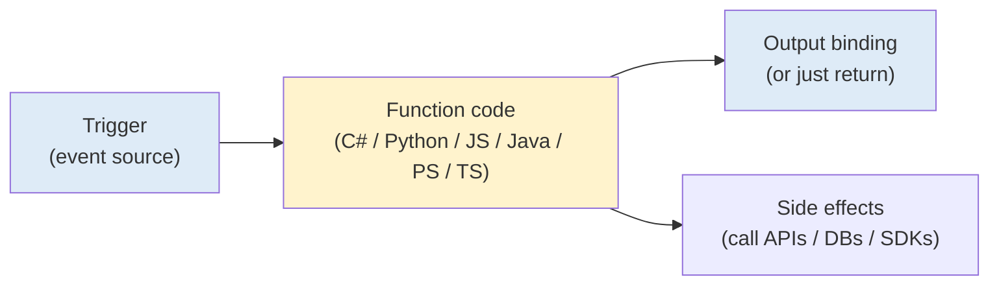
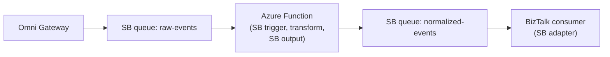
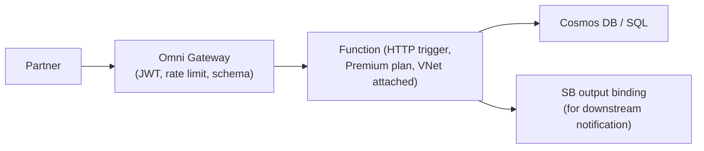
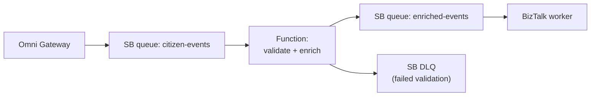
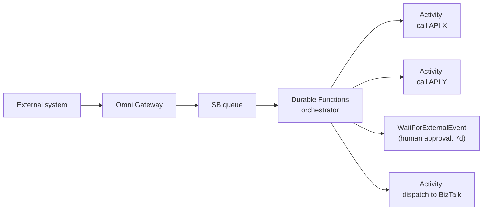
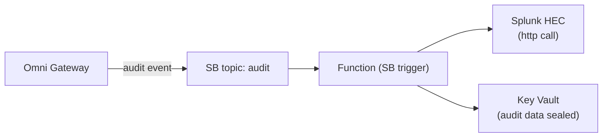

# 13 — Azure Functions: What They Are, What They Replace

Companion to [doc 11 (Service Bus)](11-azure-service-bus-integration.md) and [doc 12 (Service Bus vs BizTalk)](12-service-bus-vs-biztalk.md). Answers the question "since Service Bus only moves messages, what does the actual work? Can Azure Functions do transformation and EDI?"

**Short answer:** Functions can absolutely do transformation, enrichment, and custom event processing. They can do **some** EDI with libraries, but Logic Apps Enterprise Integration Pack + Integration Account is the right Microsoft tool for full EDI workflows. For long-running stateful orchestration, you want **Durable Functions** (a Functions extension) or Logic Apps Standard, not plain Functions.

---

## 1. What Azure Functions actually is



- **Serverless compute** on Azure. You write a function, Microsoft runs it when a trigger fires.
- **Event-driven** — each function declares one trigger (HTTP, Service Bus message, blob upload, timer, Cosmos DB change, Event Grid event, Queue Storage, etc.).
- **Stateless by default** — each invocation is independent. State, if needed, lives in external stores (Cosmos DB, Redis, SB session, blob).
- **Single-purpose** — one function, one job. Composition happens by chaining (Function A writes to a queue, Function B is triggered by that queue).
- **Auto-scaling** — Consumption plan scales from zero to thousands of concurrent instances based on trigger load.
- **Multi-language** — C#, F#, JavaScript, TypeScript, Python, Java, PowerShell.
- **Hosted** — no servers, no patching. You ship code or a container.

Functions is one of the building blocks of **Azure Integration Services (AIS)** — the cloud-native successor stack to BizTalk discussed in [doc 12 §7](12-service-bus-vs-biztalk.md#7-microsofts-strategic-direction--azure-integration-services).

---

## 2. Triggers and bindings — the core idea

Functions has two related concepts that make it productive for integration scenarios:

| Concept | What it is | Example |
|---|---|---|
| **Trigger** | What causes the function to run | "Run when a message arrives on Service Bus queue `citizen-events`" |
| **Input binding** | Declarative way to pull data into the function without writing client code | "Also give me the matching Cosmos document with id from the message" |
| **Output binding** | Declarative way to push data out without writing client code | "When the function returns, write the result to blob storage" |

Bindings cover the boring infrastructure code so the function body can focus on business logic. They exist for: Service Bus, Event Grid, Event Hubs, Storage Queue/Blob/Table, Cosmos DB, SQL Server, SignalR, Twilio, SendGrid, HTTP, and many more via extensions.

### Example: SB-triggered Function with output binding

```csharp
[Function("TransformCitizenEvent")]
[ServiceBusOutput("citizen-events-transformed", Connection = "SbConnection")]
public string Run(
    [ServiceBusTrigger("citizen-events", Connection = "SbConnection")] string raw,
    FunctionContext ctx)
{
    var src = JsonSerializer.Deserialize<CitizenEvent>(raw);
    var dst = new TransformedCitizenEvent {
        ApplicationId = src.AppId,
        SubmittedAtUtc = DateTime.UtcNow,
        // ... rest of the transform
    };
    return JsonSerializer.Serialize(dst);
}
```

The trigger, input message handling, and output to the next queue are all wired via attributes. The function body is the transform itself — six lines.

---

## 3. Hosting plans (matters more than you'd think)

| Plan | Best for | Cold start | Max runtime | VNet integration |
|---|---|---|---|---|
| **Consumption** | Bursty workloads; dev/test; cost optimization | Yes (sub-second to seconds) | 5 min | No (limited preview) |
| **Premium (Elastic Premium)** | Production; predictable load; VNet-attached | No (pre-warmed instances) | 60 min | **Yes** |
| **Dedicated (App Service plan)** | Already paying for App Service capacity; predictable | No | Unlimited | Yes |
| **Container Apps** | Container-based; want K8s-style orchestration | Configurable | Configurable | Yes |

**For citizen-data workloads on our architecture, choose Premium.** Two reasons that aren't negotiable:

1. **VNet integration** — required for Private Endpoint access to Service Bus Premium, Cosmos DB private endpoints, etc. Consumption plan doesn't support this.
2. **No cold starts** — partner-facing APIs can't tolerate 2-second cold-start latency.

Consumption plan is fine for internal batch / cron jobs / dev sandboxes.

---

## 4. What Functions can do (and where it ends)

| Need | Can Functions do it? | Notes |
|---|---|---|
| Transform JSON → XML, JSON → CSV, etc. | **Yes** | Just code. Any .NET / Python library applies. |
| Transform XSL (XSLT) | **Yes** | `System.Xml.Xsl` in .NET; `lxml` in Python |
| Enrich a message by calling an external API | **Yes** | HTTP client in any language |
| Validate against JSON Schema / XSD | **Yes** | Standard libraries |
| Drop a message on Service Bus | **Yes** | Output binding |
| Receive from Service Bus | **Yes** | Trigger |
| Long-running multi-step workflow (hours/days) | **No** — use Durable Functions or Logic Apps Standard instead | Plain Functions max out at 60 min |
| Compensating transactions / sagas | **No** as plain Functions; **Yes** as Durable Functions | |
| X12 / EDIFACT parsing | **Partially** — via libraries (e.g. `EdiFabric`, `EDI.Net`); not first-class | For real EDI work, Logic Apps EIP + Integration Account is the Microsoft answer |
| AS2 send / receive (signed envelopes, MDN ack) | **Not natively** | Logic Apps EIP is the Microsoft answer; or BizTalk |
| Trading Partner Management (B2B agreements) | **No** | Logic Apps Integration Account |
| Business Rules Engine | **No** (write rules in code or use a library) | |
| Visual workflow designer | **No** | Logic Apps has this |
| Stateful pub/sub semantics | **No** | That's what Service Bus is for |
| Adapters for SAP / Oracle / file / SFTP | Some via SDK; not 40+ like BizTalk | Logic Apps has 450+ connectors |
| Custom REST API endpoint | **Yes** (HTTP trigger) | But put API Management in front for prod |

The pattern: **plain Functions excel at stateless event-driven custom code.** Anything stateful, anything that needs a designer, anything that needs an adapter ecosystem — reach for Logic Apps (or Durable Functions for the stateful subset).

---

## 5. Durable Functions — the stateful extension

Durable Functions is a **Functions extension** that adds workflow orchestration to plain Functions. It's the answer when you need long-running stateful workflows in code.

```csharp
[Function("ProcessCitizenApplicationOrchestrator")]
public async Task<string> Run(
    [OrchestrationTrigger] TaskOrchestrationContext ctx)
{
    var input = ctx.GetInput<ApplicationInput>();

    // Step 1: validate
    var validation = await ctx.CallActivityAsync<ValidationResult>(
        nameof(ValidateApplicationActivity), input);

    if (!validation.Ok) return $"REJECTED: {validation.Reason}";

    // Step 2: enrich (wait for human approval, up to 7 days)
    var approval = await ctx.WaitForExternalEvent<bool>(
        "ApprovalReceived",
        TimeSpan.FromDays(7));

    if (!approval) return "EXPIRED";

    // Step 3: dispatch to BizTalk
    await ctx.CallActivityAsync(nameof(DispatchToBizTalkActivity), input);

    return "OK";
}
```

Key capabilities:
- **Checkpointing** — the orchestration's state is persisted; if the host restarts, execution resumes from the last completed step
- **Long-running** — can span hours, days, weeks (waiting on external events / timers)
- **Fan-out / fan-in** — run N activities in parallel, gather results
- **Sub-orchestrations** — compose larger workflows from smaller ones
- **Human-in-the-loop** — wait for external approval events with timeouts

This is the closest Functions gets to BizTalk orchestrations or Logic Apps Standard workflows — and for code-first teams, it's often a better fit than the visual designers.

---

## 6. Where Functions fit in our architecture

Concrete patterns for our gateway + Service Bus + BizTalk stack:

### 6.1 Lightweight async transform between SB queues



**When to use:** new event shapes from external partners arrive in varying formats; you normalize them in a Function before BizTalk processes the canonical form. Cheaper and faster than building yet another BizTalk receive pipeline.

### 6.2 New API endpoints behind the gateway



**When to use:** simple CRUD-style APIs that don't need BizTalk's orchestration or transformation. Faster to develop than adding new BizTalk pipelines; deploys via standard DevOps.

### 6.3 Event-driven processing of citizen events



**When to use:** pre-process events before they reach BizTalk. Cheaper to fail fast in a Function than to fail in a BizTalk orchestration mid-process.

### 6.4 Durable orchestration for new workflows



**When to use:** new workflows that would have gone into BizTalk historically. For green-field workflows, Durable Functions is often easier to maintain and version than XLANG/s.

### 6.5 Audit-log aggregation



**When to use:** decouple gateway from SIEM ingestion rate; Function handles batching, retries, and transformation to SIEM schema.

---

## 7. Decision rubric — Functions vs Logic Apps vs Durable Functions vs BizTalk vs Service Bus

| If you need to… | Use |
|---|---|
| Move a message reliably from A to B (transport only) | **Service Bus** |
| Run custom code on each message (transform, enrich) | **Azure Functions** |
| Compose a workflow with low-code visual designer + 450+ connectors | **Logic Apps Standard** |
| Long-running stateful workflow in code | **Durable Functions** OR Logic Apps Standard |
| Translate X12 850 PO and send via AS2 to a partner | **Logic Apps EIP + Integration Account** (or keep BizTalk) |
| Receive from SAP/Oracle/MQ/file/SFTP and do integration work | **Logic Apps** (450+ connectors) or BizTalk (40+ adapters) |
| Public REST API gateway with policies | **Omni Gateway / API Management** |
| Real-time pub/sub event routing across many subscribers | **Event Grid** |
| Run scheduled batch every day | **Function (timer trigger)** OR Logic Apps recurrence trigger |

The honest pattern: **Functions is the "do something" compute layer.** It pairs with Service Bus (for messaging), Logic Apps (for orchestration where you want low-code), API Management (for the API edge), and Event Grid (for event routing).

---

## 8. Functions vs BizTalk — head-to-head on common tasks

| Task | BizTalk approach | Functions approach |
|---|---|---|
| JSON → XML transform | BizTalk Map (XSLT in designer) | C# function, `System.Xml.Linq` |
| Multi-step orchestration | XLANG/s orchestration in Orchestration Designer | Durable Functions orchestrator |
| EDI 850 parse + ack | EDI Receive Pipeline + Trading Partner Management | **Don't** — use Logic Apps EIP |
| Conditional routing | Subscription expressions on MessageBox | Function with `if/else` + output bindings |
| Compensation on failure | Compensation handlers in orchestration | Durable Functions compensation pattern |
| Long-running wait for partner ack | Listen shape with correlation | `WaitForExternalEvent` in Durable Functions |
| Adapter to SAP | BizTalk SAP Adapter | Logic Apps SAP Connector (better) or Function with SAP NCo |
| Map JSON to canonical schema | BizTalk Map | Function — typically cleaner |
| HA / failover | SQL Always-On + multi-host instances | Built-in (Azure region HA) |
| Cost model | Per Windows Server VM + SQL license | Per-execution (Consumption) or per-instance-hour (Premium) |

**Pattern:** for transformation and event-driven custom code, Functions wins on cost, deployment velocity, and DevOps. For full EDI / B2B / rich adapters, BizTalk still wins (or Logic Apps EIP if modernizing).

---

## 9. PII implications for citizen data

Functions process the message in memory. Standard hardening rules from [doc 07](07-data-protection.md):

| Concern | Required control |
|---|---|
| Function logs (Application Insights) capturing payload | Custom sampling + redaction in your `host.json` + structured logging that scrubs PII fields |
| Exception stack traces containing message data | Try/catch with explicit "do not log payload" pattern; use opaque correlation IDs in error responses |
| Premium plan **required** for VNet integration | Consumption plan exposes function to public internet routing for SB calls — not acceptable for PII |
| Managed Identity for SB / Cosmos / Key Vault access | No connection strings in app settings; Entra-issued identity scoped to per-resource RBAC |
| Function host secrets (function keys) | Disable function keys for prod; only allow Entra auth or APIM in front |
| Compliance attestation | Functions inherit Azure compliance posture (SOC 2, ISO 27001, FedRAMP). Same posture inheritance argument as the SaaS gateway in [doc 07 §6](07-data-protection.md#6-shared-responsibility-matrix-you-vs-mulesoft) |

---

## 10. Cost — how to think about it

| Plan | Cost model | When the math works |
|---|---|---|
| Consumption | $0.20 per 1M executions + $0.000016 per GB-second; 1M executions/month FREE | Bursty / low-volume / dev — under ~10M executions/month is usually cheapest here |
| Premium (Elastic Premium EP1) | ~$170/mo per pre-warmed instance + execution cost | Production with steady load OR VNet integration required |
| Dedicated (App Service) | Tied to App Service Plan cost (~$70+/mo per instance) | You already have App Service capacity for other workloads |

For citizen-data workloads on Premium plan with 2 instances for HA: **~$340/mo** baseline + executions. Comparable to BizTalk Server licensing math for low-volume workloads.

---

## 11. Risks & gotchas

| Risk | Mitigation |
|---|---|
| Cold start on Consumption plan kills latency-sensitive APIs | Use Premium plan for anything partner-facing |
| Function timeouts (5 min Consumption / 60 min Premium) bite long ops | Use Durable Functions OR break into smaller Functions chained via SB |
| Application Insights captures payload data with PII | Configure custom sampling + scrub at log entry; never log entire message bodies |
| Connection strings in app settings (anti-pattern) | Managed Identity + Key Vault references |
| Function keys exposed if HTTP trigger | Disable in prod; force OAuth/APIM auth |
| Cold scale-up under spike (Consumption plan) | Premium plan with min-instance setting |
| Using plain Functions for stateful long-running work | That's what Durable Functions is for; don't fight the framework |
| Reusing Functions for full EDI workflows | Logic Apps EIP + Integration Account; Functions alone is not the tool |
| No version pinning of Functions runtime | Pin in `host.json` and your deploy pipeline; Microsoft EOL's old runtimes |
| Pull-trigger Functions (SB queue) without DLQ handling | Configure max delivery count + handle poison messages explicitly |

---

## 12. Verdict for our project

For the Omni Gateway + Service Bus + on-prem BizTalk architecture, Azure Functions earns a place as:

- The **lightweight transform / enrich tier** between Service Bus queues
- A way to **build new API endpoints** behind the gateway without adding BizTalk surface area
- The path for **new orchestrations** (Durable Functions) instead of adding XLANG/s to legacy BizTalk
- A **Logic Apps companion** for the "custom code I need to drop into this workflow" cases

Functions is **not** the tool for:
- EDI / AS2 (Logic Apps EIP, or keep BizTalk)
- Full BizTalk replacement on its own (the AIS stack is the BizTalk replacement, not Functions alone)
- Anything that needs to be stateful for longer than 60 min (use Durable Functions or Logic Apps Standard)

For citizen-data workloads, **Premium plan with VNet integration is mandatory**. Consumption plan is fine for internal sandbox / batch only.

---

## Related

- [10 — Redis](10-redis-cache.md) — Functions can use the same shared Redis instance for caching, dedup, distributed locking
- [11 — Service Bus integration](11-azure-service-bus-integration.md) — primary triggering mechanism for our Functions
- [12 — Service Bus vs BizTalk](12-service-bus-vs-biztalk.md) — Functions is part of the AIS picture mentioned there
- [07 — Data Protection](07-data-protection.md) — Functions are a PII surface; same controls apply
