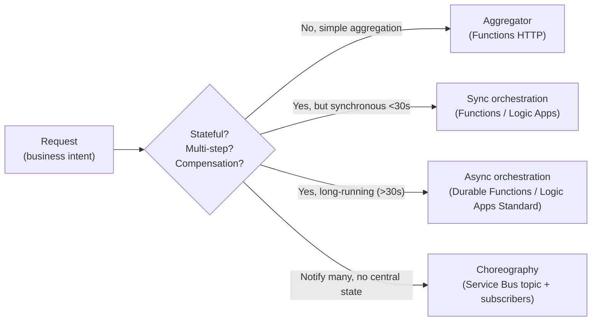
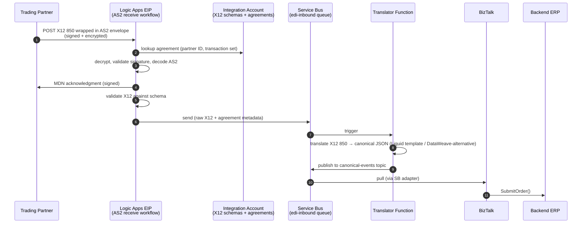
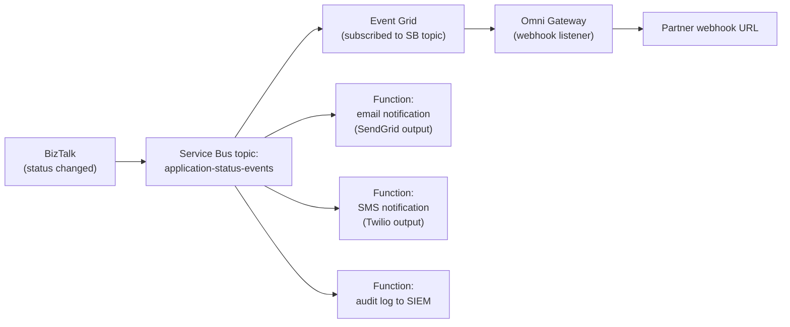
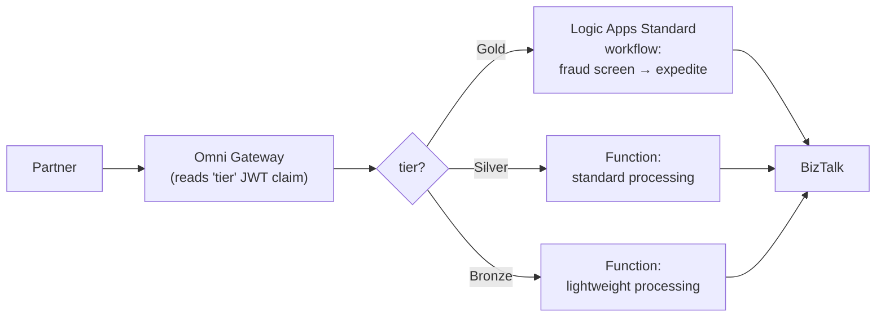

# 15 — Orchestration on the API-Led Stack

How the components we've designed across docs 01–14 work together for real orchestration scenarios — composite services, transformation, routing — and which component is responsible for what. The point is to avoid the common failure mode of designing each component in isolation and then discovering at integration time that nobody owns the seam between them.

---

## 1. The stack at a glance

Across docs 01–14 we've assembled this set of components:

| Component | Where it runs | Primary role |
|---|---|---|
| **Omni Gateway** ([doc 01](01-api-gateway-architecture.md), [doc 08](08-flex-gateway.md)) | CH 2.0 Private Space OR on-prem | API edge — auth, rate-limit, threat, contract validation, edge routing |
| **Redis** ([doc 10](10-redis-cache.md)) | Co-located with gateway per DC | Gateway shared state — config cache, rate-limit counters, idempotency |
| **Azure Service Bus Premium** ([doc 11](11-azure-service-bus-integration.md)) | Azure `centralus` (private endpoint) | Durable async messaging — queues, topics, sessions, dedup |
| **Azure Functions** ([doc 13](13-azure-functions.md)) | Azure (Premium plan, VNet-integrated) | Single-purpose code — transform, enrich, HTTP endpoints, event handlers |
| **Durable Functions** | Same | Stateful code-based orchestration — sagas, fan-out/fan-in, human-in-the-loop |
| **Logic Apps Standard** | Azure (VNet-integrated) | Low-code visual workflow + 450+ connectors |
| **Logic Apps EIP + Integration Account** | Azure | EDI / X12 / EDIFACT / AS2 / trading partner agreements |
| **BizTalk Server** ([doc 12](12-service-bus-vs-biztalk.md)) | On-prem (active/active across DCs) | Legacy orchestration + transformation + EDI; SAP / SQL / file adapters |
| **Identity Provider** ([doc 03](03-identity.md)) | SaaS (Entra ID / Okta) | OAuth, JWT, JWKS for all caller and service-to-service auth |
| **HashiCorp Vault** | On-prem + Azure replicated | Secrets, certs, runtime registration tokens |

This doc is about how these collaborate. None of them does orchestration alone in the general case — the orchestrator role rotates depending on the use case.

---

## 2. Orchestration vs Choreography — the first decision

Before assigning components, decide which collaboration pattern fits the scenario.

| Pattern | Description | When to use |
|---|---|---|
| **Orchestration** (central coordinator) | One component drives the multi-step flow; calls services in order, handles compensation, knows the end-to-end shape | Composite reads, sagas with compensation, multi-step approvals, anything requiring end-to-end visibility into a single business transaction |
| **Choreography** (pub/sub) | No central coordinator; services react to events independently | Loosely coupled fan-out, audit/notification pipelines, scenarios where new subscribers can be added without changing producers |

Most non-trivial use cases use a **mix** — orchestration for the synchronous "happy path" composite, choreography (via Service Bus topics) for the asynchronous fan-out that follows.



---

## 3. Component responsibility matrix (the core)

For each orchestration concern, who owns it?

| Concern | Owner | Backup / alternative | Anti-pattern (don't put it here) |
|---|---|---|---|
| **TLS termination at edge** | Omni Gateway | — | Backend services |
| **Inbound authN / token validation** | Omni Gateway | — | Backend services (don't trust direct callers) |
| **Outbound auth to backends** (mTLS / token exchange) | Orchestrator (Function / Logic App / BizTalk) | — | Gateway (the gateway has done its job at this point) |
| **Rate limiting / throttling** | Omni Gateway (distributed via Redis) | Service Bus partition limits as backpressure | Backend services (too late) |
| **Schema validation** | Omni Gateway (OAS) | Function on re-validation if business logic depends on it | BizTalk if request came via gateway already |
| **Edge routing** (path / host / header) | Omni Gateway | — | Orchestrator (defeats the purpose of having a gateway) |
| **Content-based routing** (inspect body) | Orchestrator (Function / Logic App) | Gateway custom WASM policy (heavy) | Backend services |
| **Format transformation** (JSON ↔ XML, schema mapping) | Logic Apps (designer) / Function (code) / BizTalk (legacy maps) | DataWeave is NOT in Omni Gateway | Gateway |
| **EDI translation** (X12 / EDIFACT / AS2) | Logic Apps EIP + Integration Account / BizTalk | — | Anywhere else (do not write EDI parsers in Functions) |
| **Composite aggregation** (call N services, merge) | Function (parallel-fan-out pattern) OR Logic Apps Parallel branch | Durable Function if results must be aggregated stateful | Gateway |
| **Long-running orchestration** | Durable Function OR Logic Apps Standard | BizTalk for legacy XLANG/s flows | Plain Function (60-min limit) |
| **Saga with compensation** | Durable Function OR Logic Apps Standard (with explicit compensation actions) | — | Plain Function chains (no compensation framework) |
| **Async event publish** | Logic Apps Service Bus connector / Function SB output binding / BizTalk SB adapter | — | Direct queue access from gateway (auth scope too broad) |
| **Async event consume** | Function SB trigger / Logic Apps SB trigger / BizTalk SB adapter | — | Gateway (HTTP-only) |
| **Fan-out to subscribers** | Service Bus topic + multiple subscribers | Event Grid for outbound webhook delivery | Single orchestrator calling N endpoints (less scalable; tight coupling) |
| **Dead-letter handling** | Service Bus DLQ + Function consumer that drains, classifies, alerts | — | Silent message loss |
| **Idempotency dedupe** | Gateway (Redis-backed via `Idempotency-Key`) + Service Bus dedup | Backend if mid-pipeline mutation possible | None — undetected duplicates is the silent bug |
| **Trace ID propagation** (W3C `traceparent`) | Every component must propagate | — | Generating new trace IDs per hop (breaks correlation) |
| **Audit-event publish** | Every component that does something audit-worthy → Service Bus audit topic | — | Component-local logs only (no central correlation) |
| **PII scrubbing** | Every component's logger ([doc 07](07-data-protection.md) deny-list) | — | Trusting some other component to scrub |
| **Backend connection pooling** | Orchestrator | — | Per-request connection setup |
| **Backend retry with exponential backoff** | Orchestrator (Polly / Durable retry policy / Logic Apps retry policy) | — | Caller / gateway |
| **Circuit breaker for backend failure** | Orchestrator (Polly / Logic Apps `terminate-on-error`) | Gateway for backends that lack any other tier | Backend |

**The pattern:** **edge concerns at the gateway · orchestration concerns at the orchestrator · transport concerns at Service Bus · domain logic at backends.** When responsibility blurs between two components, that's the seam where production incidents originate.

---

## 4. Use case — Composite read API

**Scenario:** `GET /citizens/{id}/summary` returns customer profile + recent applications + payment status in one synchronous call.

```mermaid
sequenceDiagram
    autonumber
    participant C as Client
    participant G as Omni Gateway
    participant F as Function (HTTP trigger)<br/>(aggregator)
    participant S1 as Customer Service
    participant S2 as Application Service
    participant S3 as Payment Service

    C->>G: GET /citizens/{id}/summary<br/>Authorization: Bearer JWT
    G->>G: validate JWT + scope + rate limit + schema
    G->>F: forward (mTLS, identity headers)
    par parallel fan-out
        F->>S1: GET /customers/{id}
        F->>S2: GET /applications?citizen={id}
        F->>S3: GET /payments?citizen={id}&recent=true
    end
    F->>F: merge responses; redact PII<br/>by scope; assemble shape
    F-->>G: 200 OK (merged JSON)
    G-->>C: 200 OK
```

**Who does what:**
- **Gateway**: auth + validate + rate limit + edge routing to the aggregator Function. Strips inbound `Authorization`; injects internal identity headers per the [pattern in doc 03 §7](03-identity.md#7-backend-identity-propagation--what-the-ms-stack-sees).
- **Function**: 3 parallel HTTP calls (Polly-wrapped: retry once on 5xx, 2-sec timeout each), merge results, apply scope-based PII redaction.
- **Backend services**: simple REST, trust the identity headers from the gateway perimeter.

**Why a Function and not Logic Apps?** For simple parallel-fan-out, code is faster to write and faster at runtime than the Logic Apps designer. Logic Apps Standard wins when the aggregation gets visually complex (conditional branches, looped enrichment, 5+ backends).

---

## 5. Use case — Async write with multi-step processing (saga)

**Scenario:** `POST /applications` accepts a citizen application, validates it, enriches with external lookups, routes for human approval (up to 7 days), then submits to BizTalk for final processing.

```mermaid
sequenceDiagram
    autonumber
    participant C as Client
    participant G as Omni Gateway
    participant SB as Service Bus<br/>(application-intake)
    participant D as Durable Function<br/>orchestrator
    participant Val as Validator Function
    participant Enr as Enrichment Function<br/>(state-agency lookup)
    participant H as Human reviewer<br/>(internal portal)
    participant BT as BizTalk worker

    C->>G: POST /applications {payload}<br/>Idempotency-Key: abc123
    G->>G: auth + schema + rate limit + idempotency check (Redis)
    G->>SB: send (MessageId=abc123)
    SB-->>G: ack
    G-->>C: 202 Accepted {correlationId}

    Note over D: ... orchestrator triggered by SB ...
    D->>Val: ValidateActivity(payload)
    Val-->>D: validation result
    alt validation failed
        D->>SB: publish status=REJECTED
        D-->>D: end orchestration
    end
    D->>Enr: EnrichmentActivity(payload)
    Enr-->>D: enriched payload
    D->>H: NotifyReviewerActivity(applicationId)
    D->>D: WaitForExternalEvent("Approved", timeout=7d)
    alt timeout
        D->>SB: publish status=EXPIRED
        D-->>D: compensate(); end
    end
    D->>BT: SubmitToBizTalkActivity(enriched)
    BT-->>D: receipt
    D->>SB: publish status=SUBMITTED
```

**Who does what:**
- **Gateway**: auth, validate shape, idempotency check (Redis), publish to SB, immediate 202.
- **Service Bus**: durable handoff, idempotency dedupe within 24h, dead-letter on poison messages.
- **Durable Function orchestrator**: the workflow brain — stateful, checkpointed; survives Function host restarts; can wait 7 days for human approval without holding a connection or worker thread.
- **Activity Functions** (Validator, Enrichment): stateless single-purpose code; each can be retried by the orchestrator independently.
- **BizTalk**: final integration step — the deep EDI / partner-specific work.
- **Internal portal**: separate UI that calls a Function which raises the `Approved` event into the orchestrator.

**Compensation:** every activity has a paired `compensate*` activity. The orchestrator catches `OrchestrationFailedException`, walks back through completed activities calling compensate actions in reverse order. This is the saga pattern; it's a Durable Functions strength.

**Why not Logic Apps Standard?** Both work. Use Durable Functions if the team is code-first; use Logic Apps Standard if business analysts will read/edit the workflow.

---

## 6. Use case — Inbound EDI from trading partner

**Scenario:** Partner sends X12 850 (Purchase Order) over AS2. We acknowledge with MDN, translate to canonical JSON, drop on Service Bus, BizTalk worker submits to the backend ERP.



**Who does what:**
- **Logic Apps EIP**: AS2 envelope handling (decryption, signature verification, MDN generation) — this is what EIP is built for, do not reimplement
- **Integration Account**: holds the X12 schemas, partner identities, agreements, certificates — single source of truth for B2B partners
- **Service Bus**: decouples EDI ingestion from backend processing cadence; supports replay if backend has a window of unavailability
- **Function**: translates X12 to canonical JSON — pure transformation, no orchestration
- **BizTalk**: business validation + ERP submission via its SAP/Oracle/file adapters

**Critical assumption:** Logic Apps EIP is the right Microsoft tool for AS2 + EDI. **Do not** try to do this in plain Functions; you'd be reimplementing 20 years of EDI standards. See [doc 11 §1 capability table](11-azure-service-bus-integration.md#1-scope--honest-framing--what-the-gateway-can-and-cant-do) — neither the gateway nor a plain Function can do this.

---

## 7. Use case — Outbound notification fan-out (choreography)

**Scenario:** Application status changes ("APPROVED"). Three audiences need to know: the citizen (email + SMS), the partner that submitted on their behalf (webhook), and the internal audit trail.



**Why choreography here (not central orchestration):**
- Subscribers are independent — adding a fourth audience (push notification to mobile app) doesn't require changing the producer
- Each subscriber failure is isolated (email outage doesn't block SMS)
- Service Bus topic + multiple subscriptions is the canonical implementation

**Who does what:**
- **BizTalk**: emits the status-change event (single responsibility — declare what happened)
- **Service Bus topic**: durable fan-out with per-subscriber DLQs
- **Functions (per channel)**: each owns the integration with one external system (SendGrid / Twilio / SIEM)
- **Event Grid + Gateway + Partner webhook**: outbound HTTPS delivery to external systems, with the gateway providing rate-limit + retry on the egress (per [doc 11 Pattern C](11-azure-service-bus-integration.md#pattern-c--service-bus--event-grid--gateway-webhook))

---

## 8. Use case — Content-based routing by SLA tier

**Scenario:** Same API path `/orders` but Gold-tier partners get richer processing (additional fraud screening, expedited handling); Bronze-tier gets baseline.



**Who does what:**
- **Gateway**: reads `tier` from JWT, dispatches via integration target — pure edge routing, no body inspection
- **Each tier orchestrator**: implements the tier-specific processing
- **All paths converge at BizTalk**: the canonical backend doesn't care which tier ran the pre-processing

**Important:** the tier value comes from the JWT (signed by IdP, can't be forged by the partner). If the gateway had to inspect the body to decide tier, you'd need a custom WASM policy or push routing to an orchestrator — usually not worth the complexity.

---

## 9. Transformation — where each format conversion happens

A transformation map for the architecture:

| Conversion | Where | Tool |
|---|---|---|
| JSON → JSON (rename fields, restructure) | Function (most flexible) OR Logic Apps Liquid template | Code (C#) or visual mapper |
| JSON ↔ XML | Function (`System.Xml.Linq` or `XmlSerializer`) | Code |
| JSON → X12 (outbound EDI) | Logic Apps EIP + map in Integration Account | Visual mapper |
| X12 → JSON (inbound EDI) | Logic Apps EIP + map (or Function for canonical-only mapping after Logic Apps decodes envelope) | Visual mapper / code |
| EDIFACT ↔ canonical | Logic Apps EIP | Visual mapper |
| Header injection (request enrichment) | Gateway (Omni Gateway policy) | Declarative policy |
| Schema validation against OAS | Gateway | Declarative policy |
| Schema validation against XSD | Logic Apps EIP or BizTalk | Built-in |

**Hard rule:** **DataWeave is NOT available in Omni Gateway.** That's a Mule Runtime feature. If a stakeholder mentions DataWeave, they're thinking of full Mule Runtime — wrong product. Transformation in our stack uses code (Functions), Logic Apps Liquid templates, or BizTalk Maps depending on context.

---

## 10. Routing — where each routing decision happens

| Routing type | Where it happens | How |
|---|---|---|
| Path / host / header (edge) | Gateway | Built-in route definitions |
| SLA tier (claim-based) | Gateway | JWT claim → integration target mapping |
| Geographic (e.g. US partners → US backend) | Gateway | DLB / Global Accelerator at the front, then claim/header |
| Content-based (inspect body) | Orchestrator (Function HTTP trigger or Logic Apps Condition) | Code/designer |
| Failover (backend down → secondary) | Orchestrator | Polly circuit breaker / Logic Apps run-after-failure |
| Async fan-out (one event → many subscribers) | Service Bus topic subscriptions | Subscription filters |
| Replay / DLQ recovery | Operator-triggered Function | Manual or scheduled |

**Pattern:** route as **early** as possible (cheap edge routing > expensive body inspection), as **declaratively** as possible (config over code where the gateway can express it).

---

## 11. Cross-cutting concerns — these MUST be consistent

These are the things that have to work uniformly across every component or the architecture cracks:

| Concern | Implementation |
|---|---|
| **Trace ID propagation** | Every hop honors and forwards W3C `traceparent`; never regenerates mid-flow |
| **Identity propagation** | Gateway strips inbound `Authorization`, injects internal headers per [doc 03 §7](03-identity.md#7-backend-identity-propagation--what-the-ms-stack-sees); orchestrator passes them through unchanged |
| **Idempotency** | `Idempotency-Key` header end-to-end; gateway dedupes via Redis; Service Bus dedupes via MessageId; backends accept the key |
| **Retry policy** | Exponential backoff with jitter; max-N-attempts at the orchestrator (not at the caller, which has no context) |
| **Circuit breaker** | At the orchestrator's outbound call to each downstream; not at the gateway (gateway shouldn't know about downstream-of-orchestrator services) |
| **PII redaction in logs** | Every component's logger applies the [doc 07 §3 deny-list](07-data-protection.md#3-the-12-specific-bleed-vectors) |
| **Correlation in audit events** | Every audit event carries `trace_id`, `request_id`, `actor`, `subject` |
| **Timeout budgets** | Gateway: 30s. Orchestrator (sync path): 25s. Each backend call within: ≤ 5s. Plan the budget end-to-end. |

---

## 12. Key assumptions this stack depends on

| # | Assumption | What breaks if wrong |
|---|---|---|
| 1 | Backends expose REST or are reachable via Logic Apps connectors / BizTalk adapters | Add an adapter Function before you can integrate |
| 2 | Orchestrators (Functions, Logic Apps) have private network reach to backends (no public internet on data path) | Premium plan + VNet integration mandatory; doc 07 controls violated otherwise |
| 3 | Backends accept the gateway's injected identity headers and ignore inbound `Authorization` | Backend rejects calls or trusts wrong identity |
| 4 | Write operations support `Idempotency-Key` natively | Duplicate-write incidents on retry |
| 5 | Composite read API total budget < 25s (gateway timeout - margin) | Gateway 504s; clients see failures unrelated to backend actual health |
| 6 | Every saga step has a compensating action defined | Failed sagas leave inconsistent state across systems |
| 7 | Service Bus is in same Azure region as orchestrators (centralus + centralus) | Cross-region latency adds 30+ ms per SB op |
| 8 | Logic Apps EIP + Integration Account is acquired BEFORE the EDI use case is needed | Reinventing EDI in code; weeks of work + ongoing maintenance |
| 9 | JWT contains the claims orchestrators need (tier, tenant, scope) | Custom claims must be added to IdP config; lead time for IAM team |
| 10 | BizTalk on-prem is reachable from Azure orchestrators via ExpressRoute Private Peering | Cannot bridge cloud orchestrators to on-prem backend |
| 11 | Schema versioning has explicit producer/consumer agreement (backwards-compatible additions only between major versions) | A schema break in producers cascades to every subscriber on the SB topic |
| 12 | Every component has the same time source (NTP) within 60s | JWT validation fails on `exp`/`nbf`; SB session ordering wrong; audit timeline scrambled |
| 13 | Component placement matches its role (Functions in Azure, BizTalk on-prem; not mixed) | Performance + ops nightmares trying to run cloud-native components on-prem |
| 14 | Orchestrators use Managed Identity / cert-based service principal to call backends — never shared secrets | Credential rotation becomes manual; secret sprawl in app settings |
| 15 | DLQ alarms are wired for every queue and topic subscription | Dead-lettered messages accumulate silently until a stakeholder complains |

---

## 13. Anti-patterns specific to orchestration

| Anti-pattern | Why bad | Right approach |
|---|---|---|
| Doing body-based routing at the gateway | Custom WASM policy is expensive to maintain; defeats the gateway's strength | Route at orchestrator |
| Reinventing EDI in Functions | Throwing away 20 years of EDI standards | Logic Apps EIP + Integration Account |
| Long-running orchestration in plain Functions | 60-min hard ceiling; no checkpointing | Durable Functions or Logic Apps Standard |
| Gateway calls multiple backends directly to "save a hop" | Gateway accumulates business logic; loses single-responsibility | Aggregator Function/Logic App |
| Saga without explicit compensation actions | Failures leave inconsistent state forever | Pair each step with a compensate-* action |
| Shared `Authorization` header passed through hops | Long-lived user token reaches services it shouldn't | Gateway strips; orchestrator does Managed Identity to backend |
| Per-component logging with no shared trace_id | Every incident becomes archaeology across 10 log sources | W3C traceparent end-to-end + central log aggregation |
| Choosing orchestrator by "team preference" without considering use-case fit | Code-first team picks Logic Apps; visual team picks Durable Functions — both maintain unhappy hybrids | Decision rubric: stateless code = Function; stateful code = Durable; visual + 450 connectors = Logic Apps; legacy EDI = BizTalk |
| Bypassing Service Bus "for simplicity" in long write flows | Failed backend = lost write; no replay capability | Always durable-queue async writes |
| Mixing orchestration and transformation in the same component | Component becomes the "big ball of mud" hard to test | Pure orchestrator + pure transformer; chain via SB or HTTP |

---

## Related

- [01 — API Gateway Architecture](01-api-gateway-architecture.md) — gateway role
- [03 — Identity](03-identity.md) — identity propagation across hops
- [07 — Data Protection](07-data-protection.md) — PII handling in every component
- [10 — Redis](10-redis-cache.md) — idempotency cache + rate-limit state
- [11 — Service Bus](11-azure-service-bus-integration.md) — async messaging substrate
- [12 — Service Bus vs BizTalk](12-service-bus-vs-biztalk.md) — when each runs
- [13 — Azure Functions](13-azure-functions.md) — code-first orchestration option
- [14 — Redis Assumption Register](14-redis-assumptions.md) — pattern this doc follows for orchestration-specific assumptions
