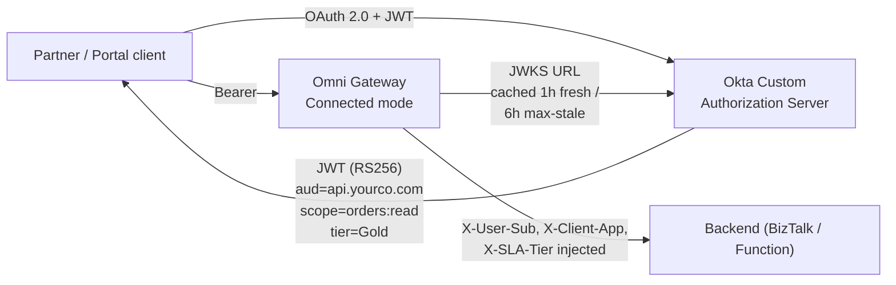

# 21 — Okta Integration Specifics

Implementation-focused companion to [doc 03 — Identity](03-identity.md) when **Okta** is the chosen IdP. Doc 03 is IdP-agnostic; this one covers the Okta-specific configuration, licensing prerequisites, and gotchas.

> **When to read this**: you've decided on Okta as the IdP per the doc 03 decision rubric, and now you're implementing. If you're still choosing between Okta / Entra / Ping / Cognito, read doc 03 first.

---

## 1. Architecture in one diagram



The flow is **vendor-agnostic** — Okta just publishes its JWKS at a stable URL and the gateway validates against it. What's Okta-specific is the **configuration shape** on the Okta side and the **claim mapping** the gateway needs to know about.

---

## 2. Prerequisites — Okta licensing (the #1 surprise)

| License component | Required for | If missing |
|---|---|---|
| **API Access Management** (add-on) | Custom Authorization Servers · Custom scopes · Custom audience · Custom claims | You can only use the **org-level authorization server**, which doesn't support custom audience values or custom scopes the way our policies need. **Confirm this before signing the SOW.** |
| **Lifecycle Management** (add-on) | Automated user provisioning / SCIM | Optional — manual user admin works for internal user flows |
| **Adaptive MFA** | Step-up auth for sensitive scopes | Optional but recommended for citizen-data APIs |
| **Workflows** | Custom event-driven Okta automations | Optional — not part of the gateway integration itself |

**Critical pre-flight check**: ask the Okta admin to confirm **API Access Management** is on the org. The standard Okta Enterprise SKU does NOT include it. Confirming early avoids a 3–4 week procurement detour mid-Phase 2.

---

## 3. Custom Authorization Server setup

This is where you define the contract Omni Gateway will enforce.

### 3.1 Create the authorization server

In Okta Admin Console: **Security → API → Authorization Servers → Add Authorization Server**.

| Field | Value | Notes |
|---|---|---|
| **Name** | `ssp-api-authz` (or your convention) | Internal identifier |
| **Audience** | `https://api.yourco.com` | This becomes the `aud` claim in issued tokens — **must match** what Omni Gateway validates |
| **Description** | `Authorization server for SSP citizen-data APIs` | For your sanity later |

### 3.2 Define scopes

**Security → API → your authz server → Scopes → Add Scope**

| Name | Display name | Description | Default | Include in public metadata |
|---|---|---|---|---|
| `orders:read` | Read citizen orders | Allow read access to /orders | No | Yes |
| `orders:write` | Submit / modify citizen orders | Allow write access to /orders | No | Yes |
| `profile` | View profile | Standard OIDC profile claims | No | Yes |
| `tier:gold` (optional) | Gold SLA tier | Indicates client is in Gold tier | No | No |
| `offline_access` | (built-in) | Refresh token grant | No | Yes |

**Naming convention**: `<resource>:<action>` lowercase. This is what shows up in JWT `scope` claim space-separated.

### 3.3 Define custom claims

**Security → API → your authz server → Claims → Add Claim**

| Name | Type | Include in | Value type | Value | Always include |
|---|---|---|---|---|---|
| `tier` | Access token | Any scope | Expression | `user.profile.slaTier` (or hardcoded per client app) | Yes |
| `tenant` | Access token | Any scope | Expression | `user.profile.tenant` | Yes |
| `azp` | Access token | Any scope | Expression | `app.clientId` | Yes |

**Why custom claims**: Omni Gateway policies in [doc 02](02-policies.md) reference `tier`, `tenant`, and `azp`. Okta doesn't include them by default — you have to map them.

### 3.4 Define access policies

**Security → API → your authz server → Access Policies → Add Policy**

For partner Client Credentials flow:

| Field | Value |
|---|---|
| **Name** | `partner-client-credentials` |
| **Assign to** | Selected clients: `partner-acme-app`, `partner-beta-app`, ... |
| **Rule → Grant type** | Client Credentials |
| **Rule → Scopes requested** | `orders:read`, `orders:write` (whatever they're entitled to) |
| **Rule → Access token lifetime** | 15 min (short — they re-acquire) |
| **Rule → Refresh token lifetime** | N/A for Client Credentials |

For internal user Authorization Code + PKCE flow:

| Field | Value |
|---|---|
| **Name** | `internal-user-auth-code-pkce` |
| **Assign to** | `ssp-internal-portal-app` |
| **Rule → Grant type** | Authorization Code, Refresh Token |
| **Rule → PKCE required** | Yes |
| **Rule → User type** | Active corporate users (federated from corporate AD) |
| **Rule → Access token lifetime** | 60 min |
| **Rule → Refresh token lifetime** | 8 hrs (rotate; revoke on logout) |
| **Rule → Inactivity timeout** | 30 min |

---

## 4. URLs to know (the configuration matrix)

For an Okta org `https://yourco.okta.com` with custom authz server ID `abc12345`:

| Purpose | URL |
|---|---|
| **Issuer** (`iss` claim value) | `https://yourco.okta.com/oauth2/abc12345` |
| **JWKS endpoint** (gateway uses this) | `https://yourco.okta.com/oauth2/abc12345/v1/keys` |
| **Authorization endpoint** (client app uses) | `https://yourco.okta.com/oauth2/abc12345/v1/authorize` |
| **Token endpoint** (client app uses) | `https://yourco.okta.com/oauth2/abc12345/v1/token` |
| **Userinfo endpoint** | `https://yourco.okta.com/oauth2/abc12345/v1/userinfo` |
| **OpenID metadata** | `https://yourco.okta.com/oauth2/abc12345/.well-known/openid-configuration` |
| **OAuth 2.0 metadata** | `https://yourco.okta.com/oauth2/abc12345/.well-known/oauth-authorization-server` |

> **Easy-miss gotcha**: there are TWO sets of these URLs in Okta — the **org-level** ones (`/oauth2/v1/keys`) and the **custom-authz-server** ones (`/oauth2/abc12345/v1/keys`). **Always use the custom-authz-server URLs** for our integration. The org-level URL serves a different JWKS and a token validated there will fail signature check at the gateway with the most cryptic error possible.

---

## 5. Token shape from Okta

What an Okta-issued access token looks like for our setup:

```json
{
  "ver": 1,
  "jti": "AT.abc123def456",
  "iss": "https://yourco.okta.com/oauth2/abc12345",
  "aud": "https://api.yourco.com",
  "iat": 1718812800,
  "exp": 1718813700,
  "cid": "0oa1xyz789partnerapp",
  "uid": null,
  "scp": ["orders:read", "orders:write"],
  "sub": "0oa1xyz789partnerapp",
  "azp": "0oa1xyz789partnerapp",
  "tier": "Gold",
  "tenant": "acme"
}
```

**Differences vs the generic shape in doc 03**:

| Doc 03 claim | Okta claim | Notes |
|---|---|---|
| `scope` (space-separated string) | `scp` (array) | Okta uses `scp` as array; gateway policy must read array, not space-split |
| `azp` | `azp` (we add via custom claim) | Set as a custom claim per §3.3 |
| `sub` for user flow = `<userid>` | `sub = <user id>` (for Auth Code) OR `sub = <client id>` (for Client Credentials) | Be aware of which flow generated the token |

---

## 6. Per-flow configuration

### 6.1 External partners — Client Credentials

```http
POST /oauth2/abc12345/v1/token HTTP/1.1
Host: yourco.okta.com
Content-Type: application/x-www-form-urlencoded
Authorization: Basic <base64(client_id:client_secret)>

grant_type=client_credentials&
scope=orders:read+orders:write
```

Response: JWT access token (15-min TTL per §3.4 policy).

Partner registration in Okta: **Applications → Add Application → API Services**. Capture `Client ID` + `Client secret`; share with partner via your secure channel (never in chat or email).

### 6.2 Internal users — Authorization Code + PKCE

```http
GET /oauth2/abc12345/v1/authorize?
  client_id=ssp-internal-portal-app&
  response_type=code&
  scope=openid+orders:read+profile+offline_access&
  redirect_uri=https://portal.yourco.com/callback&
  state=<state>&
  code_challenge=<PKCE>&
  code_challenge_method=S256
```

After user authenticates (SSO via corporate AD federation):

```http
POST /oauth2/abc12345/v1/token HTTP/1.1
Host: yourco.okta.com
Content-Type: application/x-www-form-urlencoded

grant_type=authorization_code&
client_id=ssp-internal-portal-app&
code=<auth_code>&
code_verifier=<PKCE_verifier>&
redirect_uri=https://portal.yourco.com/callback
```

Response: ID token + access token + refresh token (60-min access TTL per §3.4 policy).

**`offline_access` scope is required** to receive a refresh token. Easy miss — Okta won't return a refresh token without it.

### 6.3 mTLS for internal services

Not Okta's concern — handled at the Omni Gateway internal listener directly per [doc 03 §4](03-identity.md#4-internal-apps--mtls). Okta is not in this path.

### 6.4 Token introspection (NOT used)

Okta supports introspection at `/oauth2/abc12345/v1/introspect`. **We don't use it.** Our design validates JWT locally via JWKS (faster, no per-request IdP call). Introspection is only needed if you switch to opaque tokens — don't.

---

## 7. Omni Gateway policy configuration

JWT Validation policy fields for the external listener:

```yaml
policies:
  - policyRef:
      name: jwt-validation
    config:
      issuer: https://yourco.okta.com/oauth2/abc12345
      audience: https://api.yourco.com
      jwksUri: https://yourco.okta.com/oauth2/abc12345/v1/keys
      jwksCacheMaxAge: 3600           # 1 hour fresh
      jwksMaxStaleSeconds: 21600      # 6 hour max-stale fallback
      jwksCooldownSeconds: 30         # rate-limit cooldown on miss
      algorithms: [RS256]             # Okta default; reject HS256 / 'none'
      clockSkewSeconds: 60
      requiredClaims:
        - iss
        - aud
        - exp
        - cid                          # Okta-specific; client_id verifier
      scopesClaim: scp                 # Okta uses 'scp' (array), not 'scope' (string)
      requiredScopesPerRoute:
        - route: /orders
          method: GET
          scopes: [orders:read]
        - route: /orders
          method: POST
          scopes: [orders:write]
```

**Three Okta-specific fields to get right**:
1. `scopesClaim: scp` (not `scope`)
2. `issuer` is the custom authz server URL, not org-level
3. `jwksUri` is the custom authz server endpoint, not org-level

---

## 8. Claim mapping — Okta defaults vs what our policies need

| Our policy needs | Okta default | Action |
|---|---|---|
| `scope` (space-separated) | `scp` (array) | Configure gateway with `scopesClaim: scp` |
| `azp` (authorized party / client ID) | `cid` by default | Add custom claim `azp = app.clientId` OR configure gateway to read `cid` |
| `tier` (SLA tier) | Not present | **Custom claim required** (§3.3) — map from user profile attribute |
| `tenant` (multi-tenant flag) | Not present | **Custom claim required** (§3.3) |
| `sub` for user identity | Present (user OID for user tokens; client ID for service tokens) | No action — works as-is |

**Workflow for adding custom user attributes** (`slaTier`, `tenant`):
1. Okta Admin → **Directory → Profile Editor** → User → Add Attribute (`slaTier` string)
2. Set value per user (or via SCIM provisioning from corporate AD)
3. Map to JWT via Claims config (§3.3)

---

## 9. Caching strategy against Okta rate limits

Okta enforces rate limits per endpoint per org:

| Endpoint | Default rate limit | What it means for us |
|---|---|---|
| `/oauth2/{authzServerId}/v1/keys` (JWKS) | 100 requests / min | **Aggressive caching mandatory.** Our 1-hour fresh + 6-hour max-stale (per gateway config above) keeps us well below |
| `/oauth2/{authzServerId}/v1/token` | 600 requests / min | Each Client Credentials request hits this; high-volume partners can saturate |
| `/oauth2/{authzServerId}/v1/introspect` | 1,200 requests / min | N/A — we don't use introspection |
| `/oauth2/{authzServerId}/v1/userinfo` | 600 requests / min | N/A — we don't call this from gateway |

**Operational alarms** to add to doc 05:
- JWKS fetch failure → page (could indicate Okta rate-limit hit or outage)
- Token endpoint 429 from partners → alert partner; consider lengthening their token TTL

---

## 10. Terraform / IaC

If Okta-Terraform-provider is in scope, the authz server + client app configs can be IaC-managed:

```hcl
provider "okta" {
  org_name  = "yourco"
  base_url  = "okta.com"
  api_token = var.okta_api_token  # from Vault, never inline
}

resource "okta_auth_server" "ssp_api" {
  name        = "ssp-api-authz"
  description = "Authorization server for SSP citizen-data APIs"
  audiences   = ["https://api.yourco.com"]
}

resource "okta_auth_server_scope" "orders_read" {
  auth_server_id = okta_auth_server.ssp_api.id
  name           = "orders:read"
  description    = "Read citizen orders"
  consent        = "IMPLICIT"
  default        = false
}

resource "okta_auth_server_scope" "orders_write" {
  auth_server_id = okta_auth_server.ssp_api.id
  name           = "orders:write"
  description    = "Submit / modify citizen orders"
  consent        = "IMPLICIT"
  default        = false
}

resource "okta_auth_server_claim" "tier" {
  auth_server_id = okta_auth_server.ssp_api.id
  name           = "tier"
  value          = "user.profile.slaTier"
  value_type     = "EXPRESSION"
  claim_type     = "RESOURCE"
  scopes         = []  # always include
}

resource "okta_app_oauth" "partner_acme" {
  label                      = "partner-acme-app"
  type                       = "service"  # Client Credentials
  grant_types                = ["client_credentials"]
  response_types             = ["token"]
  token_endpoint_auth_method = "client_secret_basic"
}

resource "okta_auth_server_policy" "partner_client_creds" {
  auth_server_id   = okta_auth_server.ssp_api.id
  name             = "partner-client-credentials"
  status           = "ACTIVE"
  priority         = 1
  client_whitelist = [okta_app_oauth.partner_acme.id]
}

resource "okta_auth_server_policy_rule" "partner_rule" {
  auth_server_id           = okta_auth_server.ssp_api.id
  policy_id                = okta_auth_server_policy.partner_client_creds.id
  name                     = "partner-client-credentials-rule"
  priority                 = 1
  grant_type_whitelist     = ["client_credentials"]
  scope_whitelist          = ["orders:read", "orders:write"]
  access_token_lifetime_minutes  = 15
}
```

Keeps the Okta config version-controlled and auditable. Recommended for any non-trivial deployment.

---

## 11. Testing approach

### 11.1 Local / smoke

```bash
# Get a token (Client Credentials)
TOKEN=$(curl -sS -X POST \
  https://yourco.okta.com/oauth2/abc12345/v1/token \
  -H "Content-Type: application/x-www-form-urlencoded" \
  -H "Authorization: Basic $(echo -n '<client_id>:<client_secret>' | base64)" \
  -d "grant_type=client_credentials&scope=orders:read" \
  | jq -r .access_token)

# Decode (no signature verification — just look)
echo $TOKEN | cut -d. -f2 | base64 -d 2>/dev/null | jq .

# Hit the gateway
curl -sS -X GET \
  https://api.yourco.com/orders/123 \
  -H "Authorization: Bearer $TOKEN"
```

Verify:
- Token shape contains `tier`, `tenant`, `cid`, `aud`, `scp` per §5
- Gateway responds 200 (token validated) or 401 (with reason in `WWW-Authenticate`)

### 11.2 Integration

Wire into the CI smoke-test pipeline (per [doc 04](04-cicd.md)):
- One synthetic Client Credentials call per environment promotion
- One synthetic Auth Code + PKCE call (use Postman / Playwright)
- Validate `tier`-based rate limit by burning through the Bronze tier's quota and asserting 429

### 11.3 Load

In Phase 3 / 4 load testing:
- Verify JWKS cache hit ratio > 99% under load (per doc 05 §5.2)
- Verify Okta's `/token` endpoint isn't saturated by partner spike
- Verify the gateway falls back gracefully if Okta becomes unreachable for 1–5 min (cached JWKS keeps in-flight tokens valid; new logins fail with appropriate error)

---

## 12. Common errors and their fixes

| Error symptom | Likely cause | Fix |
|---|---|---|
| Gateway returns 401 with valid-looking token | JWKS URL is org-level not custom-authz-server | Switch `jwksUri` to `/oauth2/<authzServerId>/v1/keys` |
| Gateway accepts token but `scope` check fails | Reading `scope` not `scp` | Set `scopesClaim: scp` in policy config |
| `tier` claim missing → all clients get default tier | Custom claim not configured OR not "Always include" | Re-check §3.3 + re-issue tokens |
| Partner can't get refresh token | `offline_access` scope not requested | Add to partner's scope request |
| All partners 429 simultaneously | Hit Okta `/token` rate limit (600/min/org) | Lengthen token TTL; cache tokens at partner side |
| JWKS fetch fails intermittently | Hit `/keys` rate limit (100/min) | Verify gateway JWKS cache is working; alarm on cache-miss rate > 1/min |
| Token signature invalid after Okta key rotation | Stale cached JWKS | Force-refresh on `kid` not in cache (gateway should do this automatically) |
| Token `aud` mismatch | Authz server audience ≠ what gateway validates | Match exactly; `aud` is case-sensitive |
| User authenticated but no token | App grant types don't include Authorization Code | Update app config to enable code grant |

---

## 13. Migration from another IdP

If migrating from Entra / Cognito / Ping, plan in three phases:

### 13.1 Phase A — Dual-trust (1–2 weeks)

Configure Omni Gateway to accept tokens from **both** IdPs:

```yaml
policies:
  - policyRef:
      name: jwt-validation
    config:
      issuers:
        - issuer: https://login.microsoftonline.com/<tenant>/v2.0
          jwksUri: https://login.microsoftonline.com/<tenant>/discovery/v2.0/keys
        - issuer: https://yourco.okta.com/oauth2/abc12345
          jwksUri: https://yourco.okta.com/oauth2/abc12345/v1/keys
      audience: https://api.yourco.com
```

Validate Okta path with internal traffic first, then progressively shift partners.

### 13.2 Phase B — Cutover (per partner)

Migrate partners one at a time:
1. Provision Okta client app for partner
2. Send partner new credentials
3. Partner switches their client to Okta token endpoint
4. Monitor for traffic on old (Entra) endpoint per partner
5. Once partner traffic is 100% Okta, mark migrated

### 13.3 Phase C — Decommission (after all partners migrated + grace period)

1. Remove the old IdP from `issuers` list in gateway policy
2. Reject any remaining tokens from old IdP
3. Disable old IdP authz server (keep audit log)

**Effort estimate**: roughly **80–160 hours** depending on partner count and grace-period length. This is on top of the standard Okta integration.

---

## 14. Operational considerations

| Concern | Detail |
|---|---|
| **Token lifetime** | Access 15 min (CC) / 60 min (user); refresh 8 hrs. Tune based on incident-response needs (shorter = faster revoke; longer = less IdP load) |
| **Refresh token rotation** | Enable in Okta authz server policy. Each refresh issues a new refresh token; old one becomes invalid |
| **Session management** | Okta sessions are separate from token lifetime. User session = how often re-auth required. For citizen-data: 8 hr session, refresh-token rotation enabled |
| **Logout** | Internal portal → call Okta `/logout` endpoint to invalidate session + revoke refresh token |
| **Key rotation** | Okta rotates signing keys automatically (every ~90 days by default). Gateway JWKS cache handles transparently as long as we refresh on `kid` miss |
| **MFA** | Configure at Okta authz server policy level. For citizen-data: require MFA on initial auth + every 24 hrs |
| **Step-up auth** | For sensitive operations (e.g. PII export) — request a higher AAL via `acr_values` claim |
| **Audit log** | Okta System Log → stream to your SIEM. Per [doc 05](05-observability.md), this is alongside the gateway's own audit log |

---

## 15. License / cost impact

Adding Okta to the project doesn't materially change the consulting estimate **if** Okta is already operational at the client:

| Scenario | Delta from doc 16 baseline |
|---|---|
| Okta already operational | **+0 to +16 hrs** (within Phase 2 §4.5 budget) |
| Okta operational, new authz server needed | **+40 to +80 hrs** |
| Okta greenfield (org needs deployment) | **+120 to +200 hrs** (matches doc 16 §11 assumption #4 adjustment) |
| Migrating from another IdP | **+80 to +160 hrs** (in addition to base integration) |

**Okta licensing cost** (separate from consulting):
- **API Access Management** add-on: required; price varies by org size
- **MFA**: typically included in Enterprise SKU
- **User-based seats**: priced per active user/month

Get exact pricing from Okta directly — published list prices are rarely what enterprises pay.

---

## 16. Open questions for the Okta admin (the checklist)

Walk through this with the client's Okta admin before Phase 2 starts:

- [ ] Is **API Access Management** enabled on the org?
- [ ] Who has authz-server-admin permissions in Okta? (need them for Phase 2 work)
- [ ] What's the corporate AD federation model? (assumes existing — confirm)
- [ ] What's the user attribute that maps to `slaTier`? (or do we need to add one?)
- [ ] What's the user attribute that maps to `tenant`? (multi-tenant strategy)
- [ ] What's the existing token lifetime policy? (any conflicts with our 15-min / 60-min targets?)
- [ ] What MFA factors are enrolled? (any gaps for new user populations?)
- [ ] Is Okta Workflows in scope for any custom event handling (e.g. partner offboarding)?
- [ ] What's the Okta System Log retention? (compliance requirement)
- [ ] Is there a Terraform-managed Okta config repo already, or do we add one?
- [ ] What's the partner-onboarding workflow today? (manual admin UI vs automated via Okta API)
- [ ] Who approves new authorization server changes? (governance)

---

## Related

- [03 — Identity](03-identity.md) — IdP-agnostic identity strategy; this doc is the Okta implementation
- [02 — Policies](02-policies.md) — policy bundles that consume Okta-issued tokens
- [05 — Observability](05-observability.md) — JWKS cache health + token-validation metrics
- [16 — Consulting Estimate](16-consulting-estimate.md) §11 assumption #4 — IdP-operational assumption
- [20 — RACI Matrix](20-raci-matrix.md) — IAM team owns the Okta-side work; consultant integrates
