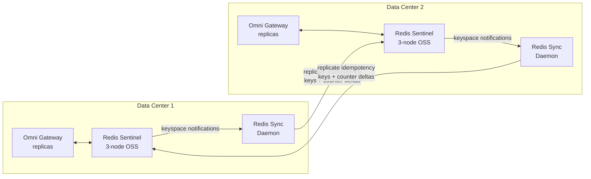

# 22 — Cross-DC Redis Sync without Redis Enterprise

[Doc 10](10-redis-cache.md) and [doc 14 A8](14-redis-assumptions.md#a8-activepassive-redis-across-dcs-not-activeactive) flagged Redis Enterprise (CRDTs) as the only OSS-compatible way to do true active/active multi-master Redis across data centers. **If Redis Enterprise is not commercially viable**, this doc covers the realistic alternative: per-DC Redis OSS + a small custom sync daemon for the subset of state that actually needs cross-DC consistency.

The headline insight: **not every key Omni Gateway puts in Redis needs cross-DC sync.** Once you decompose the state, the problem shrinks from "replicate everything" to "replicate one or two specific data classes" — small enough to script.

---

## 1. Decompose: what's actually in Redis

Per MuleSoft's docs (per [doc 10 §2](10-redis-cache.md#2-what-redis-stores-in-connected-mode)) + our own additions, the Connected-mode Redis holds four data classes. Each has different cross-DC requirements:

| Data class | What it is | Cross-DC sync needed? | Why |
|---|---|---|---|
| **Runtime configuration cache** | Policy bundles per API, pushed from Anypoint Control Plane | **No** | Anypoint Control Plane is the authoritative source. On cold start, each replica repopulates from Anypoint within seconds. Per-DC isolation is correct here. |
| **Request data cache** | Response cache, OAuth introspection cache, etc. | **No** | Cache hits are per-replica; a miss in DC2 means slightly more work but not incorrectness. Best-effort by design. |
| **Rate-limit counters** | Per-client per-window request counts (e.g. "partner-acme: 47 calls this minute") | **Optional** — depends on SLA wording | If SLA says "1000/min global," yes. If "1000/min per region/DC," no. Often **negotiable in the SLA contract**. |
| **Idempotency cache** | `Idempotency-Key → response` for 24h dedup window | **Yes** | If client retries to DC2 after DC1 first-attempt, DC2 must know about it. Otherwise duplicate processing of writes. |

So the cross-DC sync problem is really only:
- **Idempotency cache** — must sync (correctness)
- **Rate-limit counters** — sync if your SLA wording requires global limits (optional)

Everything else is per-DC and that's correct.

---

## 2. The recommended architecture



**Operating principle:**

- Each DC has its own **Redis Sentinel cluster** (3 nodes, OSS Redis 7.x) — runs locally, no Enterprise license
- A small **sync daemon** runs alongside each Redis cluster
- The daemon **subscribes to Redis keyspace notifications** on specific key patterns
- For matching keys, it **publishes the change to the peer DC's sync daemon**, which writes it to local Redis
- **Only two key patterns are synced**: `idem:*` (idempotency) and `rl:*` (rate-limit counters) — explicitly
- Everything else stays per-DC, by design

The result: cross-DC sync for the ~5% of keys that actually need it, **at a fraction of Enterprise cost** in steady state.

---

## 3. What the sync daemon does (and doesn't)

### Does

- **Subscribes to Redis keyspace notifications** for `idem:*` and `rl:*` key patterns via Pub/Sub
- **Forwards SET / EXPIRE / DEL operations** to the peer DC's sync daemon over a mutually-authenticated HTTPS channel
- **Applies received operations** to local Redis idempotently (using SETNX for idempotency keys; INCRBY for counter deltas)
- **Periodically aggregates counter state** across DCs (every 5–10 seconds) so each DC has eventually-consistent view of global counters
- **Emits Prometheus metrics**: sync lag, queue depth, replication errors, cross-DC RTT
- **Logs to SIEM** for audit (which keys synced, when)
- **Health-check endpoint** for monitoring

### Doesn't

- **Doesn't sync runtime config keys** — Anypoint Control Plane handles those
- **Doesn't sync request data cache** — per-DC is correct
- **Doesn't claim strong consistency** — eventual consistency only (1–2 second target lag)
- **Doesn't survive a network partition without measurable drift** — during partition, each DC's counters diverge; on heal, deltas are reconciled (small over-limit window possible)
- **Doesn't replace Redis Sentinel** — Sentinel still owns intra-DC HA

---

## 4. Eventual-consistency semantics (the honest trade-offs)

### Idempotency

- **Normal case (no partition):** idempotency key replicated to peer DC in 1–2 seconds. A retry within that window to the peer DC might cause one duplicate. Acceptable for most use cases (idempotency is best-effort already at 24h windows).
- **During DC partition:** retries to the surviving DC don't see prior attempts → duplicate processing risk. Mitigation: client should retry to the **same DC** within reason; cross-DC retry is the rare disaster-recovery case.

### Rate-limit counters

- **Normal case:** counters converge within 5–10 seconds of aggregation cycle. Over-limit window is bounded.
- **During DC partition:** each DC enforces local limits; effective global limit may briefly equal 2× the configured limit. Document this in your partner SLA.
- **Counter arithmetic:** the daemon uses CRDT-like semantics manually — track per-DC counters separately, sum on read. This avoids the "Last Write Wins" data loss problem of naive replication.

### Comparison with Redis Enterprise CRDTs

| | Redis Enterprise (CRDT) | This daemon approach |
|---|---|---|
| Consistency | Strong eventual (CRDT-merged) | Eventual (1–2s lag for keys; 5–10s for counters) |
| Partition tolerance | Survives partitions cleanly | Survives but with measurable drift |
| Idempotency on retry | Strong | Best-effort (window of duplicates possible) |
| Rate-limit fidelity under load | Tight | Tight in steady state; 2× drift during partition |
| Cost (steady-state) | License fee + support | Custom-code maintenance burden |
| Cost (one-time) | Setup | Build + integration test |
| Vendor risk | Redis Inc dependency | Custom-code maintenance dependency |

Neither is "right" universally. For citizen-data audit-critical workloads, Enterprise is often easier to defend. For workloads where occasional duplicate writes or brief over-limit windows are acceptable, custom daemon wins.

---

## 5. Configuration shape

The daemon takes a YAML config per environment:

```yaml
# /etc/redis-sync-daemon/config.yaml

local:
  redis_endpoints:
    - host: redis-dc1-1.internal
      port: 6380
    - host: redis-dc1-2.internal
      port: 6380
    - host: redis-dc1-3.internal
      port: 6380
  sentinel_master: omni-gw-shared
  auth_password_secret: vault://secret/redis/dc1-auth
  tls:
    enabled: true
    ca_cert_path: /etc/ssl/internal-ca.crt
    client_cert_path: /etc/ssl/redis-sync-dc1.crt
    client_key_path: /etc/ssl/redis-sync-dc1.key

peers:
  - name: dc2
    endpoint: https://redis-sync-dc2.internal:8443
    mtls:
      ca_cert_path: /etc/ssl/internal-ca.crt
      client_cert_path: /etc/ssl/redis-sync-dc1.crt
      client_key_path: /etc/ssl/redis-sync-dc1.key
    timeout_ms: 2000

sync:
  # Key patterns to replicate (Redis glob style)
  patterns:
    - prefix: "idem:"
      semantics: "setnx"           # don't overwrite if peer already has it
      ttl_preserve: true
    - prefix: "rl:"
      semantics: "counter-delta"   # treat as INCRBY, sum across DCs on read
      aggregation_interval_seconds: 10

  # Pub/Sub channel for keyspace notifications
  # (requires Redis configured with notify-keyspace-events "Ex$")
  keyspace_channel: "__keyspace@0__:*"

server:
  listen_addr: "0.0.0.0:8443"
  metrics_addr: "0.0.0.0:9090"
  health_addr: "0.0.0.0:8080"

observability:
  prometheus_metrics: true
  log_level: info
  audit_log_path: /var/log/redis-sync/audit.log
```

The daemon enforces TLS+AUTH to local Redis (per [doc 10 §4](10-redis-cache.md#4-securing-the-redis-instance-per-mulesoft-guidance)) and mTLS to peer daemons — the cross-DC channel is over the same private network as the gateway-to-backend path (per [doc 09 §7](09-onprem-install.md#7-disaster-recovery)).

---

## 6. Failure modes

| Failure | Behavior | Mitigation |
|---|---|---|
| Local Redis unreachable | Daemon retries with backoff; alerts after 30s | Sentinel handles failover; daemon reconnects |
| Peer DC unreachable | Daemon queues outbound sync messages (bounded buffer, e.g. 10k items); discards oldest if full | Sync resumes on reconnect; partition-related drift accepted |
| Peer DC slow | Backpressure: daemon drops oldest events from queue, increments drop-counter metric | Alarm on drop rate > 0; investigate network |
| Daemon crash | Systemd restart; on recovery, scans Redis for recently-written keys and re-sends | Some duplicate-replication acceptable due to idempotent peer operations |
| Network partition between DCs | Each DC enforces local limits; idempotency cache divergence accepted | Documented in SLA; healed automatically on reconnect with bounded drift |
| Daemon mTLS cert expired | Peer rejects; sync stops; alerts | Cert lifecycle automation per [doc 09 §2](09-onprem-install.md#2-prerequisites-both-paths) |
| Volume spike floods queue | Drop-oldest semantics; metric increments | Tune queue size; rate limits on peer side |

---

## 7. Implementation effort

**Custom code build (one-time):**

| Task | Hours |
|---|---|
| Architecture + design review | 16 |
| Go daemon implementation (Redis client + Pub/Sub + HTTP server + sync engine) | 100 |
| Counter aggregation logic + tests | 24 |
| mTLS + AUTH + Vault integration | 24 |
| Prometheus metrics + health endpoints | 16 |
| Containerization (Docker / systemd) | 16 |
| Integration tests against real Redis | 40 |
| Chaos / partition testing | 24 |
| Operational runbooks | 16 |
| **Subtotal one-time build** | **~276 hrs** |

**Ongoing maintenance:**

| Activity | Hours/year |
|---|---|
| Bug fixes / feature requests | 32 |
| Go runtime version updates | 8 |
| Security patches | 16 |
| Compatibility re-test per Omni Gateway version | 16 |
| Quarterly review (has MuleSoft / Redis released native cross-DC OSS?) | 4 |
| **Subtotal ongoing** | **~76 hrs/year** |

### Comparison to Redis Enterprise

| | Build cost | Year 1 total | Year 3 total |
|---|---|---|---|
| Custom daemon | ~276 hrs one-time + 76 hrs/yr | ~352 hrs | ~504 hrs |
| Redis Enterprise (lowest production tier) | License + setup ~24 hrs | License + 24 hrs build | License × 3 + 24 hrs |

Where this breaks even depends on your consultant rates and Redis Enterprise's quote — typically **custom is cheaper through Year 2, even with Enterprise's lowest tier**. Past Year 3, gap narrows.

**Decision-making factor:** custom code is **your team's maintenance burden**. Redis Enterprise is **a vendor's maintenance burden** (with a check). Pick based on team capacity, not just cost.

---

## 8. When to go custom vs Enterprise

| Pick custom daemon if | Pick Redis Enterprise if |
|---|---|
| Strong DevOps team comfortable with Go / Rust services | Lean ops team; prefer vendor-supported |
| Tight budget; can absorb 276-hr one-time investment | Budget exists for ~$15-25K/yr+ license |
| Acceptable to document "limits are eventual / per-DC during partition" in SLA | SLA requires strong global limit enforcement |
| Comfortable carrying custom-code in production | Custom-code aversion |
| Already running OSS Redis Sentinel pattern; want to keep it | Greenfield Redis deployment |
| Willing to accept ~1-2s sync lag on idempotency | Need sub-second cross-DC consistency |

---

## 9. Adjusted Redis assumptions register entries

Updates to the assumption register in [doc 14](14-redis-assumptions.md) that this approach changes:

| Assumption | Old framing | New framing |
|---|---|---|
| A8 | "Active/passive Redis across DCs (not active/active)" | **Per-DC active Redis Sentinel + custom sync daemon for idempotency + rate-limit counters; eventually consistent (1–10s lag)** |
| A19 | "Acceptable for rate-limit counters to reset during DR cutover" | "Acceptable for rate-limit counters to drift up to 2× configured during cross-DC partition (bounded; auto-heals on reconnect)" |
| A26 | "OSS Redis sufficient for our DR posture" | **Same — confirmed; custom sync daemon fills the cross-DC gap** |

---

## 10. Risks specific to this approach

| Risk | Mitigation |
|---|---|
| Custom daemon becomes maintenance burden no one wants to own | Document maintenance budget upfront; identify owner; quarterly health check |
| Sync lag occasionally exceeds target during traffic spike | Capacity-plan the daemon (memory + network); monitor lag SLI |
| Pub/Sub event loss during high churn | Periodic full-scan reconciliation (every 5 min) as backstop |
| Cross-DC mTLS cert rotation fails silently | Alarm on cert age > N days from expiry |
| Two-DC partition lasts hours, drift accumulates | Bounded by 24h idempotency TTL; counters re-baseline at next aggregation cycle |
| Daemon process crashes don't auto-recover | Systemd restart + health check + alarm |
| Insufficient testing of partition scenarios pre-production | Mandatory chaos drill: kill cross-DC link for 30 min, verify recovery |

---

## 11. Migration path (if you currently have an Enterprise quote on the table)

If you're already in active discussions with Redis Inc and just want a fallback:

1. **Build the daemon** as a Phase 2.5 mini-project (~276 hrs)
2. **Run alongside Enterprise** for one quarter as a control
3. **Compare**: sync lag, operational burden, total cost
4. **Decide at quarter end**: keep custom (drop Enterprise discussion) or pay for Enterprise (decommission daemon)

This gives you data, not opinion, when negotiating with Redis Inc — and a real walk-away alternative.

---

## 12. What's in the repo for this

| Path | Purpose |
|---|---|
| `code/services/redis-sync-daemon/` | Go-based sync daemon — see its README for build + deploy |
| `code/services/redis-sync-daemon/cmd/redis-sync-daemon/main.go` | Entry point |
| `code/services/redis-sync-daemon/internal/sync/` | Sync engine (pub/sub, replicator, aggregator) |
| `code/services/redis-sync-daemon/internal/redis/` | Redis client wrapper |
| `code/services/redis-sync-daemon/internal/peer/` | Peer DC HTTP client/server |
| `code/services/redis-sync-daemon/configs/` | Sample YAML configs |
| `code/services/redis-sync-daemon/Dockerfile` | Container build |
| `code/services/redis-sync-daemon/README.md` | Operational README |

---

## Related

- [10 — Redis Shared Storage (Connected Mode)](10-redis-cache.md) — base Redis architecture
- [14 — Redis Assumption Register](14-redis-assumptions.md) — assumptions register; A8, A19, A26 updated by this doc
- [09 — On-Prem Install Guide](09-onprem-install.md) — Redis Sentinel per-DC sizing
- [`code/services/redis-sync-daemon/`](../code/services/redis-sync-daemon/) — the implementation scaffold
